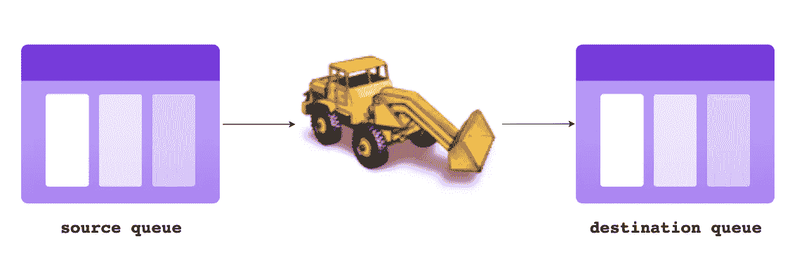
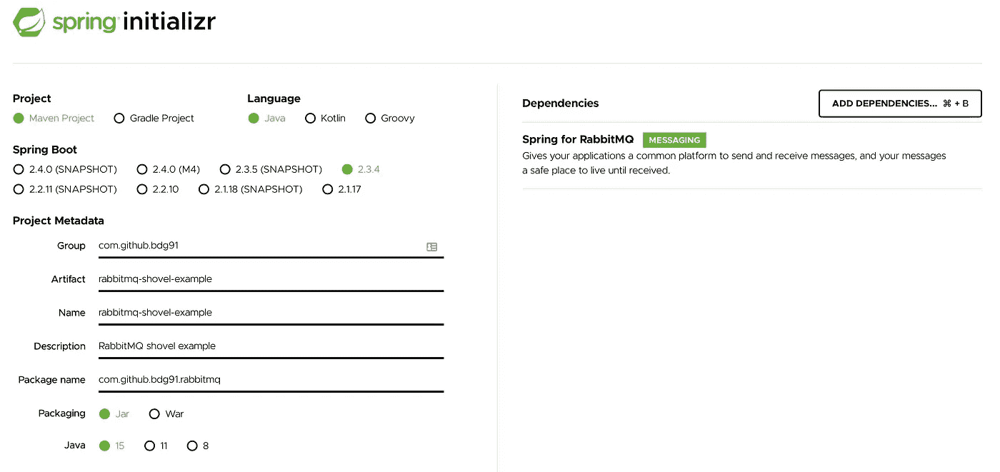
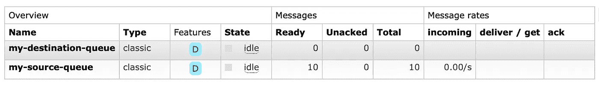
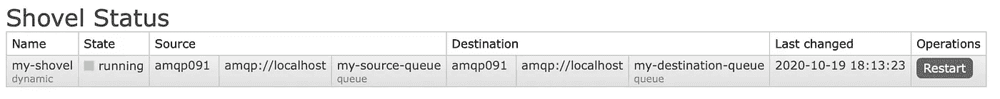

# 每天我都在铲东西

> 原文：<https://medium.com/javarevisited/everyday-im-shovelling-1c79b6d568d7?source=collection_archive---------1----------------------->

## 如何使用 Java 和 Spring Boot rabbit MQ 铲子


在 [Unsplash](https://unsplash.com/s/photos/bulldozer?utm_source=unsplash&utm_medium=referral&utm_content=creditCopyText) 上由 [Samuel Horn af Rantzien](https://unsplash.com/@pixelcrook?utm_source=unsplash&utm_medium=referral&utm_content=creditCopyText) 拍摄的照片

本文简要地解释了 RabbitMQ 铲子的概念，为什么您可能想要使用它们，以及如何在 Spring Boot Java 应用程序中设置铲子。

> 只是想看一些代码？该示例项目可在 [Github](https://github.com/basdgrt/rabbitmq-shovel-example) 上获得。

# 概念

RabbitMQ sloter 是一个简单而强大的核心 RabbitMQ 插件，可以不断地将消息从源(队列)移动到目的地(交换、主题、队列等)，其中源和目的地可以位于不同的 rabbit MQ 集群中。



官方[文档](https://www.rabbitmq.com/shovel.html)用一句话抓住了精髓:

> 一个铲的行为就像一个编写良好的客户端应用程序，它连接到它的源和目的地，消费和重新发布消息，并在两端使用确认来应对故障。

这就是它的全部，一个铲子持续可靠地将信息从一个来源移动到一个目的地。

# 为什么要用铲子？

通过允许源和目的地在不同的 RabbitMQ 集群中，铲子促进了不同团队的集群和应用程序之间的松散耦合。

如果团队 B 需要使用位于团队 A 集群上的队列中的消息，并且他们的应用程序会直接监听团队 A 的队列(紧耦合),那么当团队 A 决定关闭集群进行维护时，团队 B 的应用程序可能会中断。

如果团队 B 使用铲子将消息从团队 A 的队列移动到他们自己集群上的队列，他们可以让他们的应用程序监听他们自己集群上的队列。这是一件好事，因为它允许两个集群的所有者对他们的 RabbitMQ 环境进行维护，而不必担心意外破坏另一个团队的应用程序。

当然，如果其中一个集群关闭，铲子将无法在其源和目的地之间移动消息，但一旦两个集群都启动并再次运行，它就会恢复连接。

除了降低维护风险之外，还有一些其他优势，因为铲子可以在集群之间传输消息，这些优势包括:

*   运行不同版本的 RabbitMQ
*   使用不同的消息传递协议
*   拥有不同的用户和虚拟主机

# 用铲子和爪哇 Spring Boot

在这个循序渐进的示例中，我们将构建一个 Spring Boot 应用程序，该应用程序创建一个源和目标队列，并用铲子在它们之间移动消息。为了简单起见，源队列和目的队列将位于同一个 RabbitMQ 集群中。

## 设置一个 RabbitMQ 环境，并启用铲子插件

建立 RabbitMQ 环境最简单的方法是通过 Docker。然而，由于默认的 RabbitMQ 映像不支持 not 插件，我们需要使用自定义映像。在这个 [Docker Hub](https://hub.docker.com/repository/docker/bdg91/rabbitmq-shovel) 存储库上有一个启用了铲子插件的图像。要运行此图像:

```
docker run --name rabbitmq-shovel --rm -d -it --hostname my-rabbit -p 15672:15672 -p 5672:5672 bdg91/rabbitmq-shovel:latest
```

启动后，RabbitMQ 管理界面在 [http://localhost:15672](http://localhost:15672) 、**T5，您可以使用默认用户名 *guest* 登录，默认密码为 *guest。***

## 创建新的 Spring Boot 项目

使用 [Spring initializr](https://start.spring.io) 创建一个新的 Spring Boot 项目，将 *Spring for RabbitMQ* 作为唯一的依赖*。*



## 源队列和目标队列

添加一个配置类来声明源队列和目标队列。

## 生产者

生产者负责将消息放入我们的源队列。在这种情况下，消息只是一个字符串值。

为了在我们的源队列中获取一些消息，我们在应用程序启动后调用了 *produceMessages* 方法。

## 消费者

消费者负责从目标队列中读取消息，它记录它处理的每条消息的内容。

为了让我们的消费者监听目的地队列，我们必须将以下配置添加到 *RabbitMqConfiguration* 类中。

## 无铲试运行

如果我们现在启动我们的应用程序，并登录到 RabbitMQ 管理界面，我们将看到源队列和目标队列，在源队列中有 10 条消息。



因为我们的消费者只监听目的地队列，所以这 10 条消息不会去任何地方。

## 创造一把铲子

用 Java 创建 RabbitMQ 铲子最简单的方法是使用 RabbitMQ HTTP API 的 Java 客户端 [Hop](https://github.com/rabbitmq/hop) 。要使用 Hop，我们需要将以下依赖项添加到项目中:

```
<dependency>
  <groupId>com.rabbitmq</groupId>
  <artifactId>http-client</artifactId>
  <version>3.8.0.RELEASE</version>
</dependency>
<dependency>
  <groupId>org.springframework</groupId>
  <artifactId>spring-web</artifactId>
  <version>5.2.9.RELEASE</version>
</dependency>
<dependency>
  <groupId>com.fasterxml.jackson.core</groupId>
  <artifactId>jackson-databind</artifactId>
  <version>2.11.3</version>
</dependency>
```

Hop 允许您使用一个名为 Client 的类与 RabbitMQ 服务器进行交互。让我们在我们的 *RabbitMqConfiguration* 类中实例化一个。

最后，我们使用客户端在 *ApplicationInitializer* 类中创建我们的铲子，这样它将在应用程序启动后被创建。

由于我们的源和目的地位于同一个群集中，因此*源 Uri* 和*目的地 Uri* 相等。在现实世界的例子中， *sourceUri* 和/或 *destinationUri* 可能会指向不同的集群。

## 用铲子试运行

如果我们启动我们的应用程序，铲将所有消息从源队列移动到目的地队列。一旦消息到达目的地队列，它们就被我们的消费者使用，消费者将在控制台中为它处理的每个消息写一个日志消息。

```
c.g.b.rabbitmq.message.MessageConsumer   : Received: [message 0]
c.g.b.rabbitmq.message.MessageConsumer   : Received: [message 1]
c.g.b.rabbitmq.message.MessageConsumer   : Received: [message 2]
c.g.b.rabbitmq.message.MessageConsumer   : Received: [message 3]
c.g.b.rabbitmq.message.MessageConsumer   : Received: [message 4]
c.g.b.rabbitmq.message.MessageConsumer   : Received: [message 5]
c.g.b.rabbitmq.message.MessageConsumer   : Received: [message 6]
c.g.b.rabbitmq.message.MessageConsumer   : Received: [message 7]
c.g.b.rabbitmq.message.MessageConsumer   : Received: [message 8]
c.g.b.rabbitmq.message.MessageConsumer   : Received: [message 9]
```

我们创建的铲子可以通过*管理>铲子状态在[管理界面](http://localhost:15672)中找到。*



完整且稍加修饰的源代码可在 [Github](https://github.com/basdgrt/rabbitmq-shovel-example) 上获得。

# 结论

当您需要可靠且持续地将消息从一个集群中的源移动到另一个集群中的目的地时，rabbit MQ sloter 是一个非常棒且易于使用的工具。它只需要几行代码就可以完成，而创建一个以同样可靠和一致的方式做同样事情的客户端应用程序则需要大量的工作。