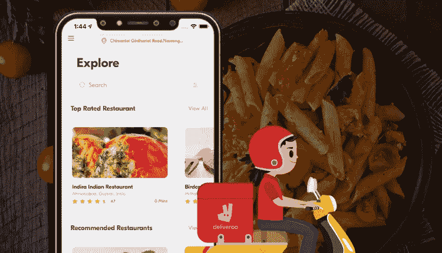
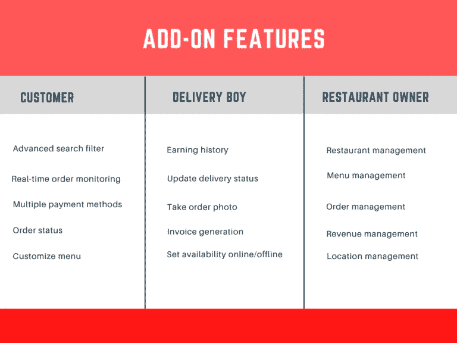

# 关于食品交付克隆应用程序开发，你需要知道的一切

> 原文：<https://medium.com/javarevisited/everything-you-need-to-know-about-food-delivery-clone-app-development-baf5e42ef416?source=collection_archive---------2----------------------->

在疫情期间，对按需送餐应用的需求急剧增长。虽然这即将结束，这个市场的人气仍然存在。因此，利用市场未开发的机会来提高回报和收入是一个好主意。特别是，如果你计划数字化你的餐馆的运作。它将确定这两个领域变得容易实现。

你想知道如何执行这个动作吗？这篇全面的文章将精确地阐明这一点。它将为您提供一系列步骤，在控制成本的同时简化流程。

## 食品配送应用的市场统计

如前所述，在新冠肺炎疫情期间，我们观察到在线食品交付克隆应用程序的受欢迎程度以一种革命性的方式增长。尽管如此，该解决方案仍有很好的前景。这就是为什么它的整合是必须的，因为它将有助于餐厅在未来几年提高知名度。

**看看下面这些数字，更好地了解这一点。**

*   到 2029 年，食品配送应用行业的市场规模将达到 3200 亿美元。
*   2022 年产生的当前收入为 0.77 万亿美元。
*   预计 2022 年至 2027 年间的 CAGR 利润增长率为 13.68%。
*   预计到 2027 年，市场规模将达到 1.45 万亿美元左右。
*   2027 年用户数量将达到 262050 万。
*   目前的用户渗透率在 2022 年增长了 32.3%。

## App 运营

该点餐系统操作简单。这允许顾客、餐馆和送货司机之间的无缝连接，直到最后的送货完成。

*   客户进入应用程序并添加他们的位置信息，以获得附近餐馆的列表。
    选择提供他们最喜欢的一餐/多餐的餐厅，并下单选择项目。
    餐厅收到订单请求，接受它，并指派一名送货司机。
    送货司机到达餐厅，挑选订单，并通知顾客。
    ·客户和送货司机可以实时跟踪对方，直到最终送货。
    ·送餐完成，顾客进行点评。

## 收入模型

按需餐饮应用有四种创收方式。想了解他们吗？查看下面的指针，了解他们-

**1。送货费**——餐厅通过应用程序提供的送货服务需要额外付费。
2**。激增定价**——当需求和订单比例较高时，该选项值得使用。这种模式有助于企业从订单中赚取额外利润。
**3。佣金**——顾客通过应用程序向餐厅订购的每一份订单都会收取佣金。
**4。广告** —这些费用必须由餐馆为他们在食品订购系统平台上的促销活动支付。

让我们为食品订购应用程序开发服务做好准备，让提高利润的过程变得简单。

## 如何开发投资更少的在线送餐 app？

你知道送餐 app 的基本知识。你现在已经准备好进入这个竞争激烈的市场。有一个难题——你必须在开发阶段遵循一些步骤。这将允许您的应用程序有效运行，不会出现任何问题。控制成本同样重要。记住这些要点，像专业人士一样完成这项工作。

> ***研究你的目标市场&评估竞争对手***

这将帮助你确定你的应用策略是否会带来预期的结果。接下来要确保你很了解你的竞争对手。总之，知道他们在做什么。

有了这两个方面的综合想法，你就可以确定一个你需要实现的 app 设计来驱动价值。
接下来问这些问题-

*   顾客对他们得到的满意吗？是/否？
*   如果没有，我的竞争对手的解决方案中缺少什么，他们的加入能为我的应用程序增加价值吗？
*   他们实现过什么样的 app 设计？它对用户友好吗？是/否？
*   如果不是，创造一个用户友好的设计需要什么？

> ***保持 App 相关***

接下来将相关功能添加到您的应用程序中。这将允许顾客、餐馆和送货司机无缝地参与解决方案。

> ***使用健壮的 Tech 栈***

接下来，在执行食品订购应用程序开发服务时使用强大的技术堆栈至关重要，这样最终解决方案才能正常工作。

这里有一些你可以利用的。实时分析— Storm，Flink
2。数据库—postgres、HBase、MongoDB 和 Cassandra
3。支付——电子钱包、Stripe、PayPal
4。语音、短信和电话验证— Twilio，Nexmo
5。云环境——Azure，Google，AWS
6。导航—谷歌地图

## 开发食品订购和交付应用程序的成本

执行[按需送餐应用程序开发服务](https://www.fooddeliveryclone.com/)的一个重要步骤可能是控制成本。这要求你得到现成的食物，克隆他们的餐厅的优势。

该解决方案将允许快速品牌发生。这也将确保你的知名度在合理的短时间内上升。
提供独立修改解决方案的灵活性；将帮助企业根据客户需求以最适合他们的方式扩展

# 包扎

2022 年，在线食品交付领域的当前收入为 0.77 万亿美元，预计 2022 年至 2027 年的 CAGR 增长率为 13.68%。这将导致市场规模在同一年达到 1.45 万亿美元。因此，至少可以说，将它纳入你的餐厅设置将创造奇迹。所以如果你还没有做，现在就做吧。

获得现成的食品交付克隆到你的优势；所以开发成本不高。将食品订购应用程序开发服务的任务外包给一家在食品交付克隆应用程序开发方面有能力的离岸公司。这将简化您的食品交付应用程序开发过程，并确保您的投资回报以革命性的方式增长。