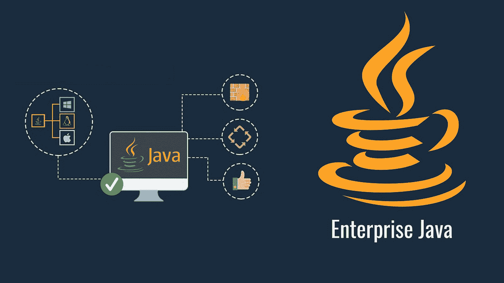

# 关于 Java EE 入门您需要知道的一切

> 原文：<https://medium.com/javarevisited/everything-you-need-to-know-about-getting-started-with-java-ee-57c8702198fa?source=collection_archive---------3----------------------->

Java 企业版

Java 是一个相当复杂的话题，对于一个刚刚开始学习这些东西的新手来说，这就更加令人困惑了。再加上一些行业术语，如 Java SE、核心 Java、J2SE、JAX、MVC，你就会得到一个灾难的配方。在本文中，我们将尝试简化重要的概念，以帮助您真正开始使用 [Java 企业版(JEE)](https://www.eduonix.com/projects-in-enterprise-java#utm_source=medium&utm_medium=social&utm_campaign=sdaprl) 。

对于一个绝对的新手来说，你需要明白的一点是，Java 编程语言和 Java 平台是两回事。Java 平台，如 Java 标准版或 Java 企业版(我们稍后会谈到这些)使用 Java 编程语言。语言是用于编写程序的编码，但平台是用于实际构建程序和部署程序的。这是你需要记住的主要区别之一。

**Java SE vs Java EE**

这里，我们不打算关注语言，而是关注平台。有两种不同类型的平台— Java SE(标准版)和 Java EE(企业版)。Java SE 是一个基础平台，它提供了一系列通用的 API，比如用于 Java 类库的 Java API。这些可以用来在 Java 平台上构建应用程序和程序。

另一方面，Java EE 平台是为那些需要大型可伸缩分布式系统来构建批量应用程序的公司而设计的。它包括用于数据库访问( [JDBC](http://www.java67.com/2018/03/top-5-free-jdbc-courses-for-java.html) 、 [JPA](https://javarevisited.blogspot.com/2018/01/top-5-hibernate-and-jpa-courses-for-java-programmers-learn-online.html) )、远程方法调用(RMI)、消息传递(JMS)、web 服务、XML 处理的附加库，并为 Enterprise JavaBeans、[servlet](http://www.java67.com/2018/02/5-free-servlet-jsp-and-jdbc-online-courses-for-java-developers.html)、portlets、Java 服务器页面等定义了标准 API。

# Java 企业版

Java EE 以前被称为 Java 2 Platform，Enterprise Edition 或 J2EE，由 Sun Microsystems 与 IBM 合作开发。最初创建它是为了通过创建可以自动化过程的标准模块和组件来简化应用程序开发和减少代码编写量。

Java EE 的主要目标是简化开发人员在通过不同的 API 构建现代应用程序时面临的常见问题。Java EE 自带的一些[突出的 API](https://www.theserverside.com/definition/J2EE-Java-2-Platform-Enterprise-Edition)包括 Servlet、JavaServer Pages (JSP)、Java Persistence API (JPA)、Enterprise JavaBeans (EJB)、JSP 标准标签库( [JSTL](http://javarevisited.blogspot.sg/2014/11/how-to-loop-hashmap-or-hashtable-in-jsp-example.html#axzz50xyqsjvD) )、Java EE 容器等。

# 学习 Java EE

围绕这个话题有如此多的困惑，学习它完全成了另一个问题。有完整的课程和教程专门帮助您学习这个平台。但是，他们中的大多数人只是简单地专注于理解理论。当学生完成课程后，这就成了一个问题，他们被卡住了。

为了解决这个问题，Eduonix 开设了一门沉浸式课程，包括理论、实际应用，甚至动手项目。企业 [Java 教程](https://www.eduonix.com/projects-in-enterprise-java#utm_source=medium&utm_medium=social&utm_campaign=sdaprl)中的项目不仅包括什么是 Java EE 及其不同组件的理论，而且您还将看到如何使用它的实例，您还将构建自己的 5 个项目！这确保了课程结束后，您将能够在 Java 平台上构建自己的项目。

其他**编程篇**你可能喜欢的
[2019 年学习 Java EE 的前 5 门课程](https://javarevisited.blogspot.com/2018/09/top-5-java-ee-courses-to-learn-online.html)
[2019 年学习 Python 的 10 个理由](https://javarevisited.blogspot.com/2018/05/10-reasons-to-learn-python-programming.html)
[2019 年你可以学习的 10 种编程语言](http://www.java67.com/2017/12/10-programming-languages-to-learn-in.html)
[每个 Java 开发者都应该知道的 10 个工具](http://www.java67.com/2018/04/10-tools-java-developers-should-learn.html)
[学习 Java 编程语言的 10 个理由](http://javarevisited.blogspot.sg/2013/04/10-reasons-to-learn-java-programming.html)
[2010 年 Java 和 Web 开发者应该学习的 10 个框架 2019 年更好的 Java 开发者](http://javarevisited.blogspot.sg/2018/01/10-frameworks-java-and-web-developers-should-learn.html)
[2019 年要学习的 5 大 Java 框架](http://javarevisited.blogspot.sg/2018/04/top-5-java-frameworks-to-learn-in-2018_27.html)
[每个 Java 开发者都应该知道的 10 个测试库](https://medium.freecodecamp.org/these-are-the-top-testing-tools-libraries-and-frameworks-for-java-developers-8c0e3f9bc11d)