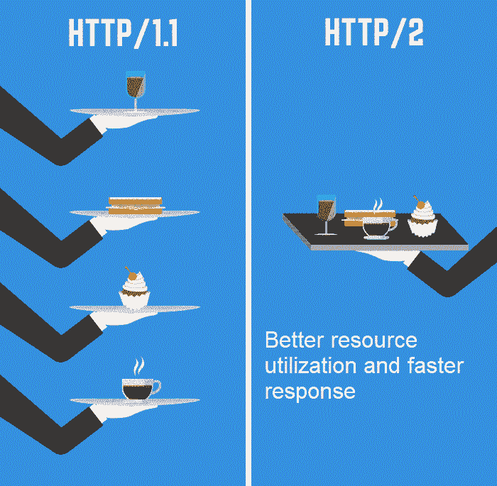

# 关于 HTTP/2 协议你需要知道的一切

> 原文：<https://medium.com/javarevisited/everything-you-need-to-know-about-http-2-protocol-e64bfffafe47?source=collection_archive---------2----------------------->

图片来源:[https://CSS-tricks . com/WP-content/uploads/2017/02/image 02 . gif](https://css-tricks.com/wp-content/uploads/2017/02/image02.gif)

大家好。在本文中，我们将了解什么是 HTTP/2，它的特性、术语和优点。我们还将比较 HTTP/2 和 HTTP/1，并看到一个关于 HTTP/3 的简要介绍来结束本文。让我们开始吧。

如果你有兴趣了解 HTTP 和 HTTP(S ),请浏览我下面的文章