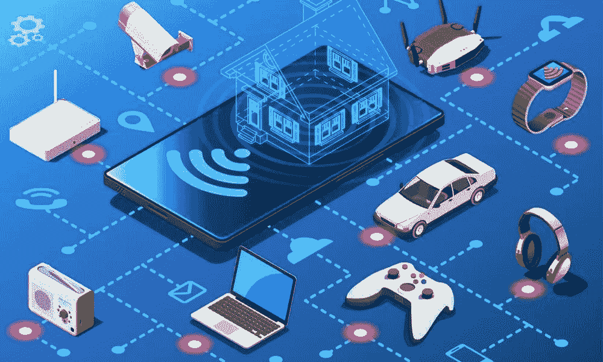

# 关于 IoT(物联网)你需要知道的一切

> 原文：<https://medium.com/javarevisited/everything-you-need-to-know-about-iot-internet-of-things-1b481e917edc?source=collection_archive---------0----------------------->

图片来源:[https://media . kasperskycontenthub . com/WP-content/uploads/sites/43/2018/09/18085355/abstract-IOT-1000 x600 . jpg](https://media.kasperskycontenthub.com/wp-content/uploads/sites/43/2018/09/18085355/abstract-iot-1000x600.jpg)

大家好，你可能听说过时髦的词[物联网](/javarevisited/my-favorite-courses-to-learn-internet-of-things-iot-in-2020-best-of-lot-8517aa9fc838)，但可能没有深入探讨过。让我们在本文中详细了解一下物联网。

# IoT 是什么？

物联网是指嵌入传感器和软件的设备或设备网络，通过互联网连接到其他设备和系统…