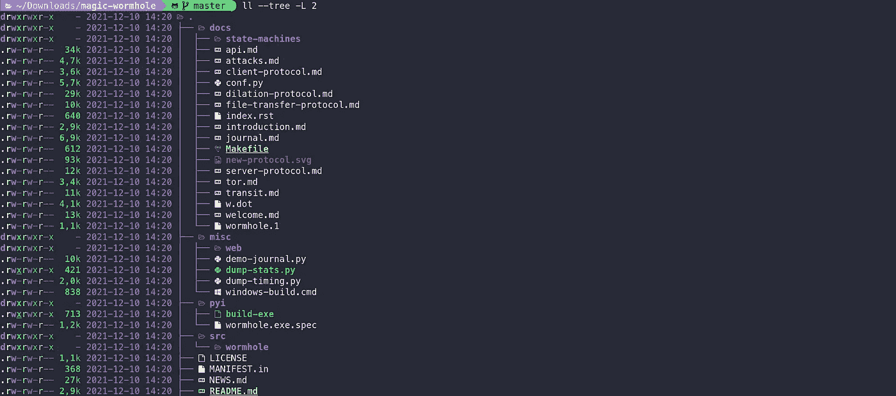

# Exa 是更好的 ls。在终端上更快地掌握信息。

> 原文：<https://medium.com/javarevisited/exa-is-the-better-ls-grasp-information-faster-on-your-terminal-c7918ff3a5a7?source=collection_archive---------0----------------------->

## 让浏览文件变得更有趣。



大家每天都用`ls`。它出现在我最常用的十个命令中的六个(根据最近的 6803 个命令计算):

```
 2000 git
    589 mvn
    427 gcloud
    392 ./ci/deploy
    298 cd
   ** 237 ls**
    223 docker
    193 sudo
    140 curl
    113 terraform
```