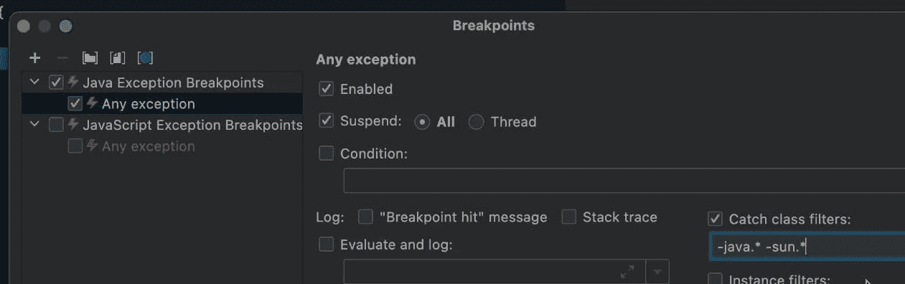
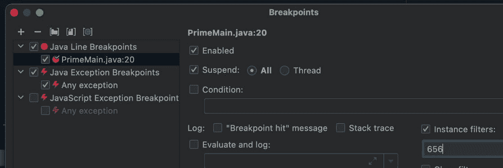
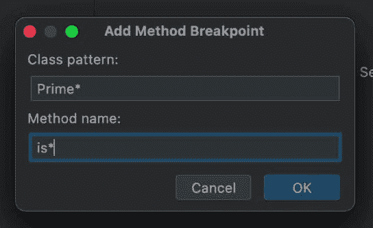
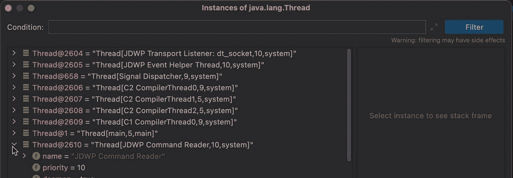

# 不糟糕的异常断点和方法断点的真实用例

> 原文：<https://medium.com/javarevisited/exception-breakpoint-that-doesnt-suck-and-a-real-use-case-for-method-breakpoints-d1f04d41dd6e?source=collection_archive---------2----------------------->

两周前，[我以一种“扣人心弦”](https://talktotheduck.dev/basics-of-breakpoints-you-might-not-know)的方式离开了这个系列。嗯，虽然编程博客可以让事情悬而未决，但其中最大的一个前提是异常断点不必太糟糕。如果你过去用过它们，你就会知道抓住所有的异常是荒谬的。你每一秒钟都会在一个断点处结束，这没有任何帮助。

有一个解决方案，在《小鸭 6》中讨论过，7 号也涵盖了很多我们感兴趣的领域，还有另一个关于方法断点的悬念:

# 过滤

过滤器解决了“嘈杂”断点的问题。它们让我们将断点限制在一个非常具体的狭窄区域，然后我们可以更随意地检查它。当[调试](https://javarevisited.blogspot.com/2011/02/how-to-setup-remote-debugging-in.html)一个大项目时，这是我们可以使用的无价工具。

# 捕捉类

这一特性使得异常断点值得拥有。但是让我们后退一点来讨论这个问题……至少对于 JVM 语言来说。

对于一个典型的 web 请求，Java 需要执行许多操作，这些操作的唯一响应是一个异常。例如，URL 请求将需要报头解析。如果头中的数字与您预期的不同，将抛出一个`NumberFormatException`……它被捕获在 [JVM](/javarevisited/7-best-courses-to-learn-jvm-garbage-collection-and-performance-tuning-for-experienced-java-331705180686) 实现中，因为它是预期的。

但是对于这个异常和 JVM 代码中的许多其他异常，异常断点支持仍然会中断。对于任何重要的应用程序来说，这都是一个问题。

解决办法很简单。过滤掉 java 或 sun 根包中的捕获类。我们可以在当前断点对话框中使用过滤器`-java.* -sun.*`来做到这一点，注意用于过滤掉包的字符`-`。这个小类过滤器将去除多余的噪音，让您专注于您捕捉到或没有捕捉到的异常。未捕获的异常在调试器中几乎总是有用的，因为它会导致应用程序致命错误。

您可以根据需要添加额外的过滤器来覆盖其他[库](/javarevisited/20-essential-java-libraries-and-apis-every-programmer-should-learn-5ccd41812fc7)和您自己的类。这是一个显著的特点！

在所有的断点类型中，我觉得这些是最有潜力的。我希望更多的人用这个过滤器默认打开这个(它本身应该是默认的)。

# 情况

这将断点限制在当前对象。这是我通常会使用条件断点的地方。问题是条件可能会导致错误，例如在实例难以区分的情况下。条件也需要更多的工作。

当应用实例过滤器时，需要从观察器中获取对象 ID，并将其用于字段。

# 班级

起初，类过滤器似乎是多余的，直到我们看到我们有更精细的断点。一个很好的例子是 field watchpoint，假设该字段不是私有的，它可以由不同类的访问来触发。

假设你有一个公共域，你担心有人在你的类之外读或者写。您的代码不能更改，因为遗留问题太多。使用信息向您显示谁在使用它，但是它分散在各处…您只是想看看在这个时间段内是否有人在实际访问该字段…

在这种情况下，您可以添加一个类过滤器，以便只在不属于类集的字段 watchpoint 中进行访问。

# 呼叫者

你是否曾经到达一个断点并查看堆栈…然后一直按 continue，直到堆栈改变为包含你想要的方法。调用你电话的那个。这就是呼叫者过滤器的用武之地。您可以不考虑特定的堆栈元素，也可以要求特定的方法。

# 方法断点

你可能还记得我提到过你不应该使用方法断点…它们通常只是由行断点来模拟，以避免它们典型的开销。所以当在一个方法上放置一个时，实际上并不需要它们。

但是还有另一种方法。您可以使用过滤器/名称添加断点，例如，您可以向所有以单词“Prime”开头的类中以单词“is”开头的所有方法添加断点，正如我们在这里看到的。

这听起来可能有点过分，但是有一个常见且有效的用例。想象一下，使用一个遵循命名约定的复杂多态 API。很难知道调用哪个方法来处理哪个行为。这样，你可以用一个简单的模式抓住所有的嫌疑人。那么你如何处理过多的噪音呢？

我们可以像在程序的其他地方一样使用条件断点。我们可以使用跟踪点和上面列表中几乎所有的选项。

# 显示对象

对于最后一节，我将转到手表，而不是当前的断点讨论。这是一个非常酷、非常简单的特性……但对许多开发人员来说却很陌生。当您右键单击 IntelliJ watch 中的一个对象时，您可以要求显示“所有对象”。这字面上的意思是进程中的所有对象。

当你在一个`Thread`对象上这样做时，你会看到 JIT 编译器线程。在一个`String`数组上执行此操作时，您可以看到内部 JVM 常量消息字符串。当你看着一个特定的对象，想知道“这是正确的实例吗”，那么...您可以查看所有实例，并通过右键单击进行验证。

您甚至可以用一个表达式语句来缩小列表，使它对更大的对象列表更加有用。

# TL；速度三角形定位法(dead reckoning)

我希望这让你大吃一惊。当我们试图构建一个应用程序时，有太多的调试器功能被我们忽略了。我们今天讨论的工具都是为调试大型代码库而设计的。这些工具的能力真正大放异彩的地方。

这些工具让我们可以轻松地在运行时定义复杂的逻辑，直接引导我们找到应用程序代码中的问题区域。

当您将这些功能整合到调试过程中时，它将会带来回报。