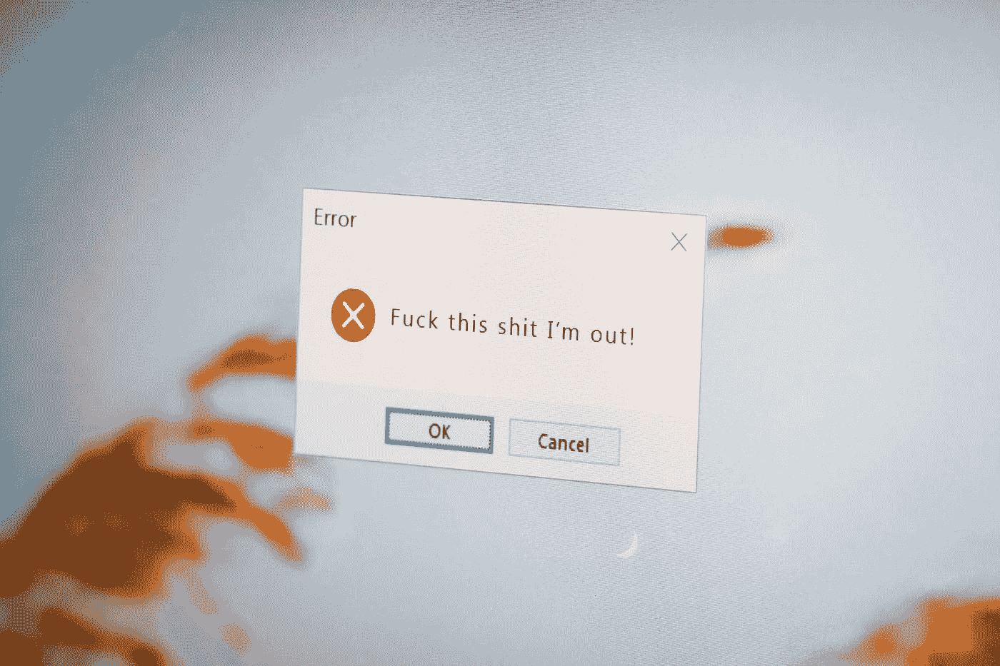

# 异常处理:三种图解方式

> 原文：<https://medium.com/javarevisited/exception-handling-3-ways-illustrated-40fe0322db1?source=collection_archive---------3----------------------->

我们将探讨几种处理异常的方法，以便您可以为您的应用程序选择您最喜欢的方法。

[农旺](https://unsplash.com/@californong?utm_source=medium&utm_medium=referral)在 [Unsplash](https://unsplash.com?utm_source=medium&utm_medium=referral) 上的照片

这是一个很少处理的主题，但在我们的应用中却无所不在。我们将通过例子看到处理错误的不同方法。目标是让您能够比较几种方法。对于技术负责人来说，心中有选择是很重要的。