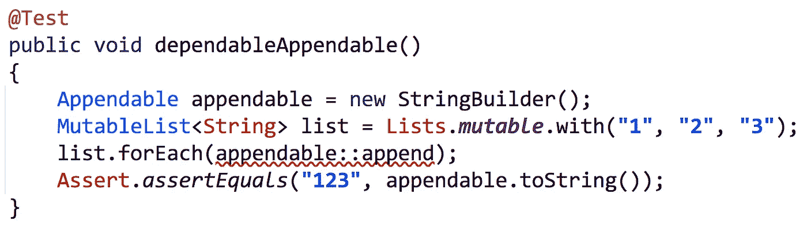
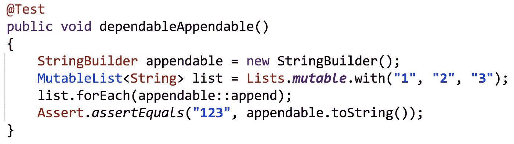
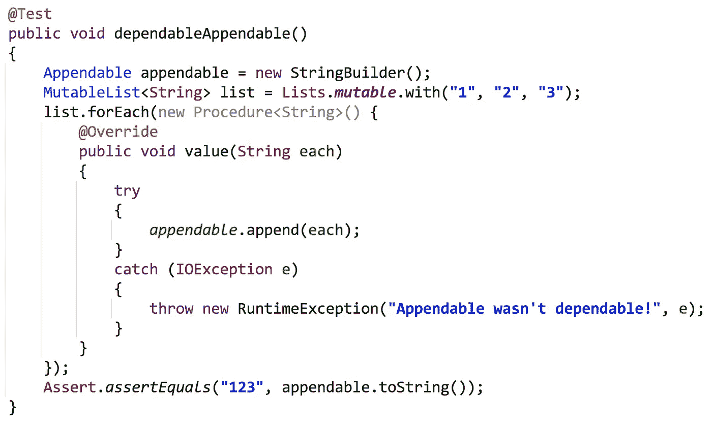
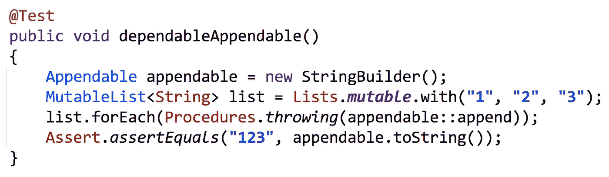
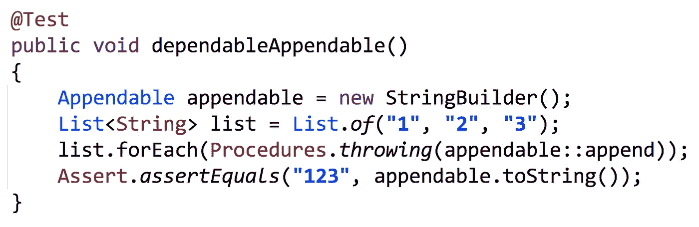
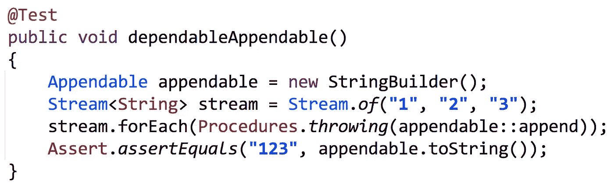

# Eclipse 集合中的异常处理

> 原文：<https://medium.com/javarevisited/exception-handling-in-eclipse-collections-9e37a68fc6a9?source=collection_archive---------1----------------------->

Java 8 之前和之后处理 [Eclipse 集合](https://github.com/eclipse/eclipse-collections)中异常的一些策略

用迭代模式和 lambdas 处理检查过的异常可能感觉像在冰上行走

# 这篇文章的灵感来源

Brian Vermeer 写了一篇关于 Java 流中异常处理的博客。

 [## Java 流中的异常处理

### 自版本 8 以来，流 API 和 lambda 是 Java 的一大改进。从那时起，我们可以和…

开发到](https://dev.to/brianverm/exception-handling-in-java-streams-2mjh) 

这篇文章让我想起了几年来我们在 [Eclipse 集合](https://github.com/eclipse/eclipse-collections)中对异常处理的支持。我想我会展示一些在 Java 8 之前和之后使用 Eclipse 集合处理检查异常的简单例子。我还将展示将与 [Java 流](/javarevisited/7-best-java-tutorials-and-books-to-learn-lambda-expression-and-stream-api-and-other-features-3083e6038e14)一起工作的例子。

# 可靠的附件

Java 里有个接口叫`Appendable`。`Appendable`是`StringBuilder`、`StringBuffer`、`PrintStream`等几个类的父接口。这个接口从 Java 5 开始就存在了。它定义了一个方法`append`，如下所示:

如果我创建了一个`String`的`MutableList`，并试图使用`append`作为`forEach`方法的方法引用，我的 IDE 会给我一个警告，说有一个未处理的异常:`java.io.IOException`。

未处理的异常:`java.io.IOException`

事实证明，`StringBuilder`并没有在`append`方法的方法签名中抛出一个`java.io.IOException`。所以如果我把类型改成`StringBuilder`，异常就会消失。

StringBuilder accept 方法不会抛出`java.io.IOException`

如果我将代码改为使用`StringBuffer`，情况也是如此。然而，所有处理文件的`Appendable`实现很可能会抛出异常。因此，如果我使用接口，而不是具体的实现，我将不得不处理异常。Java 8 之前处理异常**的丑陋方式可能如下所示。**

这是一种常见的模式，捕捉一个被检查的异常并抛出一个`RuntimeException`。在 Java 8 之前，我们经常在 Eclipse 集合中拥有不同功能接口的特定“检查”版本。每个函数接口包(函数、谓词、过程)中都有一个名为“checked”的包。使用`[CheckedProcedure](https://www.eclipse.org/collections/javadoc/10.4.0/org/eclipse/collections/impl/block/procedure/checked/CheckedProcedure.html)`，我们可以将代码简化如下:

Java 8 之前如何处理检查异常

如果`Appendable`抛出异常，异常将被捕获，如果是`RuntimeException`，异常将被冒泡。如果是已检查的异常，将创建一个`RuntimeException`并抛出，将已检查的异常设置为原因。

在 Java 8 之后，我们引入了新的接口来处理检查异常。对于每种功能接口类型(`Function`、`Predicate`、`Procedure`)，都有相应的“投掷”类型(`[ThrowingFunction](https://www.eclipse.org/collections/javadoc/10.4.0/org/eclipse/collections/impl/block/function/checked/ThrowingFunction.html)`、`[ThrowingPredicate](https://www.eclipse.org/collections/javadoc/10.4.0/org/eclipse/collections/impl/block/predicate/checked/ThrowingPredicate.html)`、`[ThrowingProcedure](https://www.eclipse.org/collections/javadoc/10.4.0/org/eclipse/collections/impl/block/procedure/checked/ThrowingProcedure.html)`)。功能接口在工厂上也有相应的方法(`[Functions.throwing](https://www.eclipse.org/collections/javadoc/10.4.0/org/eclipse/collections/impl/block/factory/Functions.html#throwing(org.eclipse.collections.impl.block.function.checked.ThrowingFunction))`、`[Predicates.throwing](https://www.eclipse.org/collections/javadoc/10.4.0/org/eclipse/collections/impl/block/factory/Predicates.html#throwing(org.eclipse.collections.impl.block.predicate.checked.ThrowingPredicate))`、`[Procedures.throwing](https://www.eclipse.org/collections/javadoc/10.4.0/org/eclipse/collections/impl/block/factory/Procedures.html#throwing(org.eclipse.collections.impl.block.procedure.checked.ThrowingProcedure))`)。将这些特性与 Java 8 或更高版本结合使用，我们现在可以编写以下代码:

用 Java 8 或更高版本处理检查异常

您也可以对 [Java 集合](https://javarevisited.blogspot.com/2020/04/top-5-courses-to-learn-java-collections-and-streams.html#axzz6XMFoMrEo)和 [Java 流](https://javarevisited.blogspot.com/2018/08/top-5-java-8-courses-to-learn-online.html)使用相同的方法。

在接受消费者的 Iterable 上使用 Java 8+ forEach 方法

这段代码有效，因为 Eclipse 集合中的`Procedure`接口扩展了`Consumer`接口。代码也可以作为`Stream`使用。

使用流 forEach，它也接受消费者

# 抛出自己的运行时异常

如果您想要控制抛出的 RuntimeException 的类型，有一个重载版本的抛出方法支持这一点。

Function2 接受当前元素、捕获的异常和要重新抛出的 RuntimeException 类型

假设我想重新抛出一个`UndependableAppendableException`，以防`IOException`在调用`append`时被捕获。代码可能如下所示:

UndependableAppendableException 构造函数与抛出

注意，我在这里保留了使用 Java Stream 的代码。对 Eclipse 集合中的`List`或`MutableList`使用`forEach`也是一样。

# 但是等等，关于…

这是 Eclipse 集合中现有的异常处理功能。如果您想要额外的功能，可以考虑提交请求特性的问题，或者通过对 Eclipse 集合项目的 pull 请求做出贡献。我们欢迎 Eclipse 集合的新贡献者。查看下面的博客，了解更多关于如何开始的信息。

 [## 寻求帮助！

### 嘘！我要告诉你一个秘密。对于一些人来说，这可能只是改变他们的软件…

medium.com](/@donraab/help-wanted-b1acf25d8c8d) 

*我是*[*Eclipse Collections*](https://github.com/eclipse/eclipse-collections)*OSS 项目在*[*Eclipse Foundation*](https://projects.eclipse.org/projects/technology.collections)*的项目负责人和提交人。* [*月食收藏*](https://github.com/eclipse/eclipse-collections) *为* [*投稿*](https://github.com/eclipse/eclipse-collections/blob/master/CONTRIBUTING.md) *。如果你喜欢这个库，你可以在 GitHub 上让我们知道。*