# Java 中的异常处理。

> 原文：<https://medium.com/javarevisited/exception-handling-in-java-503cab4d4742?source=collection_archive---------2----------------------->

大家好，这篇文章将包括 Java 中异常处理的大部分内容。我们中的大多数人试图学习并擅长编程语言，如 [java](/javarevisited/10-free-courses-to-learn-java-in-2019-22d1f33a3915) 、 [python](/javarevisited/8-advanced-python-programming-courses-for-intermediate-programmer-cc3bd47a4d19) 、 [c#](/javarevisited/5-best-c-c-sharp-programming-courses-for-beginners-in-2020-494f7afc7a5c) 和其他语言，努力在互联网上找到好的、简单的和有用的内容。

我们大部分时间都花在寻找好的网站和 YouTube 视频或教程来学习编码。

在这篇文章中，我将讲述 java 中的异常处理，这将帮助你很好地了解这个主题。也会在本文最后补充面试问题。

首先，

# **什么是例外？**

异常就像是程序执行过程中扰乱程序正常流程的障碍。因此，该计划将停止或中断，这是真的不建议。

> 定义:异常是一种意外事件，通常在程序执行过程中出现。这导致程序的正常流程中断，然后程序异常停止。

# 什么是异常处理？

异常处理是一种有助于保持程序正常流程的技术，即使在执行期间代码中出现意外问题。通常出现的问题有:

1.  错误的输入数据格式，
2.  网络连接失败，
3.  打开一个不存在的文件等等。

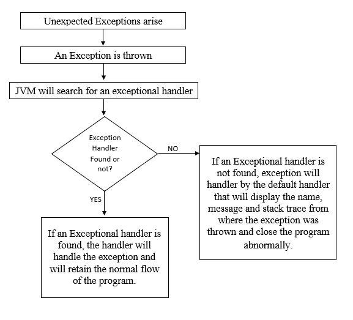

处理异常所遵循的步骤

# 异常层次结构

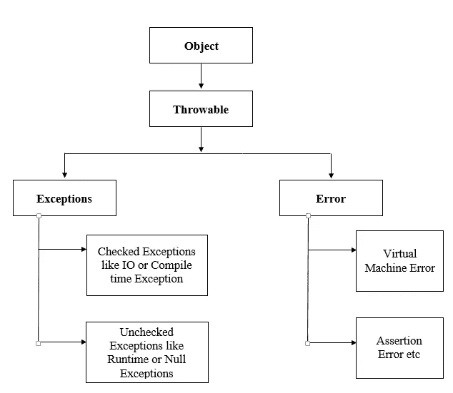

异常层次结构

# 例外的类型

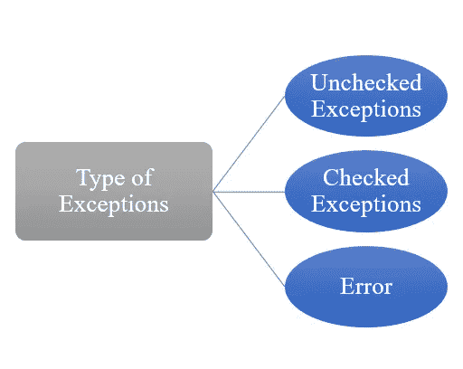

例外的类型

java 中有两种类型的异常:

1.  检查异常
2.  未检查的异常
3.  错误

**检查异常:** *仅在编译时由编译器处理或检查的异常。例如 IOException、SQLException、中断异常、FileNotFoundException 等。*

**未检查的异常:** *只在执行或运行时处理或检查的异常。示例有算术异常、数字格式异常、数组索引输出异常、安全异常等。*

**错误:** *错误是不可逆的。它总是在运行时发生。这是由应用程序运行的环境造成的。例如 OutOfMemoryError、AssertionError 等。*

# **基本异常处理程序**

# 内置异常

这些是 Java 库中已经存在的异常。这有助于处理某些错误情况。

一些内置异常包括:

**算术异常**

当由于某些算术运算而发生异常时抛出。

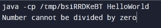

以上代码的输出

**ArrayIndexOutOfBoundException**

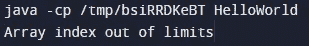

以上代码的输出

**数字格式异常**

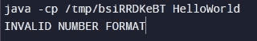

以上代码的输出

**StringIndexOutOfBoundsException**

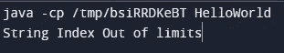

以上代码的输出

还有更多…

# 用户定义的异常

用户定义的异常是 java 异常库中不存在的异常。我们程序员过去常常创建和使用我们自己设计的异常，以便增强错误语句，更好地理解。

Java 为我们提供了开发自己的异常和使用 throw 关键字抛出异常的工具。

下面我实现了用户定义的异常，看看吧

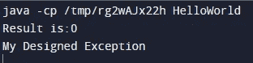

以上代码的输出

# 异常处理关键字

Java 异常处理主要由五个关键字管理:

Java 异常处理中使用的关键字

下面我就来阐述一下关键词。

**试试**

这个块用于指定我们应该放置异常代码的块。

语法:

*尝试{//引发异常的代码}*

嵌套 Try:Try 块中的一个或多个 Try 块。

**接住**

该块用于处理异常。

语法:

*catch(异常 e){//异常的处理}*

多 catch:一个程序中的一个或多个 Catch 块。

**最后**

这个块用于指定我们无论如何都要运行的重要代码。即使出现异常且没有使用 catch 块处理，finally block 语句肯定会运行。这个块通常包括关闭连接或流等代码。

**投掷**

这是一个用于抛出异常的关键字。

**摔投**

这是一个用于声明异常的关键字。它不抛出任何异常，但是告诉我们在一个方法中可以有任何异常。总是与方法签名一起使用。它给程序员一个信息，可能会有异常。

# **异常传播**

异常传播是一个概念，它将异常从一个方法转移到它的前一个方法，以便处理异常。

让我们看一个例子，更好地理解，

在这个例子中，我们采用了两种方法，m1()和 m2()。我们在 m1()中调用了 m2()方法，并在 m2()方法中引发了一个异常。但是我们只是提出了一个异常，而没有处理它。因此，它将异常传播到之前的方法或调用方方法，现在调用方方法(m1()方法)负责处理异常。

# 抛出异常

当引发异常时，首先由 catch 块捕获该异常，然后使用 throw 关键字再次引发该异常。

请参见示例，以便更好地理解。

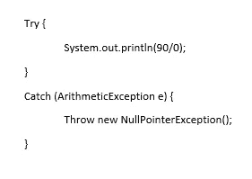

在这一点上，我们可以清楚地看到打印语句中会有错误。引发异常将是 ArithmeticException，我们已经使用 catch 块处理了它。但是我们已经抛出了异常，并将算术异常转换为另一个异常，即 NullPointerException。

将一个异常转换成另一个异常类型是在抛出异常的帮助下完成的。

所以，伙计们，我希望你们现在感觉很好，很放松，就像你们在 java 中处理异常一样。这是 java 中非常重要的概念。大多数面试官只从这个话题提问。但是不要太紧张，因为你可以自信地谈论异常处理。

我写下了一些差异，这对你准备面试会有很大帮助。

错误与异常

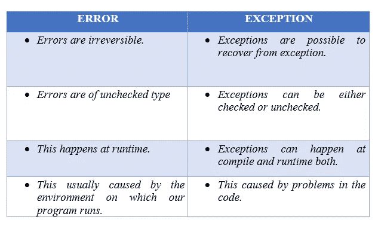

投掷 vs 投掷

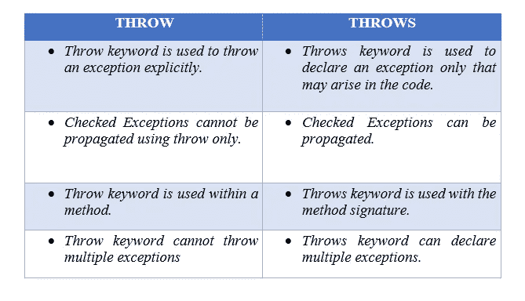

我被问到的一些面试问题是:

1.  定义例外。
2.  定义例外处理。
3.  什么是投掷和投掷。
4.  投掷和投掷的区别。
5.  什么是未检查和已检查的异常。
6.  终于被什么堵住了。
7.  定义内置异常并提及一些内置异常。
8.  定义用户定义的异常，并说明如何执行。
9.  什么是异常传播。
10.  什么是抛出一个异常。
11.  异常类的基类。
12.  告诉我异常类的层次结构。

祝你们一切顺利。我希望你们都理解 java 中的异常主题。它只需要在特定的主题上做大量的练习。尝试编写关于异常处理的代码。努力学习并记住出现的异常和错误。这对你以后肯定有帮助。

*谢谢大家*