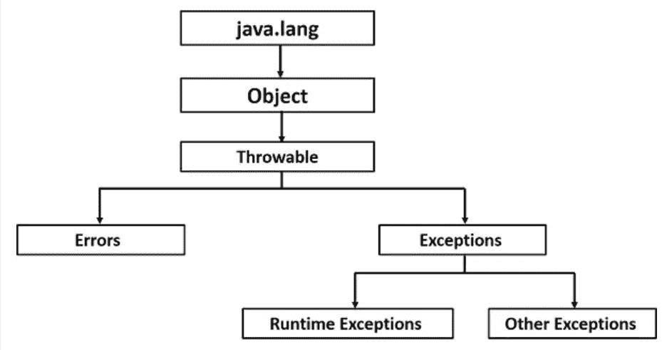

# Java 中的异常处理

> 原文：<https://medium.com/javarevisited/exception-handling-in-java-89e4b292626f?source=collection_archive---------3----------------------->

异常是运行代码时发生的不需要的事件。

下面是 Java 中的类层次结构:



基本思想是: **try** 会有可能抛出错误的业务逻辑。 **catch** 块有处理和捕捉异常的代码。**最后**块用于清理目的，如关闭流、关闭文件、删除文件。

# 尝试捕捉块:

下面的代码在编译期间给出了一个错误。原因是 createFile()是 java.io.File 包的一个方法，它在内部抛出一个异常。

```
public class DemoException {
    static DemoException *demoException*;

    public static void main(String args[]) throws IOException {
        *demoException* = new DemoException();
        *demoException*.createFile();
    }
    void createFile() {
        File myFile = null;
        myFile = new File("newFile.txt");
        System.*out*.println(myFile.getAbsolutePath());
        if (myFile.createNewFile()) {
            System.*out*.println("File is created!");
        } else {
            System.*out*.println("File already exists.");
        }
    }
}
```

有两种方法可以修复编译时问题:

1。Add 在方法定义行中引发 IOException

```
void createFile() **throws IOException** {
    File myFile = null;
    myFile = new File("newFile.txt");
    System.*out*.println(myFile.getAbsolutePath());
    if (myFile.createNewFile()) {
        System.*out*.println("File is created!");
    } else {
        System.*out*.println("File already exists.");
    }
}
```

2.使用 try catch 块

```
void createFile() {
    **try** {
        File myFile = null;
        myFile = new File("newFile.txt");
        System.*out*.println(myFile.getAbsolutePath());
        if (myFile.createNewFile()) {
            System.*out*.println("File is created!");
        } else {
            System.*out*.println("File already exists.");
        }
    } **catch** (Exception e) {
        System.*out*.println("An exception was thrown" + e);
    }
}
```

因此，当您调用任何方法时，如果它抛出一个错误，您将不得不在方法定义中或者用 try catch 块来捕获异常。

下面是一个例子:

下面的代码将再次给出一个编译器异常，因为 fileOperations 方法不处理 createFile()抛出的异常。

```
public class DemoException {

    public static void main(String args[]) {
        *fileOperations*();
    }
    static void fileOperations() { **// compile time issue as exception is not handled
            File file = *createFile*();**
    }
    static File createFile() throws IOException {
        File myFile = null;
        try {
            myFile = new File("newFile.txt");
            System.*out*.println(myFile.getAbsolutePath());
            if (myFile.createNewFile()) {
                System.*out*.println("File is created!");
            } else {
                System.*out*.println("File already exists.");
            }
        } catch(Exception e) {
            System.*out*.println("An exception catched :" +e);
            throw new IOException();
        }
        return myFile;
    }
}
```

正确的解决方案是在方法定义中使用 try catch 或 throws 异常，如下所示:

```
static void fileOperations() {
   ** try** {
        File file = *createFile*();
    } **catch** (Exception e) {

    }
}
```

或者

```
static void fileOperations() **throws IOException**{
        File file = *createFile*();
}
```

# **尝试使用资源:**

基本上，try with resources 用于消除使用额外的 finally 块来关闭文件或流的复杂性。JVM 保证，一旦 try 块执行完成，资源将被关闭。

*一个 try catch 最后的格式:*

```
public class DemoException {

    public static void main(String args[]) {
        *method*();
    }
    static void method() {
        try{ 
            // open a file
            // open a file stream
        } catch(Exception e) {

        } finally {
            //close the file and the file stream
        }

    }
}
```

如果我们必须使用 try with resources 做同样的事情，那么我们将不会使用 finally，因为一旦 try 块执行完毕，默认情况下 JVM 将关闭 try 使用的流和文件。

**资源试用格式:**

```
public class DemoException {

    public static void main(String args[]) {
        *method*();
    }
    static void method() {
        **try()**{
            // business logic
        } catch(Exception e) {

        } 

    }
}
```

上面用粗体标记了代码，这是我们需要编写代码来打开任何资源(如文件和流)的地方。

尝试使用资源的示例:

```
 import java.io.File;
import java.io.FileOutputStream;
import java.io.IOException;
import java.io.OutputStream;
import java.util.logging.Level;
import java.util.logging.Logger;

public **class DemoException** {

    static DemoException *demoException*;

    private static final Logger *LOGGER* =  Logger.
                 *getLogger*(Logger.*GLOBAL_LOGGER_NAME*); **public static void main**(String args[]) throws IOException {
        *demoException* = new DemoException();
        ***demoException*.fileOperations**();
    } void **fileOperations**() {
        try {
            File file = *demoException*.**createFile**();
            *demoException*.**openOutputStream**(file);
        } catch (Exception e) {
            *LOGGER*.log(Level.*WARNING*, "Error in file");
        }
    } File **createFile**() {
        File myFile = null;
        try {
            myFile = new File("newFile.txt");
            System.*out*.println(myFile.getAbsolutePath());
            if (myFile.createNewFile()) {
                System.*out*.println("File is created!");
            } else {
                System.*out*.println("File already exists.");
            }
        } catch(Exception e) {
            *LOGGER*.log(Level.*WARNING*, "Error in creating file");
        }
        return myFile;
    }
    void **openOutputStream**(File file) throws IOException {
        **try (*OutputStream out = new FileOutputStream(file)*)** {
            write(out);
            System.*out*.println("Output Stream");
        }
    }
    void **write**(OutputStream out) throws IOException {
        throw new IOException();
    }
}Outputs an exception. write() throws an exception. The exception is then catched by openOutputStream(). openOutputStream although doesn't have a catch block, throws an exception to fileOperations(), which is catched and then on console we see an exception logged. 
Outputs : WARNING: Error in file
```

如果您看到上面的代码， **try with resources(用粗体标记)没有 catch 块，它在内部负责捕捉异常并将异常抛出给方法的调用方。**

# for 循环的异常处理:

如果运行下面的代码，控制台上会显示什么？

```
public class DemoException {
    public static void main(String args[]) {
        for(int i = 0; i<10;i++) {
            try {
                throw new RuntimeException();
            } catch (Exception e) {
                System.*out*.println("Error thrown" +e);
            }
        }
    }
}
```

这些选项包括:

1.  只打印一次异常
2.  将异常打印 10 次

**的答案是** —它将**打印 10 次**的异常，因为我们正在处理 for 循环中的所有异常。

但是，如果我们在 catch 块中专门抛出一个异常，那么用粗体标记的错误抛出语句将只打印一次。

```
public class DemoException {
    public static void main(String args[]) {
        for(int i = 0; i<10;i++) {
            try {
                throw new RuntimeException();
            } catch (Exception e) {
                **System.*out*.println("Error thrown" +e);**
                throw new RuntimeException();
            }
        }
    }
}
```

现在，如果我们在 for 循环之外使用了 try catch 块，那么“Error thrown”也只打印一次。

```
public class DemoException {
    public static void main(String args[]) {
        try {
            for (int i = 0; i < 10; i++) {
                throw new RuntimeException();
            }
        } catch (Exception e) {
            System.*out*.println("Exception thrown" +e);
        }
    }
}
```

**结论:** 希望这些实际例子涵盖了我们在日常工作中遇到的所有基本场景。如果你认为我可以添加更多的细节，或者你有任何特定的使用案例，请告诉我。