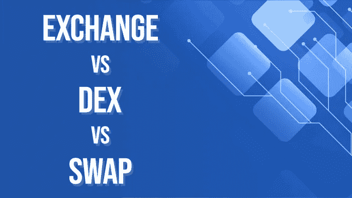

# 交换对指数对互换

> 原文：<https://medium.com/javarevisited/exchange-vs-dex-vs-swap-1395aa3e0510?source=collection_archive---------0----------------------->

2009 年，比特币作为加密货币的出现极大地推动了加密行业的发展。加密货币的缓慢而渐进的采用不仅凸显了证券交易所的发展，也将所有人的注意力引向了区块链。

[区块链](/javarevisited/best-blockchain-courses-and-certification-in-2020-63729f8f04d0)成为一项热门技术，越来越多的早期采用者利用互联网上的交换过程。交易所或集中交易所(CEX)、分散交易所(DEX)和掉期是通过区块链进行的不同类型的加密货币交易所。尽管 [CEX、DEX 和 Swap](https://www.leewayhertz.com/exchange-vs-dex-vs-swap/) 是受欢迎的加密交易所，但对任何希望进入加密货币交易领域的人来说，了解它们可能会派上用场。

**中央加密货币交易所(CEX)** 类似于传统的证券交易所，唯一的区别是人们可以将他们的法定货币(如美元)转换为比特币和[以太坊](https://javarevisited.blogspot.com/2021/11/top-5-courses-to-learn-ethereum-for.html)等加密货币。

所有 CEX 交易都由一个中央机构管理，交易所本身被视为“中间人”。集中式交易平台有一个存储用户数据的订单簿，有助于监管加密货币对法定货币的需求和供应。集中式平台的交易速度、数据量和交易量都要高得多，因为所有数据都通过专用服务器进行交换。由于有一个管理交易/交易所的中央机构，CEX 提供了极大的灵活性和安全性，使初学者可以很容易地在用户友好的平台上交易数字货币。CEX 交易平台的几个例子是币安和北海巨妖。

**另一方面，分散加密货币交易所(DEX)** 执行 CEX 的核心功能，但没有一个中央机构监管数据和交易。DEX 平台消除了银行和金融机构等第三方，促进了分散网络上的数字交易。DEX 的行为类似于[区块链](https://www.java67.com/2018/02/5-free-blockchain-technology-courses.html)上的 [dApps(去中心化应用)](https://www.leewayhertz.com/dapp-development-services/)，其中数据不在内部服务器和/或 IT 架构上交换。相反，使用生态系统中的智能合约来促进和监管交易所，该智能合约允许相关参与者为交易所存放预期的数字资产。买方和卖方可以不通过中间人直接进行交易，同时提供高水平的安全性，DEX 中涉及的用户可以保持匿名，因为这种交易只需要追踪到用户的公共地址。Uniswap、Bisq 和 GDEX 是一些流行的 DEX 平台。

有趣的是， **Swap** 交易所通过允许用户交易属于两种不同区块链协议的两种不同令牌，结合了 CEX 和 DEX 的功能。互换提供了直接从原始交易账户/私钥钱包中交换令牌/资产的好处，而不必将法定货币转换为货币或将令牌迁移到不同的区块链。顾名思义，掉期交易使数字资产交易变得更加容易，因为钱包内交易可以更快地促进非托管和链上交易。快速的交易速度和零网络费用是掉期交易受欢迎的额外因素。

# 哪个更好？—比较 CEX、DEX 和 Swap

像 CEX、DEX 和 Swap 这样的交易平台是区块链的结果。交易市场采用区块链对交易者在交易数字资产时寻求的隐私、安全和灵活性产生了巨大影响。监管、安全、数据验证、交易费用、用户界面和风险评估等方面对于决定你必须选择哪种虚拟交易至关重要。尽管此类交易所平台旨在解决与虚拟交易平台相关的“痛点”，但有几件事让一家交易所看起来比另一家更好。

# 监管/治理

各交易所在虚拟交易平台上如何监管，成为交易前需要考虑的重要因素。CEX 由一个中央机构(平台本身)监管，而 DEX 和 Swaps 则由智能合约代替中央机构来监管区块链上的交易。

# 数据验证

所有在 CEX 交易的加密资产都需要追溯到用户的凭证。因此，CEX 的每个交易者都需要通过 KYC(了解你的客户)注册并验证他们的证书。相反，DEX 和 Swaps 通过区块链地址而不是用户的凭据来促进匿名交易。

# 隐私和安全

与 CEX 相比，DEX 和 Swap 交易所提供了更高的安全性，因为分散式交易所无法追溯到用户。任何在 DEX 和 Swap 平台上交易的人都使用私人或公共地址。除了隐私，DEX 和互换比集中式交易所提供更高的安全性，因为 DEX 和互换上的区块链交易是由专家验证的。智能合约的使用也增加了 DEX 和掉期的安全性，而 CEX 使用户更容易受到风险、安全漏洞、黑客和数据操纵的影响。

# 交易费用

由于 CEX 涉及第三方，交易商通常不得不支付更高的交易成本，而 DEX 和掉期交易成本则更低。DEX 上没有第三方，使用户能够以零佣金和交易费进行交易，而便利交易账户之间直接交易的掉期交易为用户节省了网络费用。但是，对于从私钥钱包到交易帐户的交易以及私钥钱包到私钥钱包的交换，用户需要支付象征性的费用。

# 正在总结…

说到受欢迎程度，去中心化交易所(DEX)和去中心化交易平台的未来似乎更光明。密码专家预计，DEX 的市场份额在未来将呈指数级增长。话虽如此，中央交易所(CEX)继续以用户友好的界面和更强的监管和合规功能吸引虚拟交易者。虽然 CEX、DEX 和掉期共存于它们的优势和局限性，但它们继续为全球不同类型的用户普及加密货币交易。