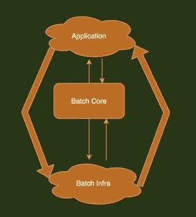
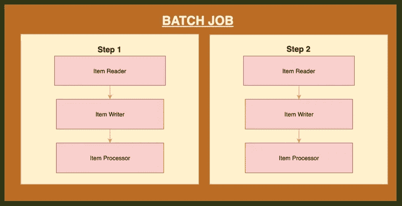

# 体验春批。

> 原文：<https://medium.com/javarevisited/experiencing-spring-batch-204bc1d27a60?source=collection_archive---------1----------------------->

#图片来自 JavainUse

Spring batch 是为批量数据处理开发和使用的轻量级框架。与基于 shell 和 db 的批处理相比，它更加高效和灵活。

Spring batch 是基于 Spring 框架的原理设计的，这使得开发工作更加灵活，并允许增强它以提高服务水平。

Spring batch 内部不提供任何调度功能，因此我们可以使用第三方调度程序，如 Tivoli、Control-M 等，或者我们可以使用 executor 框架通过自定义线程实现来调度它，以进行多任务并行处理或有序处理。

在这篇文章中，我将解释 spring batch 在开发活动中实现的两种方法，并且我将分享自定义的调度程序。

## Spring Batch 的基本架构:

批处理架构包含三个主要组件，即**应用程序、批处理核心**和**批处理基础设施**。

**应用程序**包含了所有的作业及其基于 spring batch 框架构建的代码。**批处理核心**包含启动批处理作业所需的所有 API。 **Batch Infra** 是另一个重要的组件，包含应用程序和核心组件使用的所有读取器、写入器和处理器。

上图显示了 spring 批处理的核心，即单个批处理中可以有多个作业，并且单个作业可以有多个步骤。每个作业将由作业启动器触发，我将在以后文章中解释多种类型的作业启动器。

## 使用 Spring 批处理

Spring batch 可以使用一个 [XML 文件](https://javarevisited.blogspot.com/2013/06/spring-helloworld-example-in-java-using-3.0-dependency-injection.html#axzz5yW1NnuQ4)或 [Java 类](https://www.java67.com/2019/10/spring-helloworld-example-in-Java-eclipse.html)来配置，在本文中我将使用 XML 文件来解释 spring batch。在 spring batch 的实现过程中，我创建了两个 xml 文件:

**1。definition context . XML**(非常类似于 bean 和其他配置声明的 spring 上下文)

**2。BatchJobConfig.xml** (所有的作业和步骤以及其他 task-let 操作都在其中声明)

由于代码共享的限制，我将共享两个 xml 的示例以供参考，并解释相同的内容以使您更好地理解。

## ***definition context . XML:***

> *<beans xmlns = " http://www . spring framework . org/schema/beans " http://www . spring framework . org/schema/beans/spring-beans . xsd>*<上下文:component-scan base-package = " package "/>
> 
> <bean class="”org.springframework.batch.core.scope.StepScope”"></bean>
> 
> <bean id="”config”" class="”org.springframework.beans.factory.config.PropertiesFactoryBean”"><property name="”location”"><value>类路径:*。属性</value></property></bean>
> 
> <bean id="”jdbcTemplate”" class="”org.springframework.jdbc.core.namedparam.NamedParameterJdbcTemplate”"><constructor-arg ref="”dataSource&quot;"></constructor-arg></bean>
> 
> <bean id="”jobLauncher”" class="”org.springframework.batch.core.launch.support.SimpleJobLauncher”" scope="”singleton”"><property name="”jobRepository”" ref="”jobRepository”"><property name="”taskExecutor”"><bean class="”org.springframework.core.task.SimpleAsyncTaskExecutor”"></bean></property></property></bean>
> 
> <bean id="”throttledTaskExecutor”" class="”org.springframework.batch.admin.util.ThrottledTaskExecutor”" scope="”singleton”">T17<property name="”throttleLimit”" value="”1&quot;"></property></bean>
> 
> <bean id="”dataSource&quot;" class="”org.springframework.jdbc.datasource.DriverManagerDataSource”"></bean>

在上下文 xml 中，我们已经声明了所有的 [spring bean](https://javarevisited.blogspot.com/2011/09/spring-interview-questions-answers-j2ee.html) 、[线程执行器](https://javarevisited.blogspot.com/2016/12/difference-between-thread-and-executor.html#axzz6ehrUZiIN)、任务执行器和数据源。它主要包含在整个应用中使用的通用配置，即批处理核心部分。

## **BatchJobConfig.xml**

> *<beans xmlns = " http://www . spring framework . org/schema/beans "*[*http://www . spring framework . org/schema/beans/spring-beans . xsd*](http://www.springframework.org/schema/beans/spring-beans.xsd)*>*<上下文:component-scan base-package = " package "/>
> 
> <bean import:=""></bean>
> 
>  <job id="“helloWorldJob”"><step id = " step 1 " next = " step 2 ">
> <tasklet>
> <chunk reader = " MySQL reader " writer = " fileWriter "
> processor = " custom item processor "></chunk>
> </tasklet>
> </step></job>
> 
>  <step id="“step2”"><小任务>
> <bean id:" tasklet 1 ">
> </小任务>
> </步骤>
> < /作业></step>

而在作业配置 XML 中，从体系结构的角度来看，它包含应用程序和批处理基础部分。读取器和写入器可以是任何与数据库相关的操作，也可以是编程方式的基本数据处理。

## 简要描述:

一个**项阅读器**从特定的源将数据读入 Spring 批处理应用程序，而一个**项写入器**将数据从 Spring 批处理应用程序写入特定的目的地。一个**项目处理器**是一个包含处理代码的类，它处理读入 spring 批处理的数据。

如果应用程序读取了 **"n"** 条记录，那么处理器中的代码将在每条记录上执行。当没有给出读取器和写入器时，一个**小任务**充当 SpringBatch 的处理器。它只处理一个任务。

例如，如果我们正在编写一个作业，其中包含一个简单的步骤，我们从 [MySQL 数据库](/javarevisited/top-5-courses-to-learn-mysql-in-2020-4ffada70656f)中读取数据，对其进行处理并将其写入一个文件(平面文件),那么我们的步骤使用

*   一个从 MySQL 数据库中读取数据的**阅读器**。
*   写入平面文件的**写入器**。
*   一个**定制处理器**，按照我们的意愿处理数据。

> <bean id="”jobLauncher”" class="”org.springframework.batch.core.launch.support.SimpleJobLauncher”" scope="”singleton”"><property name="”jobRepository”" ref="”jobRepository”"><property name="”taskExecutor”"><bean class="”org.springframework.core.task.SimpleAsyncTaskExecutor”"></bean></property></property></bean>

作业启动器是触发批处理作业的点。它用给定的一组参数启动批处理作业。上面的规范表示示例启动器代码。