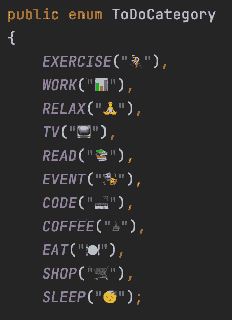
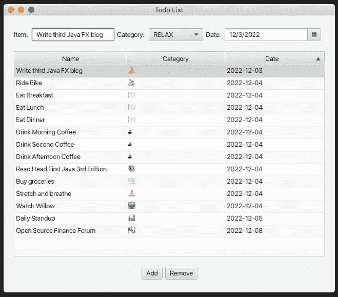

# 在 JavaFX 中试验 Java 枚举、表情符号和组合框

> 原文：<https://medium.com/javarevisited/experimenting-with-java-enums-emojis-and-combobox-in-javafx-2c12492cf65?source=collection_archive---------0----------------------->

了解如何在 JavaFX 组合框中使用 Java 枚举和表情符号。



带表情符号的 to directory Java 枚举

# 将我的 JavaFX 升级到 DoList 应用程序

在我的 Java `TodoListApplication`的第二次迭代中，我使用了 JavaFX `DatePicker`和`TableView`组件。我还引入了一个名为`ToDoItem`的 Java 记录，看看如何在 JavaFX 应用程序中使用记录。

[](/javarevisited/experimenting-with-java-records-datepicker-and-tableview-in-javafx-446ff272dfd2) [## 在 JavaFX 中试验 Java 记录、日期选择器和表视图

### 将我的 JavaFX ToDoList 从 ListView 升级到 TableView

medium.com](/javarevisited/experimenting-with-java-records-datepicker-and-tableview-in-javafx-446ff272dfd2) 

我在之前的博客中说过，我会坚持我的 ToDoList。我还打算这么做(下一篇博客！)，但是我意识到在使它持久化之前，我想先给我的`ToDoItem`添加一条信息。

## 添加 to directory 枚举

我想给我的`ToDoItem`记录添加一个类别，以便按类别跟踪待办事项。所以我创建了一个`ToDoCategory` enum，它的类别与我经常做的事情相匹配。

```
public enum ToDoCategory
{
    EXERCISE("🚴"),
    WORK("📊"),
    RELAX("🧘"),
    TV("📺"),
    READ("📚"),
    EVENT("🎭"),
    CODE("💻"),
    COFFEE("☕️"),
    EAT("🍽"),
    SHOP("🛒"),
    SLEEP("😴");

    private String emoji;

    ToDoCategory(String emoji)
    {
        this.emoji = emoji;
    }

    public String getEmoji()
    {
        return this.emoji;
    }
}
```

我为名为`getEmoji`的表情符号`String`添加了一个 getter。这一点以后会很重要。

## 更新我的`ToDoItem`记录

用`ToDoCategory`更新我的`ToDoItem`记录是一个相当简单的改变。重要的一点是，当`ToDoItem`持有对`ToDoCategory`的引用时，它将从`getCategory`方法中的类别返回`emoji`。

```
public record ToDoItem(String name, ToDoCategory category, LocalDate date)
{
    public String getCategory()
    {
        return this.category.getEmoji();
    }

    public String getName()
    {
        return this.name;
    }

    public String getDate()
    {
        return this.date.toString();
    }
}
```

## 添加组合框

下一步我想给我的`todolist-view.fxml`添加一个`ComboBox`。我将`todoCategory` `ComboBox`放置在`todoItem` `TextField`和`todoDate` `DatePicker`之间。

```
<HBox id="HBox1" alignment="CENTER_LEFT" spacing="5.0">
    <Label text="Item: " />
    <TextField fx:id="todoItem" />
    <Label text="Category: " />
    <ComboBox fx:id="todoCategory" />
    <Label text="Date: " />
    <DatePicker fx:id="todoDate" />
</HBox>
```

我将`ComboBox`绑定到一个名为`todoCategory`的变量，并将其添加到我的`TodoListController`中。

```
@FXML
public ComboBox<ToDoCategory> todoCategory;
```

然后我需要写一些代码，用所有的`ToDoCategory`枚举值填充`ComboxBox`中的值。于是我更新了`TodoListController`的`initialize`方法。

```
@FXML
protected void initialize()
{
    this.todoList.setColumnResizePolicy(TableView.CONSTRAINED_RESIZE_POLICY);
    MutableList<ToDoItem> items = Lists.mutable.empty();
    ObservableList<ToDoItem> list = FXCollections.observableList(items);
    this.todoList.setItems(list);
    ObservableList<ToDoCategory> categories = 
        FXCollections.observableList(Lists.mutable.with(ToDoCategory.values()));
    this.todoCategory.setItems(categories);
}
```

我用一个 [Eclipse 集合](https://github.com/eclipse/eclipse-collections) `MutableList`包装了从`ToDoCategory`枚举的`values`方法返回的数组，然后使用`FXCollections`实用程序类将其包装在一个`ObservableList`中。

显示在`ComboBox`中的文本是每个枚举的`toString`实现的返回值，它将是枚举文本本身。这正如我所希望的那样。

## 更新 onAddButtonClick 代码

当点击 add 按钮时，我现在需要用所有三个 UI 组件值构建`ToDoItem`实例。添加`todoCategory` `ComboBox`选择值很简单。

```
@FXML
protected void onAddButtonClick()
{
    ToDoItem item = new ToDoItem(
            this.todoItem.getText(),
            this.todoCategory.getValue(),
            this.todoDate.getValue());

    this.todoList.getItems().add(item);
}
```

## 向 TableView 添加类别列

最后，我想将类别列添加到`TableView`中。我觉得在这里显示`ToDoCategory`枚举的表情值会很酷。

```
<TableView fx:id="todoList">
    <columns>
        <TableColumn text="Name" minWidth="75.0" sortable="true">
            <cellValueFactory>
                <PropertyValueFactory property="name" />
            </cellValueFactory>
        </TableColumn>
        <TableColumn text="Category" minWidth="50.0" sortable="true">
            <cellValueFactory>
                <PropertyValueFactory property="category" />
            </cellValueFactory>
        </TableColumn>
        <TableColumn text="Date" minWidth="50.0" sortable="true">
            <cellValueFactory>
                <PropertyValueFactory property="date" />
            </cellValueFactory>
        </TableColumn>
    </columns>
</TableView>
```

我在 name 和 date 列之间添加了 category 列，并使其可排序。

# 我更新的 JavaFX 应用程序视图

这是我的 TodoListApplication 现在运行的样子。



你可能会注意到，我有一个阅读类别，但没有写作类别。我可能会改变这一点，但决定在这次迭代中，我会把写这篇博客归类在 RELAX 下。写作对我来说是一种精神放松。我保持非常专注，整理我的想法，并把它们写下来，减轻我的大脑不得不抓住太多信息的压力。写作是我精神上的瑜伽。

# 我的 todolist-view . fxml & TodoListController 源代码

为了方便起见，我已经将我的大部分代码(包括`ToDoItem`和`ToDoCategory`类型)放在了`TodoController`类中。我可能会在未来的迭代中改变这一点。自从我的上一篇博客以来，`TodoListApplicaton`代码没有改变，所以如果你想的话，请在那里查阅。

`todolist-view.fxml`

```
<?xml version="1.0" encoding="UTF-8"?>

<?import javafx.geometry.Insets?>
<?import javafx.scene.control.Button?>
<?import javafx.scene.control.cell.PropertyValueFactory?>
<?import javafx.scene.control.ComboBox?>
<?import javafx.scene.control.DatePicker?>
<?import javafx.scene.control.Label?>
<?import javafx.scene.control.TableColumn?>
<?import javafx.scene.control.TableView?>
<?import javafx.scene.control.TextField?>
<?import javafx.scene.layout.HBox?>
<?import javafx.scene.layout.VBox?>
<VBox alignment="CENTER" spacing="20.0" xmlns:fx="http://javafx.com/fxml"
    fx:controller="example.todolist.TodoListController">
    <padding>
        <Insets bottom="20.0" left="20.0" right="20.0" top="20.0" />
    </padding>

    <HBox id="HBox1" alignment="CENTER_LEFT" spacing="5.0">
        <Label text="Item: " />
        <TextField fx:id="todoItem" />
        <Label text="Category: " />
        <ComboBox fx:id="todoCategory" />
        <Label text="Date: " />
        <DatePicker fx:id="todoDate" />
    </HBox>
    <TableView fx:id="todoList">
        <columns>
            <TableColumn text="Name" minWidth="75.0" sortable="true">
                <cellValueFactory>
                    <PropertyValueFactory property="name" />
                </cellValueFactory>
            </TableColumn>
            <TableColumn text="Category" minWidth="50.0" sortable="true">
                <cellValueFactory>
                    <PropertyValueFactory property="category" />
                </cellValueFactory>
            </TableColumn>
            <TableColumn text="Date" minWidth="50.0" sortable="true">
                <cellValueFactory>
                    <PropertyValueFactory property="date" />
                </cellValueFactory>
            </TableColumn>
        </columns>
    </TableView>
    <HBox id="HBox2" alignment="CENTER" spacing="5.0">
        <Button text="Add" onAction="#onAddButtonClick" alignment="BOTTOM_LEFT" />
        <Button text="Remove" onAction="#onRemoveButtonClick" alignment="BOTTOM_RIGHT" />
    </HBox>
</VBox>
```

`TodoListController`

```
package example.todolist;

import java.time.LocalDate;

import javafx.collections.FXCollections;
import javafx.collections.ObservableList;
import javafx.fxml.FXML;
import javafx.scene.control.ComboBox;
import javafx.scene.control.DatePicker;
import javafx.scene.control.TableView;
import javafx.scene.control.TextField;
import org.eclipse.collections.api.factory.Lists;
import org.eclipse.collections.api.list.MutableList;

public class TodoListController
{
    @FXML
    private TextField todoItem;

    @FXML
    public ComboBox<ToDoCategory> todoCategory;

    @FXML
    private DatePicker todoDate;

    @FXML
    private TableView<ToDoItem> todoList;

    @FXML
    protected void initialize()
    {
        this.todoList.setColumnResizePolicy(TableView.CONSTRAINED_RESIZE_POLICY);
        MutableList<ToDoItem> items = Lists.mutable.empty();
        ObservableList<ToDoItem> list = FXCollections.observableList(items);
        this.todoList.setItems(list);
        ObservableList<ToDoCategory> categories = 
            FXCollections.observableList(
                Lists.mutable.with(ToDoCategory.values()));
        this.todoCategory.setItems(categories);
    }

    @FXML
    protected void onAddButtonClick()
    {
        ToDoItem item = new ToDoItem(
                this.todoItem.getText(),
                this.todoCategory.getValue(),
                this.todoDate.getValue());

        this.todoList.getItems().add(item);
    }

    @FXML
    protected void onRemoveButtonClick()
    {
        int indexToRemove = this.todoList.getSelectionModel()
            .getSelectedIndex();
        this.todoList.getItems().remove(indexToRemove);
    }

    public record ToDoItem(String name, ToDoCategory category, LocalDate date)
    {
        public String getCategory()
        {
            return this.category.getEmoji();
        }

        public String getName()
        {
            return this.name;
        }

        public String getDate()
        {
            return this.date.toString();
        }
    }

    public enum ToDoCategory
    {
        EXERCISE("🚴"),
        WORK("📊"),
        RELAX("🧘"),
        TV("📺"),
        READ("📚"),
        EVENT("🎭"),
        CODE("💻"),
        COFFEE("☕️"),
        EAT("🍽"),
        SHOP("🛒"),
        SLEEP("😴");

        private String emoji;

        ToDoCategory(String emoji)
        {
            this.emoji = emoji;
        }

        public String getEmoji()
        {
            return this.emoji;
        }
    }
}
```

# 后续步骤

我的下一步将是使我的待办事项列表持久化。我现在已经使用了足够多的 JavaFX 组件，并希望体验 JavaFX 应用程序的更多生命周期。我希望你喜欢这次在 JavaFX 中使用 Java enum、表情符号和`ComboBox`的简短旅程。😀

感谢您的阅读！

我是由[*Eclipse Foundation*](https://projects.eclipse.org/projects/technology.collections)*管理的*[*Eclipse Collections*](https://github.com/eclipse/eclipse-collections)*OSS 项目的创建者和提交者。Eclipse Collections 为* [*投稿*](https://github.com/eclipse/eclipse-collections/blob/master/CONTRIBUTING.md) *打开。*