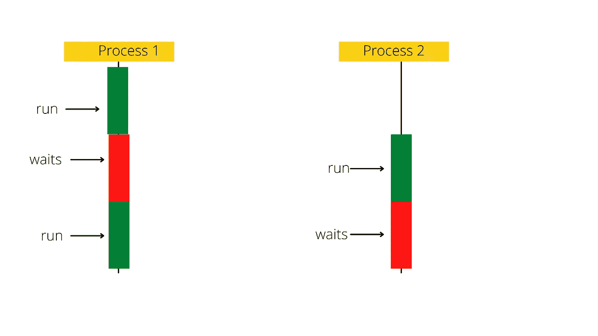

# 探索 java.util.concurrent 包中的内容(第 1 部分)

> 原文：<https://medium.com/javarevisited/exploring-whats-inside-java-util-concurrent-package-part-1-6287dafea6df?source=collection_archive---------0----------------------->

## 正是您日常编程任务所需的东西

java 中的 java.util.concurrent 包包含使并发编程成为可能的接口和类。

**什么是并发编程？**

并发