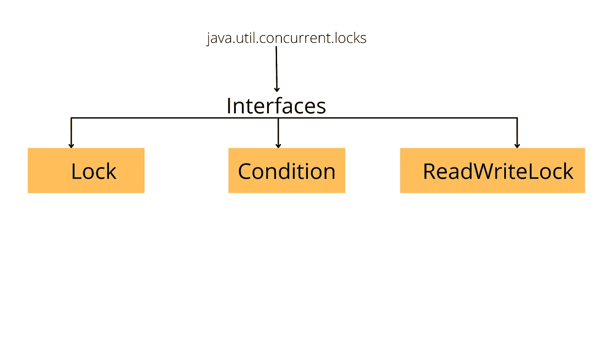

# 探索 java.util.concurrent 包中的内容(第 2 部分)

> 原文：<https://medium.com/javarevisited/exploring-whats-inside-java-util-concurrent-package-part-2-e887ccf36681?source=collection_archive---------1----------------------->

锁包中的接口

上图显示了包含在**Java . util . concurrent . locks**包中的接口。

在本系列的[第 1 部分](/javarevisited/exploring-whats-inside-java-util-concurrent-package-part-1-6287dafea6df)中，我们探索了 java.util.concurrent 包中的内容。如果你还没有，我建议你先读一下那部分。