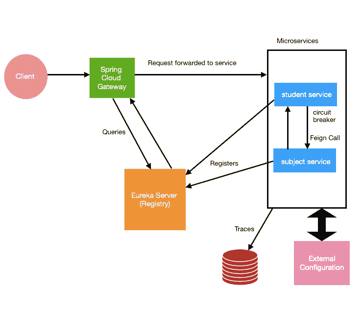

# 微服务中的外部配置:Spring 云配置

> 原文：<https://medium.com/javarevisited/external-configuration-in-microservices-spring-cloud-config-9c925f64749f?source=collection_archive---------0----------------------->

让我们来看看我们作为 spring cloud 系列的一部分构建的整体微服务架构。

使用 Spring 云组件的微服务架构

如果你没有从一开始就关注这个 Spring Cloud 系列，请查看这个索引页，如果需要的话可以将其加入书签— [Spring Cloud 教程](https://rubyshiv.medium.com/under-the-spring-cloud-umbrella-7cd2879f3a58)。

## 为什么选择 Spring Cloud Config？