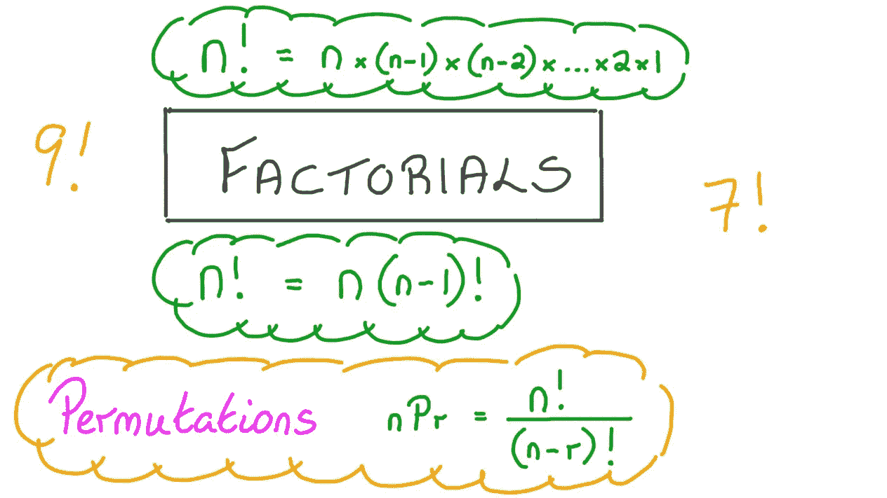

# Java 中如何计算阶乘？迭代和递归示例

> 原文：<https://medium.com/javarevisited/factorial-in-java-using-recursion-and-loop-iterative-solved-e2f6903d5b14?source=collection_archive---------4----------------------->

## 在这个编程练习或编码作业中，你将学习如何使用递归和循环在 Java 中编写计算阶乘的方法

大家好，用 java 写一个计算给定数的阶乘的方法是流行的编程之一…