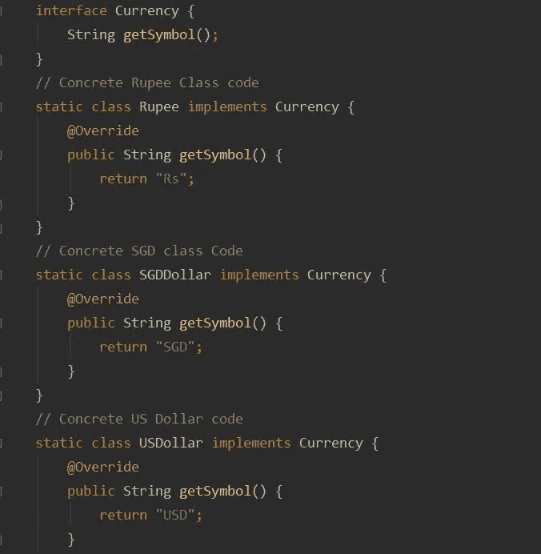
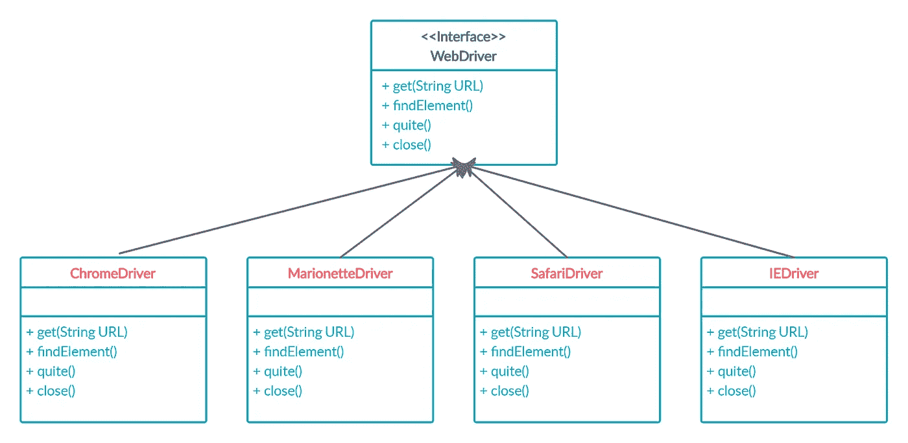
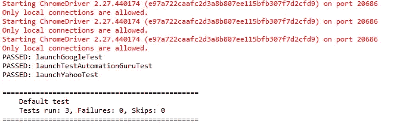

# 测试自动化的工厂模式

> 原文：<https://medium.com/javarevisited/factory-pattern-for-test-automation-828b09499dab?source=collection_archive---------1----------------------->

首先，我们应该知道什么是/为什么是设计模式(请参考链接以获得更多理解——待定)。我们应该知道什么是工厂模式，什么时候使用工厂模式。

工厂模式是 Java 中最常用的设计模式之一。这种类型的设计模式属于创建模式，因为这种模式提供了创建对象的最佳方式之一。

在[工厂模式](http://javarevisited.blogspot.sg/2011/12/factory-design-pattern-java-example.html#axzz51cvxH5kW)中，我们创建一个对象，而不将创建逻辑暴露给客户端，并引用新创建的对象返回给客户端，使用或者在接口中指定并由子类实现，或者在基类中实现并可选地由派生类覆盖(使用公共接口)。

为什么工厂模式是-

1.  工厂类防止客户端代码的耦合。
2.  初始化保存在一个地方，而不是有多个新的 MyObject()调用，满足了不重复自己(DRY)的原则。
3.  对象的新版本可以很容易地从工厂方法中返回。派生类必须满足 Liskov 替换原则。
4.  工厂设计模式提供了一种为接口而不是实现编码的方法。
5.  工厂模式通过继承提供了实现和客户端类之间的抽象。

让我们写一些代码来理解它。

**演示—实时**

这个例子很容易理解工厂模式的行为，

货币具体类、工厂类和工厂客户代码

## **演示—用于测试目的**

Chrome/Firefox/Safari/IE 驱动程序的具体类实现了这个 WebDriver 接口，我们可以通过 WebDriver 接口引用 ChromeDriver/FirefoxDriver 等，而无需对代码做太多修改

使用带有测试类的工厂模式

让我们看看工厂是如何与我们的示例集成的。作为用户，测试类不应该真正关心驱动程序实际上是如何创建的。它需要的只是一个 WebDriver 实例来执行给定的测试用例。因此，我们提出了自己的抽象类“DriverManager ”,测试类可以使用它来获取驱动程序实例，并在测试中使用它们。

让我们看看具体的实现示例-

[DriverManager.java](https://gist.github.com/preelakmali/876a0481209dcc7b1b758ed177a43adf)

[ChromeDriverManger.js](https://gist.github.com/preelakmali/df7c8e8e873fe95a4d02a1bf5cfe7da6)

DriverType.java

【DriverManagerFactory.java 

[FactoryPatternTest.java](https://gist.github.com/preelakmali/d1661a6bfd24566e17a2a2a1543a4d44)

输出

通过使用[工厂模式](https://javarevisited.blogspot.com/2012/06/20-design-pattern-and-software-design.html)，我们对测试类完全隐藏了浏览器/服务实例的创建逻辑。如果我们得到一个添加新浏览器的新需求，比如说 PhantomJS，应该没什么大不了。我们只需要创建一个扩展 DriverManager 的 PhantomJSDriverManager。

希望这篇文章会有所帮助，您的疑问请尽管问:)