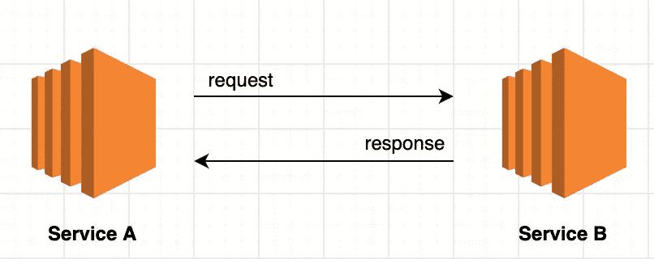

# 假装客户端:集成服务的一种优雅方式

> 原文：<https://medium.com/javarevisited/feign-client-one-of-the-elegant-ways-to-integrate-services-64f5c6c03283?source=collection_archive---------1----------------------->

## 从最低限度到深度定制

约翰·汤纳在 [Unsplash](https://unsplash.com?utm_source=medium&utm_medium=referral) 上的照片

## **简介**

在这个简洁的教程中，让我们了解使用 Feign Client 集成服务是多么简单。我们将从实现最常见的方法开始——不要太花哨，只要能让我们理解就行。

然后，一旦我们理解了基础知识，我们将直接进入定制，这在与其他[微服务](/javarevisited/10-best-java-microservices-courses-with-spring-boot-and-spring-cloud-6d04556bdfed)集成时通常是必要的。特别是，需要为授权设置预定义的请求头就是一个很好的例子。

在我们深入研究之前，让我们从最基本的开始。

## **裸露最小值**

为了建立一些上下文(让我们过度通信)，假设我们有*服务 A* 和*服务 B —* 独立运行。

现在，让我们假设*服务 A* 需要从*服务 B* 访问一些资源(这非常简单和常见)。鉴于这一要求，有很多方法可以做到这一点；但是让我们使用 Feign Client——因为 rest 服务调用实现已经被抽象了。

首先，为了简单起见，让我们从服务 B 创建一个虚拟端点:

然后，在服务 A 上，让我们为它创建一个虚拟客户端:

此外，不要忘记在您的配置类或主类中包含注释来启用 Feign clients:`@EnableFeignClients`——这对于组件扫描`@FeignClient`注释是必要的。

最后，让我们创建一个集成测试来验证我们的 Feign 客户端是否工作:

确保服务 B 正在运行——瞧！我们现在成功地访问了*和*端点；然而，在现实中，有相当多的东西我们需要使之可配置。让我们来看看其中的一些(非详尽):

*   URL —每个环境都有适当的值
*   标题—在请求中包含与身份验证相关的详细信息
*   错误处理
*   等等

有了这些，事实上，很明显我们需要学习如何进行定制——让我们直接开始吧。

## **定制**

有几种方法可以进行定制，其中一些只需要对上面的代码做很小的改动；然而，在某些情况下，有必要手动创建虚拟客户端。

这样，使用 FeignBuilder API——让我们来探索这种方法。

为了演示，让我们创建一个新的接口，我们称之为`CustomFeignClient`:

接下来，让我们为它创建一个配置类:

请注意，使用这种配置，我们能够解决我们之前担心的问题:

*   URL —使用目标，我们可以通过任何方式自由配置它(例如，应用程序属性、集中式配置服务器等等)
*   头——使用请求拦截器，我们可以添加与 auth 相关的条目。(很明显，甚至可以创建一个单独的类并实现`RequestInterceptor`接口来实现一种更简洁的方法。)
*   错误处理——同样，我们可以使用 lambda 或通过创建实现`ErrorEncoder`的具体类来处理异常，在这种情况下。

现在，为了再次验证一切正常，让我们快速创建一个集成测试:

所以是的，就是这样！

## 结论

在这个简短的教程中，我们已经使用 feign client 初步实现了集成两个服务的最低要求，然后学习了如何完全定制它。

此外，虽然我们只看了最重要的代码要点，并跳过了 pom.xml 的一些设置，以保持文章简洁明了——但是，如果我们需要参考它，完整的源代码总是可以在 [GitHub](https://github.com/emyasa/medium-articles/tree/master/spring-cloud-feign) 上获得。