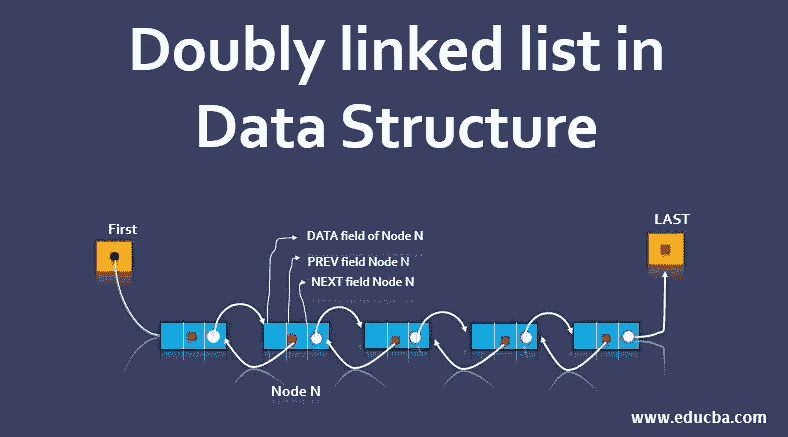

# 在有序双向链表中寻找给定和的对

> 原文：<https://medium.com/javarevisited/find-pair-with-a-given-sum-in-a-sorted-doubly-linked-list-13fbac7b8a7d?source=collection_archive---------3----------------------->



双向链表

链表是准备面试时要学习的最重要的概念和数据结构之一。掌握好[链表](/javarevisited/top-20-linked-list-coding-problems-from-technical-interviews-90b64d2df093)在编码面试中会是一个巨大的加分点。

## 问题陈述:

给定一个正相异元素的排序双向链表，任务是在双向链表中寻找其和等于给定值 **num 的配对。**

## 讨论的解决方法:

*   使用[的蛮力方法**嵌套循环**](https://javarevisited.blogspot.com/2015/09/how-to-loop-two-dimensional-array-in-java.html)
*   使用**哈希**的时间优化方法
*   使用双指针方法**的空间和时间优化方法**

## 这个编码问题的关键是:

*   了解**哈希**
*   了解 [**双指针**方法](https://javarevisited.blogspot.com/2013/05/find-if-linked-list-contains-loops-cycle-cyclic-circular-check.html)

```
For example:Suppose we have a sorted doubly-linked list as
5 <-> 7 <-> 10 <-> 15 <-> 20and we are given the value of **num** is 17 i.e. **num = 17\.** Now we have to find two integers from the sorted doubly-linked list which gives the total sum as **17.**So, we can clearly see that integers **7 and 10** together add up to **17,** hence, in this case, the two numbers will be **7 and 10**
```

**你能用 O(1)的空间复杂度在 O(n)的时间复杂度内做到吗？**

现在，暂时忘记你被给予的找出解决方案的时间复杂性，现在，想一想找到问题的解决方案的最基本的方法。

[](https://javarevisited.blogspot.com/2017/07/top-10-linked-list-coding-questions-and.html#axzz6fY0boe26)

让我们看看代码:p

## 天真的解决方案:

上述问题的**强力**解决方案是使用一个嵌套循环来获取一个整数，并找到其总和等于给定的 **num 的其他整数。**

让我们来看看这种方法的途径:

```
- Pick the first integer from the doubly-linked list
- Calculate the difference between the given num and the current integer in the doubly-linked list and store it in a variable **diff**
- Now, search for **diff** by traversing the complete linked list which will be the second number in the list (if present)
```

**该问题的时间复杂度为 O(n)，n 是双向链表中节点的总数。**

现在，由于这是一个蛮力解决方案，如果你仔细考虑时间复杂度的优化，我们可以有一个稍微优化的解决方案。

你能想到这样的解决办法吗？

如果你不能够思考，让我给你一点提示，我们可以在 **O(n)时间内借助 [**哈希**](https://javarevisited.blogspot.com/2010/10/difference-between-hashmap-and.html) 解决上述问题。**

## 哈希解决方案:

让我们看一下这个散列算法。

```
start function findPair(reference to the headNode, number) unordered_set<int> nodeHash;

  struct node *headRef = headNode;
  start while(headRef->next is not NULL)
     insert headRef->data to nodeHash
  end while bool nodeFound = false; start while(headRef->next is not NULL)
      int diff = number - headRef->data
      start if(diff is present in nodeHash)
          print(diff and headRef->data)
          set nodeFound to true
          break the loop
      end if
  end while start if(nodeFound is false)
      print("Not Found")
  end ifend findPair
```

现在，分析上面的方法，我们看到该算法具有 O(n) 的**时间复杂度，这足以很好地解决这个问题，但是查看[算法](https://javarevisited.blogspot.com/2019/04/top-20-searching-and-sorting-algorithms-interview-questions.html)的空间复杂度，我们看到它花费了 **O(n)空间**，就空间复杂度而言，这不是优化的解决方案。**

我们能做得更好吗？

想一个方法，我们可以在 O(n)时间和 O(1)空间中解决这个问题。

是的，我们可以在常数空间中，通过使用两个指针的方法，简单地遍历并找到它，如果它存在的话。

让我们看看这个有效的方法。

## 两点解决方案:

让我们看一看这个在空间和时间方面最有效的算法。

```
start function findPair(reference to the headNode, number)
    struct node *headPointer = headNode
    struct node *tailPointer = headNode start while(tailPointer->next is not NULL)
        tailPointer = tailPointer->next
    end while bool foundNode = false start while(headPointer is not equal to tailPointer and tailPointer->next is not equal to headPointer)
          start if(headPointer->data + tailPointer->data == number)
                print(headPointer->data and tailPointer->data)
                set foundNode as true
                break the loop
          end if
          start else
                start if(headPointer->data + tailPointer->data < number)
                      headPointer = headPointer->next
                end if
                start else
                      tailPointer = tailPointer->prev
                end else
          end else
    end while start if(foundNode is false)
          print("Not Found")
    end ifend findPair
```

现在，既然你已经知道了问题背后的[算法](/javarevisited/20-algorithms-coding-problems-to-crack-you-next-technical-interviews-23191f229788)，那么你可以用你想要的编程语言编写你自己的功能性**代码**。

## 分析:

*   时间复杂度:`O(n)`，其中 **n** 是给定双向链表的大小，这是因为我们只遍历链表一次。
*   空间复杂度:`O(1)`，因为我们没有使用任何额外的空间来存储整数或节点。

**不断学习，不断成长，不断探索！**

**万事如意！**

更多有趣和信息丰富的文章和提示请关注我的 [**媒体**](https://swapnilkant11.medium.com/) **和**[**Linkedin**](https://www.linkedin.com/in/swapnil-kant-279a3b148/)