# RabbitMQ 和 Spring boot 的第一步

> 原文：<https://medium.com/javarevisited/first-steps-with-rabbitmq-and-spring-boot-81d293554703?source=collection_archive---------0----------------------->


在本文中，我打算给出一个例子，展示如何使用 RabbitMQ、Java 和 Spring Boot 在队列中发布和使用消息。
在开始编程之前，我们必须澄清一些要点:

**什么是 RabbitMQ？**

RabbitMQ 是一个开源的消息服务器，它利用了 AMQP(高级消息队列协议)协议。Rabbit 与许多编程语言兼容，允许您简单可靠地处理消息流量。值得一提的是，它还具有原生管理界面，并且是跨平台的。

**我们将如何在本地使用它？**

本地使用 rabbit 有两种选择:安装或使用 docker 容器。在这个例子中，我们将使用 [docker](/javarevisited/top-5-free-courses-to-learn-docker-for-beginners-best-of-lot-b2b1ad2b98ad?source=collection_home---4------2-----------------------) 。

运行本教程的先决条件(带链接):

*   [jdk 已安装](https://www.oracle.com/java/technologies/downloads/)；
*   [docker 已安装](https://www.docker.com/products/docker-desktop)；
*   [Intellij 或 Eclipse 已安装](https://www.jetbrains.com/pt-br/idea/download/#section=windows)；

## 开始排队

RabbitMQ 自己的网站显示:

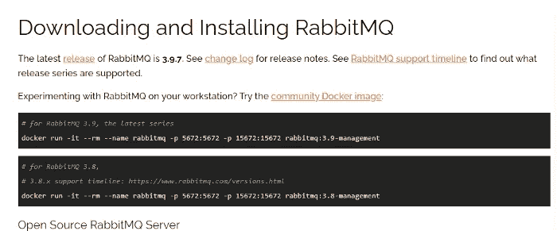

让我们使用这个命令，并在提示符下运行它:

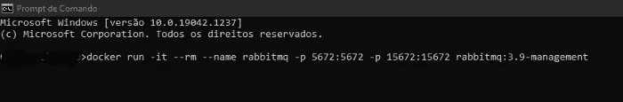

最终结果看起来像这样:

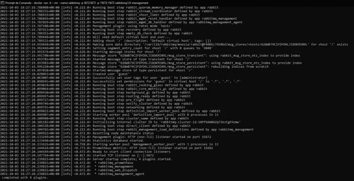

兔子在工作。如果你愿意，看看桌面 docker 上的容器，这个应该出现在这里:

[](https://javarevisited.blogspot.com/2014/03/top-10-websphere-mq-series-interview-questions-answers-active-rabbit.html)

正如我所说的，有一个接口，默认情况下可以通过端口 15672 访问，所以访问[http://localhost:15672/](http://localhost:15672/)就有可能访问它。

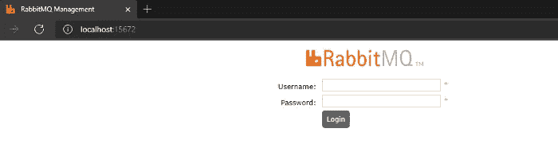

登录时，我们将使用 guest 作为用户名，guest 作为密码。这是兔子的概览屏幕:

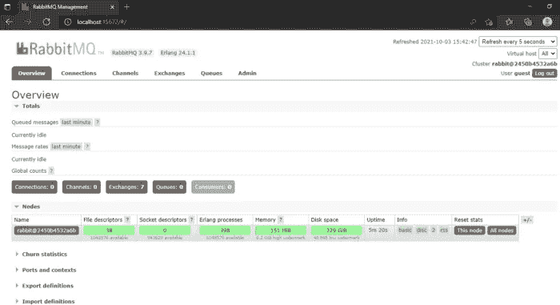

下一步是创建我们将在示例中使用的队列。但是放松点，不难。让我们单击“队列”，然后单击“添加新队列”:


完成后，让我们填充这个队列的数据(我只输入了名称，其余的都是默认的):

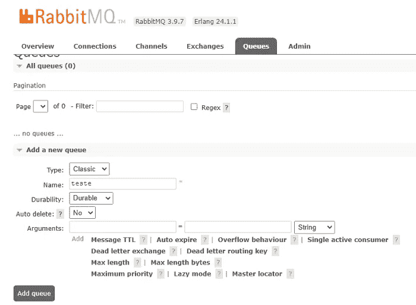

我的队列的名称将是一个测试，在创建之后，我们可以在 queues 页面上看到它:

[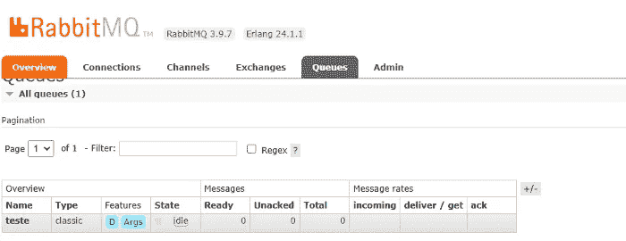](https://medium.com/javarevisited/top-10-free-courses-to-learn-maven-jenkins-and-docker-for-java-developers-51fa7a1e66f6)

## 创建消费者:

在一个有 [maven](/javarevisited/6-best-maven-courses-for-beginners-in-2020-23ea3cba89) 的 Spring Boot 项目中，让我们放入下面的依赖关系:

```
<dependency>
    <groupId>org.springframework.boot</groupId>
    <artifactId>spring-boot-starter-amqp</artifactId>
</dependency>
<dependency>
    <groupId>org.springframework.amqp</groupId>
    <artifactId>spring-rabbit-test</artifactId>
    <scope>test</scope>
</dependency>
```

事实上，我们只需要第一个，但是拥有用于运行单元测试、集成测试等的测试工具总是好的。

maven 下载完依赖项后，我们将编写代码。
这是负责创建消费者的类:

```
import org.springframework.amqp.rabbit.annotation.RabbitListener;
import org.springframework.messaging.handler.annotation.Payload;
import org.springframework.stereotype.Component;

@Component
public class QueueConsumer {

    @RabbitListener(queues = {"${queue.name}"})
    public void receive(@Payload String fileBody) {
        System.*out*.println("Message " + fileBody);
    }

}
```

不要惊讶，只是这个代码。在 application.properties 中，我们将配置以下属性:

```
spring.rabbitmq.host=localhost
spring.rabbitmq.port=5672
spring.rabbitmq.username=guest
spring.rabbitmq.password=guest

queue.name=teste
```

最后，主类接收@/EnableRabbit 注释，如下所示:

```
import org.springframework.amqp.rabbit.annotation.EnableRabbit;
import org.springframework.boot.SpringApplication;
import org.springframework.boot.autoconfigure.SpringBootApplication;

@EnableRabbit
@SpringBootApplication
public class AppApplication {

   public static void main(String[] args) {
      SpringApplication.*run*(AppApplication.class, args);
   }

}
```

这个注释也可以放在配置类中，没问题。在这个例子中，我并没有为此创建一个类。

现在只要启动应用程序，在它已经启动之后，让我们回到兔子的队列屏幕并咨询这个消费者。为此，请单击队列名称:


将显示以下画面:


看看那里的消费者，它是连接的。让我们发送一条短信:
点击“发布消息”

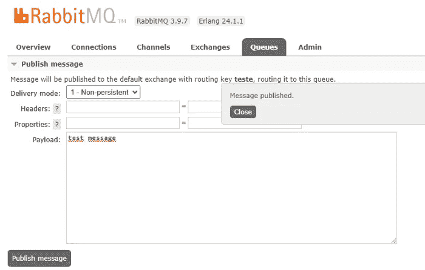

在 ide 控制台中，我们可以看到我们留在类中的 system.out.println:


消费在起作用，公布吧。

## 创建发布者

第一步是放置依赖项并填充 application.properties，就像在消费者中所做的那样。我就不重复了，因为完全是一回事。

接下来，我们必须创建一个配置类:

```
import org.springframework.amqp.core.Queue;
import org.springframework.beans.factory.annotation.Value;
import org.springframework.context.annotation.Bean;
import org.springframework.context.annotation.Configuration;

@Configuration
public class SenderConfig {

    @Value("${queue.name}")
    private String message;

    @Bean
    public Queue queue() {
        return new Queue(message, true);
    }

}
```

该类创建一个队列 bean，用于发送消息。
就在一个实际发送消息的类之后:

```
import org.springframework.amqp.core.Queue;
import org.springframework.amqp.rabbit.core.RabbitTemplate;
import org.springframework.beans.factory.annotation.Autowired;
import org.springframework.stereotype.Component;

@Component
public class QueueSender {

    @Autowired
    private RabbitTemplate rabbitTemplate;

    @Autowired
    private Queue queue;

    public void send(String order) {
        rabbitTemplate.convertAndSend(this.queue.getName(), order);
    }
}
```

并且在主类中还必须使用 [@EnableRabbit](http://twitter.com/EnableRabbit) 注释:

```
import org.springframework.amqp.rabbit.annotation.EnableRabbit;
import org.springframework.boot.SpringApplication;
import org.springframework.boot.autoconfigure.SpringBootApplication;

@EnableRabbit
@SpringBootApplication
public class AppApplication {

   public static void main(String[] args) {
      SpringApplication.*run*(AppApplication.class, args);
   }

}
```

为了便于测试，我创建了一个带有 [rest GET 方法](https://javarevisited.blogspot.com/2016/04/what-is-purpose-of-http-request-types-in-RESTful-web-service.html)的控制器来开始发送消息:

```
import org.springframework.beans.factory.annotation.Autowired;
import org.springframework.web.bind.annotation.GetMapping;
import org.springframework.web.bind.annotation.RequestMapping;
import org.springframework.web.bind.annotation.RestController;

@RestController
@RequestMapping("/teste")
public class TesteController {

    @Autowired
    private QueueSender queueSender;

    @GetMapping
    public String send(){
        queueSender.send("test message");
        return "ok. done";
    }

}
```

完成后，让我们启动应用程序并在浏览器中打开该 url:


结果如上图所示。在使用者端，消息被接收并处理:

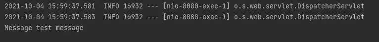

到目前为止的要点是:我们将一些东西直接发送到队列，但是使用 rabbitmq，建议将它发送到一个交换，然后这个交换发送到队列。

看起来像这样:

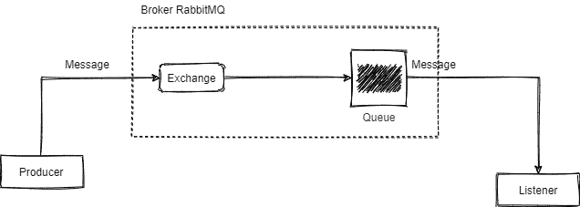

## 交换类型:

*   **Direct** :将消息传递给与之相连的队列，允许使用路由关键字。
*   扇出(Fanout):这种类型主要用作广播，所有感兴趣的人都会接收到未经任何过滤的消息。路由关键字不支持。
*   **主题**:它看起来像是前两者的混合，它允许发送到几个队列，也允许使用路由关键字，能够根据路由关键字中发送的值绑定消息。

**什么是路由关键字？**

**路由密钥**:与消息一起发送的密钥，交换机用它来决定消息的路由位置。

我们做个交易吧？步骤非常简单:

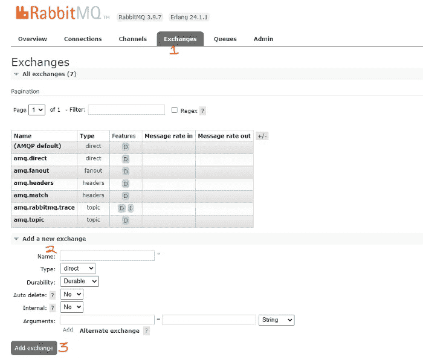

现在让我们放一个路由键并将其绑定到一个队列。这也很简单:只需单击所创建的交易所的名称，并填写字段，如下例所示:

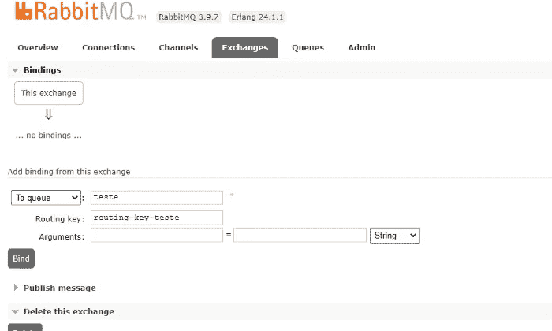

然后只需点击绑定，你就完成了:

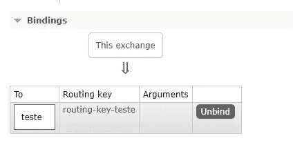

现在是时候编写一个代码，在交易所上发布一条消息，在那里创建的消费者会收到这条消息。

第一件事是为 rabbitmq 创建一个配置类:

```
@Configuration
public class RabbitMQConfig {

    @Bean
    public ConnectionFactory connectionFactory() {
        CachingConnectionFactory connectionFactory = new CachingConnectionFactory("localhost");
        connectionFactory.setUsername("guest");
        connectionFactory.setPassword("guest");
        return connectionFactory;
    }

    @Bean
    public Queue testeQueue() {
        return new Queue("teste", true);
    }

    @Bean
    DirectExchange exchange() {
        return new DirectExchange("direct-exchange");
    }

    @Bean
    Binding testeBinding(Queue testeQueue, DirectExchange exchange) {
        return BindingBuilder.*bind*(testeQueue).to(exchange).with("teste-routing-key");
    }
}
```

注意，在这个类中，我定义了一个队列、一个交换和队列的交换绑定。

之后，我创建了一个控制器，以便于测试:

```
@RestController
@RequestMapping("/teste")
public class TesteController {

    public TesteController(RabbitTemplate queueSender) {
        this.queueSender = queueSender;
    }

    private final RabbitTemplate queueSender;

    @GetMapping
    public String send() throws JsonProcessingException {
        queueSender.convertAndSend("teste-exchange", "routing-key-teste", "test message");
        return "ok. done"; }
}
```

瞧，当发送消息时，它将在监听队列的类中被接收，队列是我们在本文开始时创建的。

**放置标题:**

还有一个更重要的细节:我们可以在发送的邮件中指定标题，如果你打开这个例子:

```
import org.springframework.amqp.core.AmqpTemplate;
import org.springframework.amqp.core.Message;
import org.springframework.amqp.core.MessageProperties;
import org.springframework.web.bind.annotation.GetMapping;
import org.springframework.web.bind.annotation.RequestMapping;
import org.springframework.web.bind.annotation.RestController; @RestController
@RequestMapping("/teste")
public class TesteController {

    public TesteController(RabbitTemplate queueSender) {
        this.queueSender = queueSender;
    }

    private final RabbitTemplate queueSender;

    @GetMapping
    public String send() throws JsonProcessingException {

        String mensagem = "test message";

        MessageProperties messageProperties = new MessageProperties();
        messageProperties.setHeader("ultima", "sim");
        Message message = new Message(mensagem.getBytes(), messageProperties);

        queueSender.convertAndSend("teste-exchange", "routing-key-teste", message);
        return "ok. done";
    }

}
```

不要觉得这个代码代码很丑呵呵，这只是一个概念证明。

在监听器中，我们可以看到这个标题:

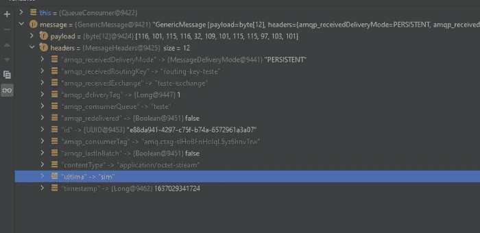

希望能有所帮助。

这段代码在这里:【https://github.com/mmarcosab/rabbitmq-example 