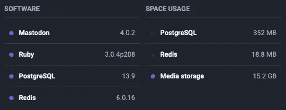

# 乳齿象上的 OpenJDK (Foojay)之友:更新

> 原文：<https://medium.com/javarevisited/foojay-on-mastodon-an-update-b83380ede045?source=collection_archive---------3----------------------->

几周前，我们与 Java 社区一起在 foojay.io 上检查了是否有兴趣拥有一个面向 Java 的乳齿象服务。

*   [给 OpenJDK 的朋友们开个 Java 乳齿象社区吧！](https://foojay.io/today/lets-start-a-java-mastodon-community-for-friends-of-openjdk/)
*   [Java 乳齿象服务:反馈](https://foojay.io/today/java-mastodon-service-the-feedback/)
*   [Foojay 乳齿象服务:在这里！](https://foojay.io/today/foojay-mastodon-service-here-it-is)

今天，Nicolas Frankel 也解释了他如何从 Twitter 转移到 Mastodon，并建立了一个交叉发布解决方案(当然是自动化的，作为一个真正优秀而懒惰的开发者)。

# 了解乳齿象

下面这个视频，我试着给乳齿象一个快速的介绍。如果这对你来说是全新的，它可以帮助你开始。

# Foojay .社会地位

我们宣布 [foojay.social](https://foojay.social) 已经一个月了。让我们分享一些自那以后发生的事情…

在我们自己的账户[foojay.social/@foojay](https://foojay.social/@foojay)上，我们分享和在 Twitter 上一样的内容，主要是新文章的链接。我们不使用交叉发布工具，而是尽可能地链接到作者的乳齿象帐户或其他参考资料。这个账号也有一个月了，已经有了将近 250 个粉丝。

管理仪表板显示我们在 foojay.social-server 上总共有 118 个活跃用户，他们交互了 4000 多次。本月有两个类似垃圾邮件的消息被报告，这些帐户被阻止，不再能够与这个乳齿象实例进行交互。

大多数用户帐户是个人帐户，但是我们很高兴一些 Java 相关的项目在我们的实例上找到了他们的新家，例如:

*   JabRef ( [@jabref_org](https://foojay.social/@jabref_org) ):开源书目管理软件。
*   芝加哥科特林用户群( [@ChicagoKUG](https://foojay.social/@ChicagoKUG) ):伊利诺伊州芝加哥的科特林爱好者。
*   Pi4J ( [@pi4j](https://foojay.social/@pi4j) ):开源 Java 库项目，为 Raspberry Pi 上的底层硬件 I/O 提供简化的 OO 友好接口。
*   布鲁塞尔 JUG ( [@brujug](https://foojay.social/@brujug) ):布鲁塞尔(比利时)Java 用户组。
*   ACME 4j([@ ACME 4j](https://foojay.social/@acme4j)):ACME 协议的开源 Java 客户端(RFC 8555)。

在这个概览中，您还可以看到交互中涉及最多的乳齿象实例列表，以及一些其他统计数据。

在管理员用户界面中，还会显示已用空间存储。媒体存储包含该实例所有成员的时间线，并且随着数据的不断清理和更新，该时间线在 12gb 和 20GB 之间“波动”。

# 结论

我们从一个通过 [toot.io](https://toot.io/mastodon_hosting.html) 托管 foojay.social 的小实例开始，它为我们提供了 200Gb 的存储空间，应该能够处理 **250 个活跃用户**。

这意味着在我们的初始设置中，我们可以欢迎更多的 Java/JVM/OpenJDK 成员！因为我们通过专业的托管服务提供商工作，我们可以轻松地扩大规模。

所以…欢迎加入！

*原载于 2022 年 12 月 16 日*[*https://foojay . io*](https://foojay.io/today/foojay-on-mastodon-an-update/)*。*