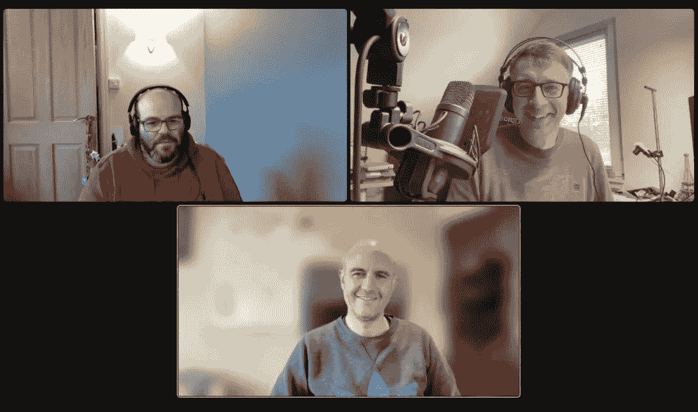

# Foojay 播客#8: JUG 世界巡回赛:曼彻斯特

> 原文：<https://medium.com/javarevisited/foojay-podcast-8-jug-world-tour-manchester-a6d7f51eac72?source=collection_archive---------9----------------------->

在这个 Foojay 播客中，我们引入了一个新话题:**每月一次，我们将虚拟地拜访一个 Java 用户组(JUG ),了解他们如何组织活动，并从他们的经历中学习**。

在第一期 Foojay JUG 播客中，我们将飞往英国的**曼彻斯特**！

# 客人

*   乔纳森·布洛克([@乔纳森·布洛克](https://twitter.com/jonbullock)，[@乔纳森·布洛克@foojay.social](https://foojay.social/@jonbullock) )
*   尼克·埃比特([@尼克比特](https://twitter.com/nickebbitt))

# 播客主持人

*   弗兰克·德尔博特([@弗兰克·波特](https://twitter.com/frankdelporte)，[@弗兰克·波特@foojay.social](https://foojay.social/@frankdelporte) )

# 播客

# 内容

*   00'00 简短介绍和音乐
*   00'15 介绍本期播客的主题
*   00'24 嘉宾和主持人介绍
*   曼彻斯特壶如何开始，尼克和乔纳森作为组织者加入
*   组织了多少次 JUG 会议
*   04'22 关于曼彻斯特 JUG 社区以及有多少人加入 sessions
*   最杰出的会议和演讲者(乔希·朗和文卡特)
*   吸引新的演讲者
*   12 ' 40 Covid 和虚拟会话前后
*   15'15 吸引本地发言人
*   16'58 在 JUG 或会议上了解新技术和核心 Java
*   22'43 关于多样性
*   25'05 水壶摆放位置
*   26'44 管理一个罐子需要多少努力
*   29'50 你能在哪里找到曼切斯特罐
    [https://twitter.com/mcrjava](https://twitter.com/mcrjava)
    [https://www.youtube.com/@ManchesterJavaCommunity](https://www.youtube.com/@ManchesterJavaCommunity)
    [https://www.meetup.com/ManchesterUK-Java-Community/](https://www.meetup.com/ManchesterUK-Java-Community/)
    [https://github.com/orgs/ManchesterJavaCommunity/projects/1](https://github.com/orgs/ManchesterJavaCommunity/projects/1)
*   其他活动(非会议组织，10 周年纪念，jmanc)
*   35’46 实用组织方法
    https://github.com/orgs/ManchesterJavaCommunity/projects/1
*   37'55 与其他壶的合作
*   39'28 结论

别忘了分享这个帖子！

*原载于 2022 年 12 月 5 日*[*https://foojay . io*](https://foojay.io/today/foojay-podcast-8/)*。*