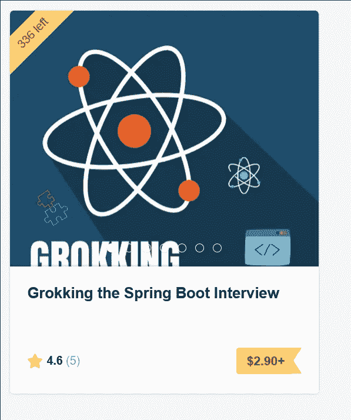

# 对于#IndependencDay 周末，我的 Java 和 Spring 书籍是“支付你想要的，最低 3 美元”。

> 原文：<https://medium.com/javarevisited/for-independencday-weekend-my-java-and-spring-books-are-pay-what-you-want-3-minimum-eacb9cc55f81?source=collection_archive---------1----------------------->

大家好，

对于**#独立日周末**，我的两本书都是《随心所欲》(Pay What You Want)， **$3 最低。**

- [花 2.9 美元](https://gumroad.com/l/QqjGH)搜索 Java 面试(u . p .——30 美元)

- [花 2.9 美元寻找 Spring Boot 的采访(T7)](https://gumroad.com/l/hrUXKY)

这个价位只剩几本了，赶紧趁没了。

**下面是链接**——[https://javinpaul.gumroad.com/](https://javinpaul.gumroad.com/)

万事如意。