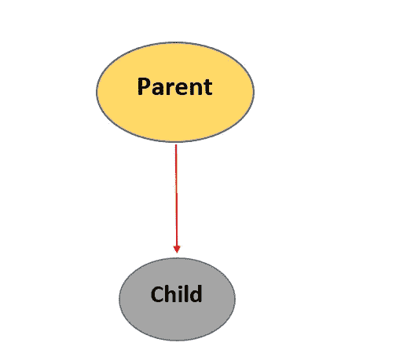

# JAVA-四大支柱

> 原文：<https://medium.com/javarevisited/four-pillars-in-java-2a5a38838756?source=collection_archive---------0----------------------->

## 面向对象概念介绍


桑德拉·塞塔玛在 [Unsplash](https://unsplash.com/s/photos/colours?utm_source=unsplash&utm_medium=referral&utm_content=creditCopyText) 上的照片

Java 有四大支柱。那些是；

> 1. ***传承***
> 
> 2. ***多态性***
> 
> 3. ***封装***
> 
> 4. ***抽象***

在本文中，我将简要介绍每个概念。

**1。** [**继承**](https://javarevisited.blogspot.com/2012/10/what-is-inheritance-in-java-and-oops-programming.html)

在继承中，您可以创建一个由另一个类继承的新类。所以新的类我们可以称之为子类或子类，而已经存在的类指的是父类或超类。一个对象获得父对象的所有行为和属性，当你从父类继承一个子类时，你可以重用那个类的字段和方法。

[](http://www.java67.com/2012/08/what-is-inheritance-in-java-oops-programming-example.html)

*继承的语法*

> **父类{**
> 
> **}**
> 
> **子类扩展父类**
> 
> **{**
> 
> **//方法和字段**
> 
> **}**

继承的一个现实例子是父亲的所有财产由儿子继承。

*优点:*代码可重用性；应用程序性能得到增强。

***注意:Java 不允许多重继承。***

**2。** [**多态性**](https://javarevisited.blogspot.com/2011/08/what-is-polymorphism-in-java-example.html)

简单来说，我们可以将这个概念定义为“有多种形式”。我们可以简单地用一个人来解释这个概念，因为一个人可以同时是很多东西。他可以是父亲、雇主、丈夫等。

[***方法覆盖***](https://www.java67.com/2012/09/what-is-rules-of-overloading-and-overriding-in-java.html)

```
class Overriding{
  void eat() {System.out.println (“She is eating”);}}
class Overriding1 extends Overriding{
  void eat(){System.out.println("He is eating");}public static void main (String args[]){
      Overriding1 obj = new Overriding1();
      obj.eat();}
}
```

[***方法重载***](https://javarevisited.blogspot.com/2017/01/what-is-real-use-of-method-overloading-in-java-or-programming.html)

如果一个类有多个同名但参数不同的方法，这就是“方法重载”。方法重载可以通过以下方式完成。

1.  通过改变参数的数量
2.  通过更改数据类型

```
class Sum {
  static int add(int a, int b){return a+b;}
  static int add(int a,int b,int c){return a+b+c;}
}
class MethodOverloading{
public static void main(String[]args){
System.out.println(Sum.add(12,12));
System.out.println(Sum.add(115,126,223));
}}
```

*优点:*灵活性；代码可重用性

**3。** [**封装**](https://javarevisited.blogspot.com/2012/03/what-is-encapsulation-in-java-and-oops.html)

封装也称为“数据隐藏”。这将把代码和数据打包到一个单元中，更适合于[单元测试](https://javarevisited.blogspot.com/2019/04/top-5-junit-and-unit-testing-courses-java-programmers.html)。

```
public class Encap{
   private String name;
   private String college;
   private int contactNo;

   public int get contactNo() {
      return contactNo;
   }

   public String getName() {
      return name;
   }

   public String getCollege() {
      return college;
   }

   public void setAge( int newcontactNo) {
      contactNo = newcontactNo;
   }

   public void setName(String newName) {
      name = newName;
   }

   public void setCollege( String newCollege) {
      college = newCollege;
   }
}
```

*优点:*安全；代码可重用性

**4。** [**抽象**](https://javarevisited.blogspot.com/2010/10/abstraction-in-java.html#axzz6oOeSmpNw)

抽象用于隐藏实现，它将只向用户显示功能。

```
abstract class {
   abstract void walk()
}class Child extends Human{
void walk(){System.out.println("Walking slowly");}
public static void main (String args[])
   Child obj= new Human();
   obj.walk();
   }
}
```

*优点:*代码复用性；增强很容易；可维护性；安全性

</swlh/5-free-object-oriented-programming-online-courses-for-programmers-156afd0a3a73>  </javarevisited/10-free-courses-to-learn-java-in-2019-22d1f33a3915> 