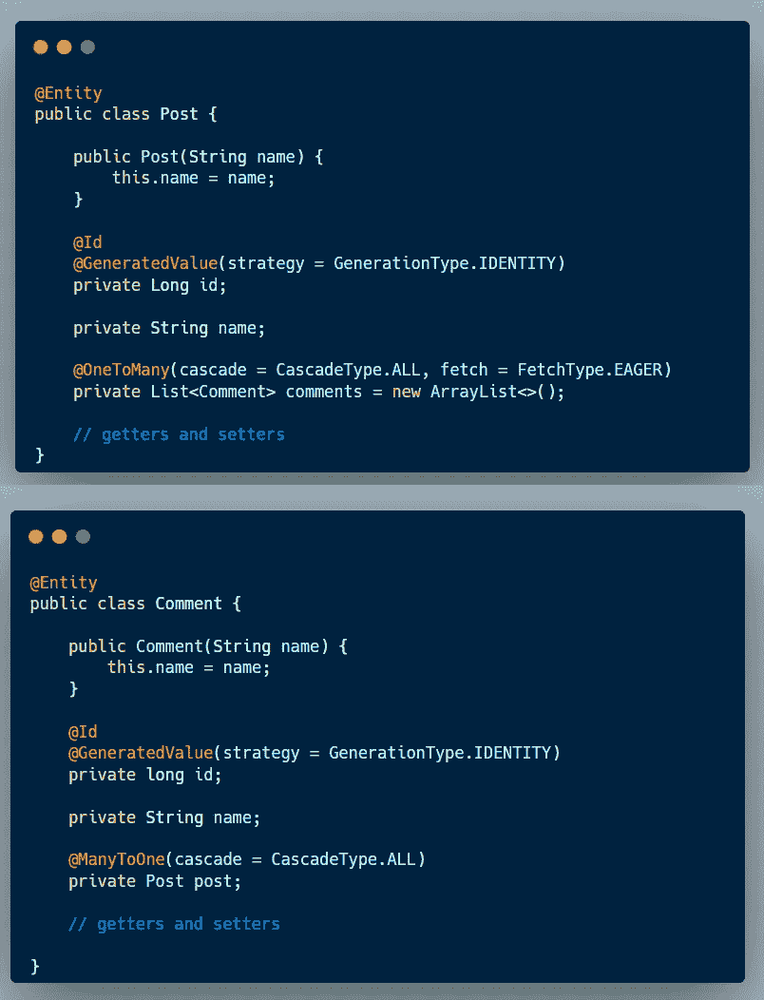

# 从龙目岛圣诞树到真正的 Java 封装

> 原文：<https://medium.com/javarevisited/from-a-lombok-christmas-tree-to-true-java-encapsulation-c69569237695?source=collection_archive---------1----------------------->

让我们讨论一下 JPA @Entities、双向关系、Lombok 和封装的最佳实践。

## 1.数据模型

对于本文中的代码示例，我们将使用*帖子*和*评论*实体*。*他们共享一种双向关系:

## 2.添加龙目岛