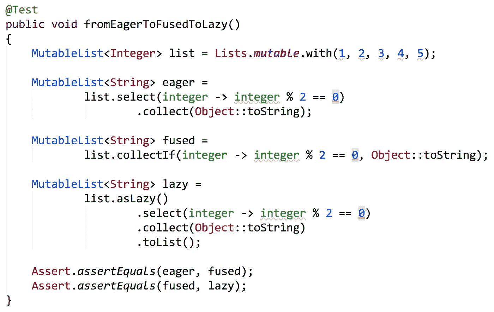
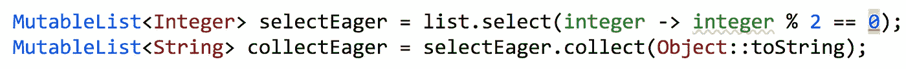
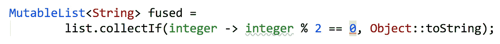
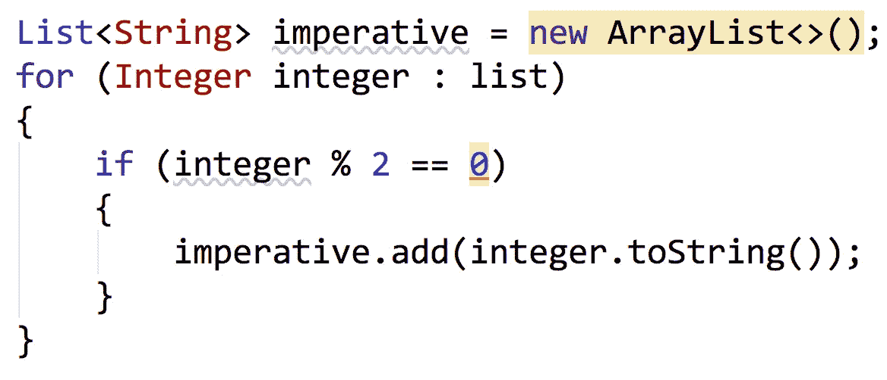
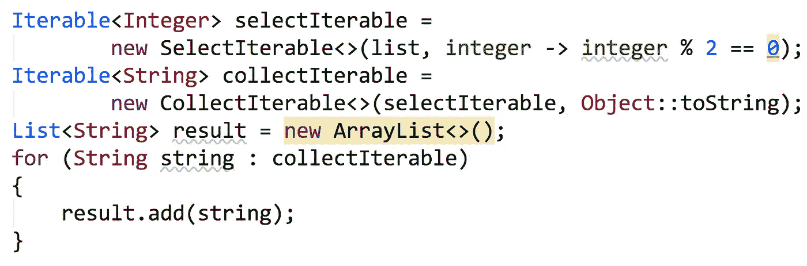

# 从渴望到融合到懒惰

> 原文：<https://medium.com/javarevisited/from-eager-to-fused-to-lazy-66450e290002?source=collection_archive---------2----------------------->

Eclipse 集合中迭代方法的演变

实现同一目标的三种方式——渴望、融合和懒惰

# 在开始的时候有渴望

当第一个迭代方法在 [Eclipse 集合](https://github.com/eclipse/eclipse-collections)中实现时，他们都很渴望。Eager 是 Eclipse 集合中集合接口和实现的默认行为。

当以流畅的方式使用带有多个操作的 eager 方法时，您可以创建中间集合。

选择和收集都是渴望的方法

对上面的`select`的调用将创建一个`MutableList<Integer>`。对`collect`的调用然后创建了一个`MutableList<String>`。下面的代码明确显示了对`select`和`collect`的调用的返回类型。

使用 Eager，每个调用都强制执行并返回一个列表

`select`和`collect`的命令式代码如下所示。

首先我们选择，然后我们收集

# 用融合方法优化

当我们开始用更高层次的迭代模式替换强制性的`for`循环时，我们偶尔会看到做多件事的`for`循环。这些`for`循环可以被分解成单独的步骤，如`select`和`collect`，但是很明显会产生更多的临时垃圾。这时我们引入了第一个名为`collectIf`的融合方法。方法`collectIf`是`selectAndCollect`的简称。

融合方法`collectIf`包括一次过滤和转换列表所需的`Predicate`和`Function`。

取所有的偶数并用 toString 变换它们

这是命令式`for`循环在执行`collectIf`操作时的样子。

列表的经典命令式过滤和转换

融合操作`collectIf`尽可能接近命令式`for`循环，只有在没有列表创建、`for`循环、`if`语句和对集合的`add`调用的情况下才能实现。

# 该偷懒了

在 eager 和 fused API 之后，我们将 lazy API 添加到 Eclipse 集合中。Eclipse 集合中的 lazy API 可以通过调用`asLazy`获得。惰性 API 将延迟执行，直到调用一个终端操作(如`forEach`或`toList`)。Eclipse 集合中的惰性 API 返回一个名为`LazyIterable`的`Iterable`类型。与 Java 8 中增加的`Stream`不同，`LazyIterable`可以重用。下面的博客有更多关于`LazyIterable`的内容，以及它是如何永不枯竭的。

</@donraab/lazy-and-inexhaustible-f41ffda857dc>  

惰性 API 的好处是不会创建中间集合。对`asLazy`、`select`和`collect`的调用都创建了`LazyIterable`实例，这些实例什么都不做。对`toList`的最后一次调用强制执行并创建目标列表。

懒惰在流畅的风格中很有效

下面的代码显示了每个操作的结果。

对 toList 的最后一次调用强制执行，并创建结果列表

下面的命令式代码展示了如何将两个`Iterables`组合在一起，然后使用一个`for`循环进行迭代，以获得相同的结果。

创建一个可选择的对象，在可选择的对象上构建一个可集合的对象，然后迭代添加到列表中

# 推荐

有时候用急切，融合或者懒惰更好。以下是我推荐的 Eclipse 集合规则。

1.  对于单个操作，或者如果您正在处理小型集合，请使用 eager 方法。
2.  使用融合方法，如果它与您的场景完全匹配，如`collectIf`。
3.  如果有多个操作会导致创建更多临时集合，请使用 lazy。

*我是*[*Eclipse Collections*](https://github.com/eclipse/eclipse-collections)*OSS 项目在*[*Eclipse Foundation*](https://projects.eclipse.org/projects/technology.collections)*的项目负责人。* [*月食收藏*](https://github.com/eclipse/eclipse-collections) *是开投* [*投稿*](https://github.com/eclipse/eclipse-collections/blob/master/CONTRIBUTING.md) *。如果你喜欢这个库，你可以在 GitHub 上让我们知道。*