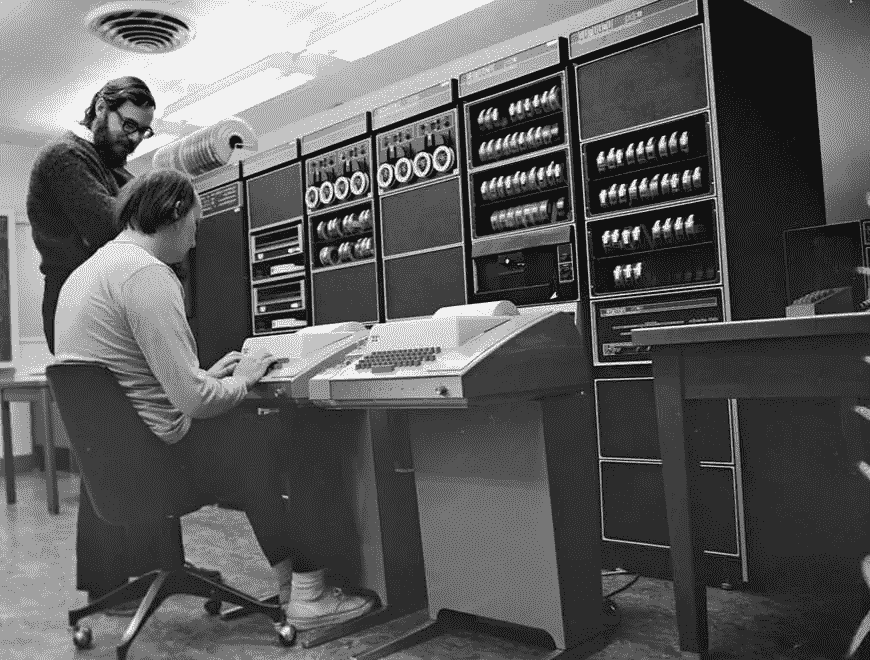

# 从 Java 到 C

> 原文：<https://medium.com/javarevisited/from-java-to-c-245ab75c2ef2?source=collection_archive---------1----------------------->

作为一名数学家和高级 Java 开发人员，我意识到我从未接触过 C 编程语言。所以昨天，趁着雨天休息，我决定尝试一下。将此文本视为友好的反馈！

所以这次冒险的起源是对 Java 中类型推断的失望(必须承认！)，之后我想:语言越复杂，实际上你能做的最少。