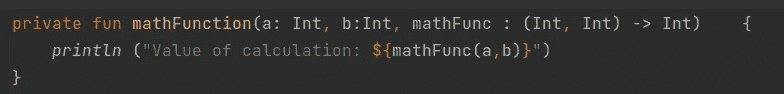
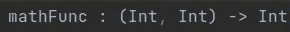
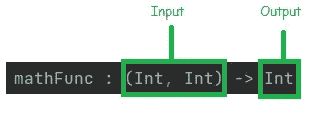
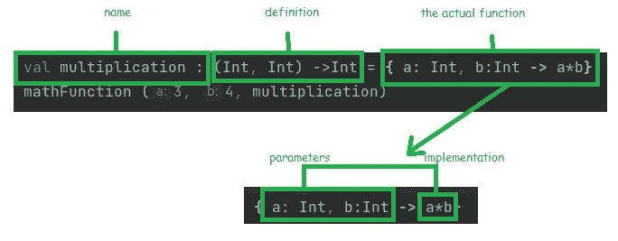
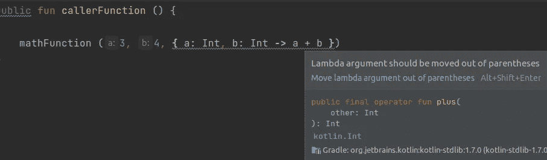
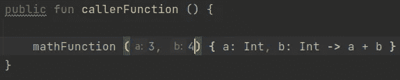

# Kotlin 中作为参数的函数—(简单解释)

> 原文：<https://medium.com/javarevisited/function-as-parameter-in-kotlin-easy-explanation-c77e6e2c40f0?source=collection_archive---------3----------------------->

复杂功能的机器

如果你像我一样来自于 Java，使用函数作为参数对你来说可能是件新鲜事。在 Java 中，最接近的方法是将函数接口声明为方法参数。[对接口](/javarevisited/10-oop-design-principles-you-can-learn-in-2020-f7370cccdd31)编程当然是一个好的实践，但是除此之外，Java 不允许使用/传递方法作为其他方法的参数。

让我们看一个例子。下面的代码声明了一个将两个数相加的函数，然后一个调用函数使用它。

在 Kotlin 中调用函数

上面的代码没有任何问题。但是使用函数作为参数可以让我们有更多的灵活性，因为它允许我们提取部分实现并在其他地方重用它。如果我们愿意的话，还可以让我们轻松地用另一个函数替换[函数](https://javarevisited.blogspot.com/2018/01/what-is-functional-interface-in-java-8.html)。请看下一段代码

作为参数运行

之前的 *sum()* 函数现在是 *mathFunction()* 这个函数采用相同的两个参数 *a* 和 *b* 但也采用一个函数。
优势是多方面的:

*   参数 *mathFunc* 表示函数*math function()*的可互换实现
*   如果需要，调用函数可以传递不同的实现
*   代码功能更加精细、可重用且易于维护

语法
现在我要更深入地解释一下语法，我还会展示一些可能的变体。

我们先从 *mathFunction()的声明开始。*

使用另一个函数作为参数的函数

前两个参数 *a* 和 *b、*没什么特别的，但是函数参数有点不同。原因是，第三个参数( *mathFunc* )是一个函数。所以基本上我们正在做的是定义必须被传递的函数的蓝图。

功能参数

意义解释

无论传递什么函数，都必须接受两个 *Int* 输入，并且必须返回 *Int。*

既然我们了解了这一点，让我们来看看打电话的人:

实际功能在上图右侧。“=”符号之前的所有内容只是值声明的一部分。这不是我们传递这个函数的唯一方法，实际上我们也可以作为匿名函数传递它，而不需要声明一个 *val。*

传递匿名函数

那看起来更好。最后一件事。注意到我的编辑器上的弹出消息了吗？
如果函数参数是一系列参数中的最后一个，惯例是把它拿出括号。这就是它看起来的样子。

按照约定调用函数

*感谢您抽出时间阅读，希望您喜欢这篇文章和/或觉得它有用。如果你喜欢这种内容，我将非常感谢你给我一些掌声，关注并在你的社交媒体上分享。我的目标是每月发表一篇文章。*