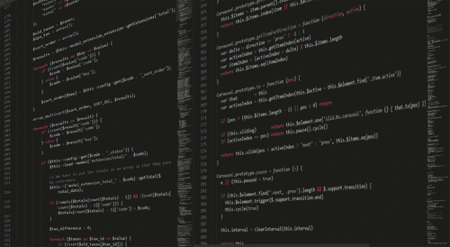

# 函数式编程——它是一种生活方式

> 原文：<https://medium.com/javarevisited/functional-programming-it-is-a-way-of-life-9ae516e06e0?source=collection_archive---------2----------------------->

## 函数式编程的主要方面是什么？和我们平常的哎呀有什么不同？

函数式编程近来蓬勃发展。它实际上是一种生活方式。这里的主要挑战是忘记 OOPS 的生活方式，然后学习函数式编程方式。一旦你学会了，它会让生活变得如此…