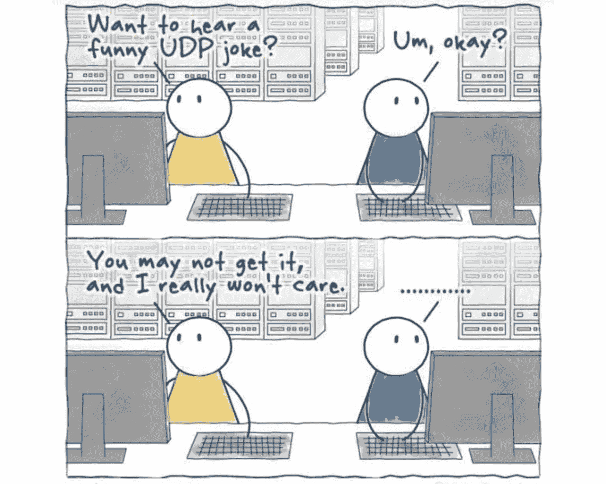

# Java 中 UDP 套接字编程的基础

> 原文：<https://medium.com/javarevisited/fundamentals-of-udp-socket-programming-in-java-4a6972370592?source=collection_archive---------1----------------------->

## 支持互联网上实时网络通信的机制。

但最终，这都不重要——neweggbusiness.com 的 Dana Choi 照片

对于在网络编程领域工作的程序员来说，套接字是最底层的抽象。套接字通信主要有两种方式(协议)。