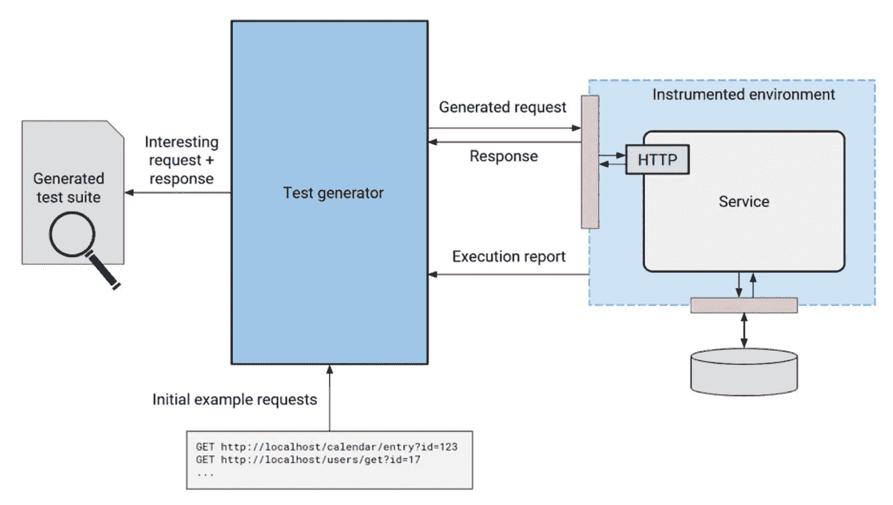

# 模糊测试 Java 和其他托管语言

> 原文：<https://medium.com/javarevisited/fuzz-testing-java-and-other-managed-languages-289a0be0a9c5?source=collection_archive---------3----------------------->

这只小猫的绒毛得了 A+

模糊测试是一种自动技术，用于查找在代码中执行有趣逻辑路径的程序输入。虽然存在许多变体，但基本思想很容易解释。从一组初始输入中，选取一个，变异一些位，并在变异的输入上运行程序。如果程序做了一些新的事情(这是你在之前的输入中没有看到的)，那么保存它以供将来分析。否则，丢弃它并重新开始。以闪电般的速度重复这个过程几百万次。

你可能会认为这样简单的方法永远不会发现任何有趣的东西。再想想。例如，这种随机化的变异过程可以凭空合成格式良好的 JPEGs 文件。模糊测试已经[非常](http://lcamtuf.coredump.cx/afl/#bugs) [成功](http://lcamtuf.coredump.cx/afl/#bugs)为各种类型的成熟项目找到了数千个安全漏洞。

因此，大型组织很快就明白了它的好处。谷歌最近宣布他们开源了 ClusterFuzz，它在 Chrome 中发现了大约 16，000 个错误，在许多其他开源项目中发现了大约 11，000 个错误。脸书在 2017 年收购了 Sapienz，这是一个依靠模糊测试来发现 Android 应用程序崩溃的工具。

尽管取得了成功，模糊测试几乎只关注于非托管或“不安全”的语言(C/C++)。对于这些语言，有许多开源或商业的 fuzzers，但是对于托管语言(例如 Java、Python、Javascript、C#)的 fuzzing 支持现在几乎不存在。的确，不安全语言中的内存损坏缺陷通常意味着对安全漏洞的担忧。但是托管语言也受到 fuzzes 在非托管语言中检测到的许多相同的漏洞的影响:崩溃输入、空指针异常、意外的无限循环、过度的资源利用等等。

在 [Diffblue](https://www.diffblue.com/) ，我们在其他动态代码分析技术中使用 fuzzing 来进行测试编写和 bug 查找。我们的早期结果非常有希望。在 24 小时的运行中，我们的工具可以为大型 Java 服务(Apache Solr，288 KLOC)创建 36%的端到端覆盖率，并找到 70 多种独特的方法来使服务器响应崩溃(Solr 开发人员正在开始修复这些崩溃)。

那么我们学到了什么？永远不要低估配置良好的随机搜索的威力。Fuzzing 已经被证明能够找到执行非平凡代码路径的程序输入，对于托管语言还有很多要说的。请继续关注更多关于 fuzzing 的更新。

## 您可能还会对以下内容感兴趣:

*   [如何用 Java 编写你的第一个单元测试](/@DiffblueHQ/how-to-write-your-first-java-unit-test-d65fc5599bbd)
*   [Java 开发者最常用的库(2019)](/@DiffblueHQ/most-popular-libraries-used-by-java-developers-2019-d35d2cc3c66)
*   [十大软件开发书籍](/@DiffblueHQ/summer-reading-list-10-software-development-books-ea11f9c8707c)
*   [引入单元回归测试](https://diffbluehq.medium.com/introducing-unit-regression-tests-200e3db1f638)
*   [有哪些不同类型的测试？](https://diffbluehq.medium.com/what-are-the-different-types-of-tests-5680c361dd3a)