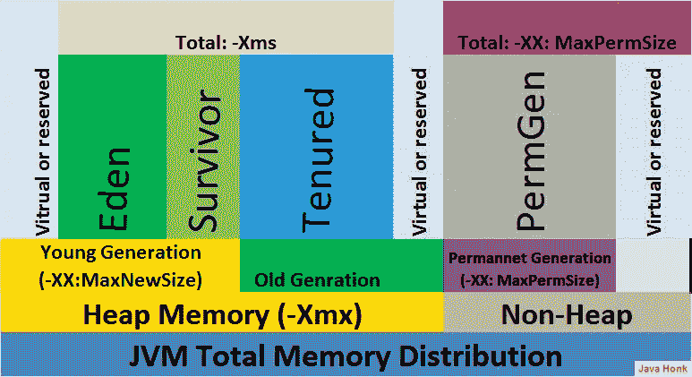
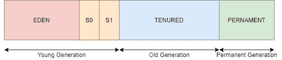

# 垃圾收集器—简介

> 原文：<https://medium.com/javarevisited/garbage-collection-an-introduction-169922e90c61?source=collection_archive---------1----------------------->

JVM 如何处理垃圾收集，以及如何对其进行调优。

Java 应用程序的性能在很大程度上依赖于垃圾收集技术，因此有相当多的收集器可供选择也就不足为奇了。OpenJDK 有三个适合生产的收集器和一些实验性的，你可能不想在生产中使用。

所有这些收集器都有非常不同的性能特征(稍后将详细介绍)，但是它们都有您应该理解的基本概念。



JVM 中的垃圾收集

# 垃圾收集工

对于开发人员来说，Java 的一大特点是不需要在代码中显式地管理对象的生命周期。在 Java 中，对象是在需要时创建的，当不再使用时，JVM 会自动删除它们并释放内存。与 C 或 C++相反，在 C 或 c++中，您必须通过编程来管理这个过程，这对于大多数人来说并不“理想”。如果您曾经花时间优化 Java 程序——调整和定制 JVM 也可能是一件麻烦的事情，但是我向您保证，当您理解了事情是如何在幕后工作的时候，您将能够相当容易地调优您的应用程序。

## 什么是 GC

垃圾收集器的主要任务是找到正在使用的对象，并用剩余的对象(不使用的对象)释放内存。这有时被误解为查找没有引用它们的对象。但这只是部分正确。如果我们以一个链表为例——列表中的每个对象都将指向所述列表中的下一个对象。但是如果没有任何东西指向列表的头部，那么整个列表都应该从内存中释放出来。

仅仅跟踪引用是不够的，因此 JVM 必须定期在堆中搜索未使用的对象。搜索的起点总是一个 GC 根对象——一个可以从堆(系统类的线程堆栈)外部访问的对象。然后，GC 执行一个算法，扫描根对象可到达的所有对象。可到达的对象是活的对象，其他的都是垃圾，你可能已经猜到了。

当 GC 找到未使用的对象时，JVM 可以释放这些对象占用的内存，并用它来为新对象分配空间。然而，因为对象可以有不同的大小，仅仅释放空间是不够的。在某些时候，必须压缩内存以防止内存碎片。

以一个在循环中分配两个数组的程序为例。一个数组有 1024 个字节，第二个只有 16 个字节。让我们看看这个堆会是什么样子。


分配后堆

现在我们假设 16 字节的数组不再使用，而 1024 字节的数组仍在使用。在垃圾收集过程之后，我们最终得到一个由非常小的空闲区域组成的堆，这些空闲区域只能用 16 字节或更少字节的对象来填充。在下图中，绿色区域现在是自由的。


释放对象后堆

我想你可以看到如果 JVM 像这样构造内存的潜在问题。我们最终会有很多“无用”的内存空间，无法用新的对象来填充。幸运的是，GC 除了查找和删除未使用的对象之外，还做了一件事来解决这个问题。在每个内存清除过程之后，GC 还会压缩堆。这意味着活动对象在内存中被重新定位，所以我们不会以空的区域结束。形象地说，这是另一张图片——GC 过程的最后一步。


压缩后堆

活动对象被移动到内存中来填充空的区域，在堆的末尾留给我们一个更大的区域。

不同的 GC 收集器处理压缩过程的方式不同。一些算法将这个过程延迟到绝对必要的时候，一些算法只压缩一小部分内存，而另一些算法压缩整个堆。这些不同的方法是不同算法具有不同性能特征的主要原因。

执行内存压缩的另一个大问题是实际运行的应用程序。如果有应用程序线程在运行，那么在内存中移动对象并不总是安全的。当跟踪对象和执行内存压缩时，GC 必须确保应用程序线程没有使用这些对象。为了确保 GC 操作是安全的，执行了“停止世界”暂停。这种暂停会在 GC 进程期间停止所有应用程序线程。可以想象，这些暂停对性能的影响最大，因此在调优 GC 时，最大限度地减少这些暂停是一个重要的考虑因素。

## 世代

大多数垃圾收集器通过将堆分成几代来工作。主要有两个世代:老一代(终身)和年轻一代。年轻一代被进一步分为两个部分:伊甸园和幸存者。

在一个 Java 应用程序中，有许多对象只在很短的一段时间内使用。以下面这段代码为例，它计算订单的利润并将其加到总额中。

```
var sum = new BigDecimal.ZERO
for (Order order: orders)) {
  BigDecimal profit = order.getValue().subtract(order.getCost());
  sum = sum.add(profit);
}
```

`BigDecimal`类是不可变的，意思是值不能改变。每当对对象执行算术运算时，都会创建一个新的对象。如果我们用 1000 个订单运行这个简单的循环，那么在堆中会创建 2000 个`BigDecimal`对象——这是一个很大的对象数。

这种操作在 Java 中很常见，所以垃圾收集器可以利用大多数对象只被使用很短时间的事实。这就是老一代和年轻一代的用武之地。对象首先在堆的年轻代部分分配。当年轻一代填满时，GC 停止应用程序线程并清空年轻一代堆。不再使用的对象从堆中移除，仍在使用的对象被移到其他地方。

This design has two performance advantages. The young generation is only a portion of the heap thus processing it is faster than processing the entire heap. This also means that application pauses are much shorter but more frequent. Small pauses are always better performance-wise than fewer longer pauses.

The other big performance advantage has to do with the previously mentioned memory compaction. When an object is created it is allocated in the eden part of the young generation. When the young generation is cleared active objects are moved to the survivor part of the young generation or to the old generation. Unused objects are simply removed leaving us with an empty heap. At the end of the GC process, eden and one of the survivor spaces are empty, and the objects that remain in the young generation are compacted with the other survivor space.



The Heap

Objects being constantly moved from the young to the old generation will eventually cause the old generation to fill up. Once this happened garbage collector will need to find and discard unused objects in the old generation. This is where GC algorithms have their biggest differences.

## Full GC

This is a simpler algorithm that stops all application threads, finds unused objects, frees up the heap and compacts the memory. A full GC generally causes a long pause for the application threads.

## Concurrent CG

Concurrent collectors are more computationally complex but allow us to find unused objects while application threads are running. Such collectors are sometimes also called low-pause collectors since they minimize the need to stop the application threads. Concurrent collectors also take different approaches to compact the old generation.

With concurrent collector your application with experience fewer and shorter pauses but there is also a quite significant tradeoff — the application will use more CPU. When fine-tuning concurrent collectors you might also experience difficulty achieving the best performance for your application (this is not as noticeable in the latest versions of OpenJDK).

## How to choose the right GC

When considering which garbage collector to use for your application, think about the overall performance you want to be met — there will always be tradeoffs.

If we take for example a REST server application we might want to measure the response time of individual requests. Let’s see how choosing the right GC comes into play.

*   Requests will be impacted by pause times — most noticeably by long pauses for full GC. In order to minimize pause times thus improving response times, we want to use a concurrent collector. A little side note: full GC will only impact requests at the time of GC, other (most) requests won't be affected.
*   If average response time is more important than outliers (described above) a nonconcurrent collector might be a better choice.
*   它还涉及到你的硬件，尤其是 CPU。如前所述，并发收集器是 CPU 密集型的，因此需要更多的 CPU 能力。如果你的机器缺乏 CPU 能力，非电流收集器是更好的选择。

## 摘要

*   垃圾收集器是一个查找已用和未用对象、从堆中移除未用对象并在释放空间后压缩内存的过程。
*   GC 算法将堆分为老代和年轻代。
*   GC 算法采用一种停止世界的方法来清除年轻一代中的对象。
*   根据我们的应用需求，我们可以使用并发或非并发 GC 算法。