# GCP 认证-让我们一起航行。与詹金斯和 GKE 的 CI/CD 第二部分。

> 原文：<https://medium.com/javarevisited/gcp-certification-lets-sail-together-714e45efb798?source=collection_archive---------2----------------------->


[第一部分](/javarevisited/gcp-certification-lets-sail-together-9f08c0344f18) **……。第一部分。让我们继续航行…..！！**

[GCP 认证——让我们一起航行。首个端到端项目——詹金斯和 GKE 的 CI/CD——第一部分|作者 Chaskarshailesh | Java re visited | 2021 年 12 月| Medium](/javarevisited/gcp-certification-lets-sail-together-9f08c0344f18)

这是我们计划实现的目标

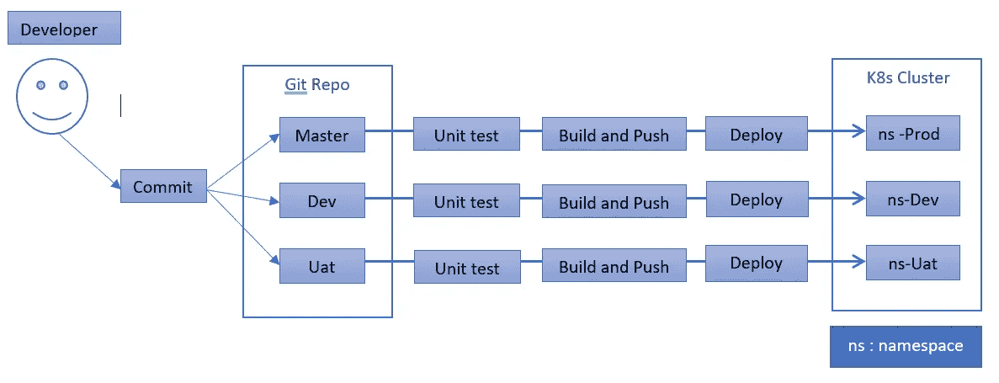

6.**CI/CD:**Kubernetes 发动机中的詹金斯

为 Jenkins 创建一个具有所需权限的服务帐户

```
cd ~/lets-sail/firstclusterepo-appgcloud iam service-accounts create lets-sail-jenkins-sa --display-name "lets-sail-jenkins-sa"gcloud projects add-iam-policy-binding lets-sail-development --member "serviceAccount:[lets-sail-jenkins-sa@lets-sail-development.iam.gserviceaccount.com](mailto:lets-sail-jenkins-sa@lets-sail-development.iam.gserviceaccount.com)" --role "roles/viewer"gcloud projects add-iam-policy-binding lets-sail-development --member "serviceAccount:[lets-sail-jenkins-sa@lets-sail-development.iam.gserviceaccount.com](mailto:lets-sail-jenkins-sa@lets-sail-development.iam.gserviceaccount.com)" --role "roles/source.reader"gcloud projects add-iam-policy-binding lets-sail-development --member "serviceAccount:[lets-sail-jenkins-sa@lets-sail-development.iam.gserviceaccount.com](mailto:lets-sail-jenkins-sa@lets-sail-development.iam.gserviceaccount.com)" --role "roles/storage.admin"gcloud projects add-iam-policy-binding lets-sail-development --member "serviceAccount:[lets-sail-jenkins-sa@lets-sail-development.iam.gserviceaccount.com](mailto:lets-sail-jenkins-sa@lets-sail-development.iam.gserviceaccount.com)" --role "roles/storage.objectAdmin"gcloud projects add-iam-policy-binding lets-sail-development --member "serviceAccount:[lets-sail-jenkins-sa@lets-sail-development.iam.gserviceaccount.com](mailto:lets-sail-jenkins-sa@lets-sail-development.iam.gserviceaccount.com)" --role "roles/cloudbuild.builds.editor"gcloud projects add-iam-policy-binding lets-sail-development --member "serviceAccount:[lets-sail-jenkins-sa@lets-sail-development.iam.gserviceaccount.com](mailto:lets-sail-jenkins-sa@lets-sail-development.iam.gserviceaccount.com)" --role "roles/container.developer"
```

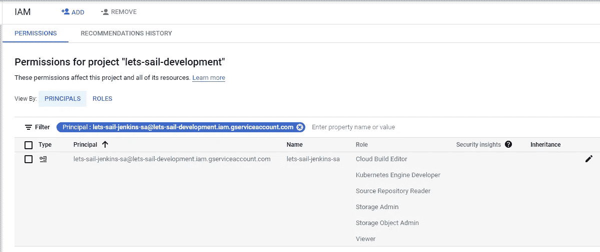

将 JSON 密钥文件下载到您的本地机器。

```
gcloud iam service-accounts keys create lets-sail-jenkins-sa-key.json --iam-account "[lets-sail-jenkins-sa@lets-sail-development.iam.gserviceaccount.com](mailto:lets-sail-jenkins-sa@lets-sail-development.iam.gserviceaccount.com)"
```

将您的服务帐户绑定到群集

```
kubectl create clusterrolebinding jenkins-first-app --clusterrole=cluster-admin --serviceaccount=default:lets-sail-jenkins-sa --namespace=prodkubectl create clusterrolebinding jenkins-deploy --clusterrole=cluster-admin --serviceaccount=prod:first-jenkins --namespace=prod
```

建立詹金斯管道

```
cd ~/lets-sail/firstclusterepo-app
**nano Jenkinsfile**pipeline {
environment {
    PROJECT = "lets-sail-development"
    APP_NAME = "first-app"
    FE_SVC_NAME = "${APP_NAME}-service"
    CLUSTER = "first-cluster"
    CLUSTER_ZONE = "us-west1-b"
    IMAGE_TAG = "gcr.io/${PROJECT}/${APP_NAME}:${env.BRANCH_NAME}.${env.BUILD_NUMBER}"
    JENKINS_CRED = "${PROJECT}"
  }
agent {
    kubernetes {
      label 'first-app'
      defaultContainer 'jnlp'
      yaml """
apiVersion: v1
kind: Pod
metadata:  
labels:
  component: ci  
spec:
  # Use service account that can deploy to all namespaces
  serviceAccountName: first-jenkins
  containers:
  - name: first-app
    image: gcr.io/lets-sail-development/first-app:1.0.0
    command:
    - cat
    tty: true
  - name: gcloud
    image: gcr.io/cloud-builders/gcloud
    command:
    - cat
    tty: true
  - name: kubectl
    image: gcr.io/cloud-builders/kubectl
    command:
    - cat
    tty: true
"""
}
  }
  stages {
    stage('Test') {
      steps {
        container('first-app') {
          sh """
            pwd     
            cd firstapp
            python test_firstapp.py
          """
        }
      }
    }
    stage('Build and push image with Container Builder') {
      steps {
        container('gcloud') {
          sh """
          cd firstapp
          PYTHONUNBUFFERED=1 gcloud builds submit -t ${IMAGE_TAG} .
          """
        }
      }
    }
    stage('Deploy Dev') {
      // Developer Branches
      when {
        not { branch 'master' }
        not { branch 'uat' }
      }
      steps {
        container('kubectl') {
          sh("sed -i.bak 's#gcr.io/lets-sail-development/first-app:1.0.0#${IMAGE_TAG}#' ./docker/dev/*.yaml")
          step([$class: 'KubernetesEngineBuilder', namespace: "dev", projectId: env.PROJECT, clusterName: env.CLUSTER, zone: env.CLUSTER_ZONE, manifestPattern: 'docker/dev/firstappservice.yaml', credentialsId: env.JENKINS_CRED, verifyDeployments: false])
          step([$class: 'KubernetesEngineBuilder', namespace: "dev", projectId: env.PROJECT, clusterName: env.CLUSTER, zone: env.CLUSTER_ZONE, manifestPattern: 'docker/dev/firstapp.yaml', credentialsId: env.JENKINS_CRED, verifyDeployments: true])
        }
      }
    }
    stage('Deploy uat') {
      // Canary branch
      when { branch 'uat' }
      steps {
        container('kubectl') {
          // Change deployed image in canary to the one we just built
          sh("sed -i.bak 's#gcr.io/lets-sail-development/first-app:1.0.0#${IMAGE_TAG}#' ./docker/uat/*.yaml")
          step([$class: 'KubernetesEngineBuilder', namespace:'uat', projectId: env.PROJECT, clusterName: env.CLUSTER, zone: env.CLUSTER_ZONE, manifestPattern: 'docker/uat/firstappservice.yaml', credentialsId: env.JENKINS_CRED, verifyDeployments: false])
          step([$class: 'KubernetesEngineBuilder', namespace:'uat', projectId: env.PROJECT, clusterName: env.CLUSTER, zone: env.CLUSTER_ZONE, manifestPattern: 'docker/uat/firstapp.yaml', credentialsId: env.JENKINS_CRED, verifyDeployments: true])          
        }
      }
    }
    stage('Deploy Production') {
      // Production branch
      when { branch 'master' }
      steps{
        container('kubectl') {
        // Change deployed image in canary to the one we just built
          sh("sed -i.bak 's#gcr.io/lets-sail-development/first-app:1.0.0#${IMAGE_TAG}#' ./docker/prod/*.yaml")
          step([$class: 'KubernetesEngineBuilder', projectId: env.PROJECT, clusterName: env.CLUSTER, zone: env.CLUSTER_ZONE, manifestPattern: 'docker/prod/firstappservice.yaml', credentialsId: env.JENKINS_CRED, verifyDeployments: false])
          step([$class: 'KubernetesEngineBuilder', projectId: env.PROJECT, clusterName: env.CLUSTER, zone: env.CLUSTER_ZONE, manifestPattern: 'docker/prod/firstapp.yaml', credentialsId: env.JENKINS_CRED, verifyDeployments: true])          
        }
      }
    }
  }
}
```

提交 Jenkins 文件

```
git status
git add .
git commit -m "Jenkins files"
git push
```

安装詹金斯

```
cd ~/lets-sail/firstclusterepo-app
mkdir jenkinshelm repo add jenkins [https://charts.jenkins.io](https://charts.jenkins.io)
helm repo update
gsutil cp gs://spls/gsp330/values.yaml jenkins/values.yamlcd ~/lets-sail/firstclusterepo-app
helm install first jenkins/jenkins -f jenkins/values.yaml --wait --namespace prod
```

验证集群上是否安装了 jenkins pod

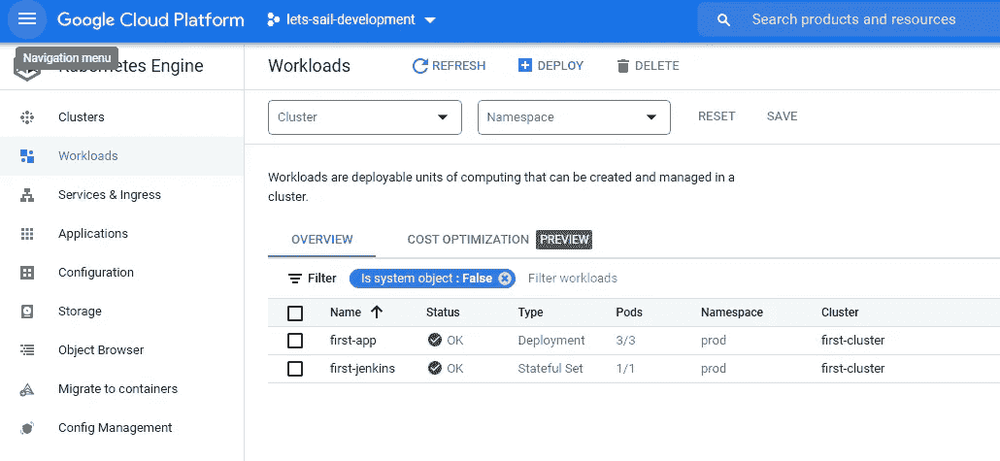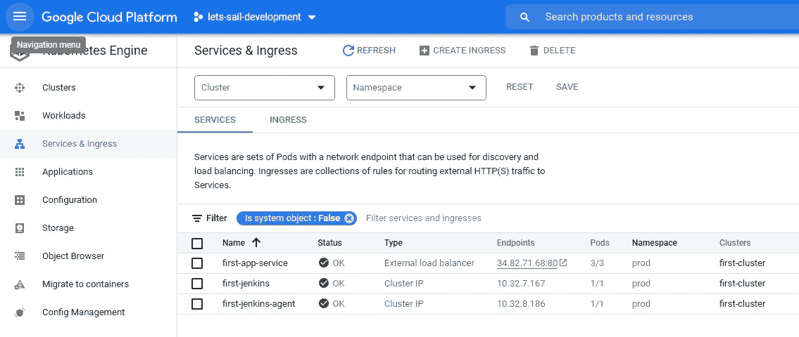

运行以下命令获取您的“管理员”用户密码

```
kubectl exec --namespace prod -it svc/first-jenkins -c jenkins -- /bin/cat /run/secrets/chart-admin-password && echo
```

通过在同一个 shell 中运行这些命令，获得要访问的 Jenkins URL，转发您的请求

```
kubectl --namespace prod port-forward svc/first-jenkins 8080:8080
```

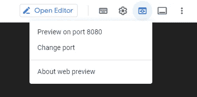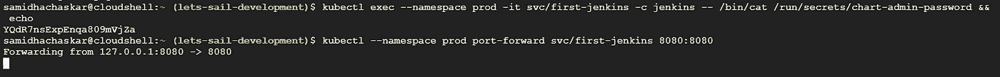

使用上面的密码和用户名登录:admin

配置安全领域和授权策略

a.在 Jenkins UI 中，单击左侧的凭据
b .单击(全局)链接
c .单击左侧的添加凭据
d .从种类下拉列表中，选择来自私钥的 Google 服务帐户
e .输入“let-sail-development”作为项目名称
保持 JSON 键处于选中状态，然后单击选择文件。
选择之前下载的**lets-sail-development-4673 c 4959 f 18 . JSON**文件，然后点击打开。

f.您现在应该会看到 1 个全局凭证。记下凭据的名称，因为您将在阶段中引用它

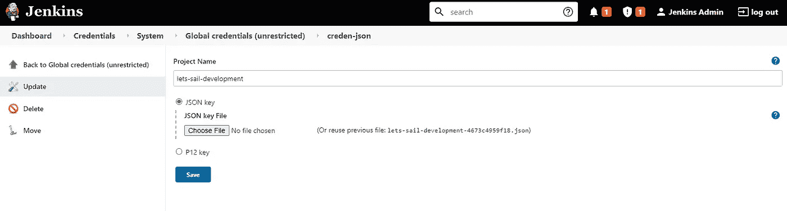

导航到 Jenkins 用户界面，按照以下步骤配置管道作业

a.单击 ui
b 左上角工具栏中的 Jenkins 链接。单击左侧导航
中的新项目链接，项目名称使用 let-sail-Jenkins-job，选择多分支管道选项，然后单击确定

c.单击 Add source 并选择 git
d。将您在云资源存储库上的第一个 repo 的 HTTPS 克隆 URL 粘贴到 Project Repository 字段中。它看起来像这样:[https://source . developers . Google . com/p/let-sail-development/r/firstclusterepo-app](https://source.developers.google.com/p/lets-sail-development/r/firstclusterepo-app)

e.从凭证下拉列表中，选择“让我们航行-发展”。

f.其格式应为**“let-sail-development service account”**
g。在“扫描多分支管道触发器”部分下，选中“定期运行，否则运行”框，然后将间隔值设置为 1 分钟。

单击保存，保留所有其他选项的默认值。

h.开始了一个分支索引作业，以识别存储库中的任何分支。

g.点击顶部菜单中的 jenkins >“让我们开始 Jenkins 的工作”。

h.您应该看到主分支现在已经为它创建了一个作业。

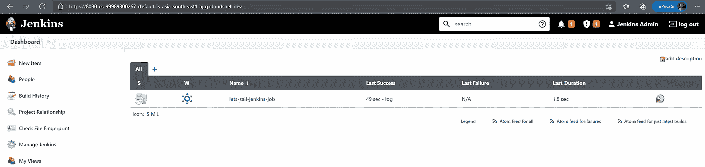

让我们回顾一下管道

**所有 3 条管道视图**

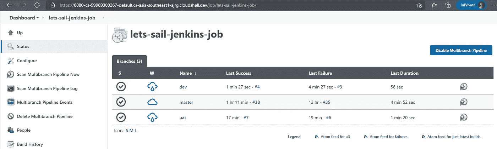

**开发管道**

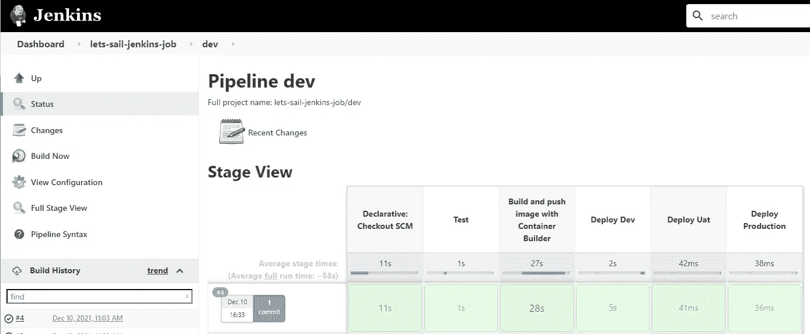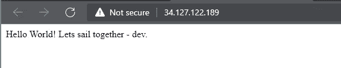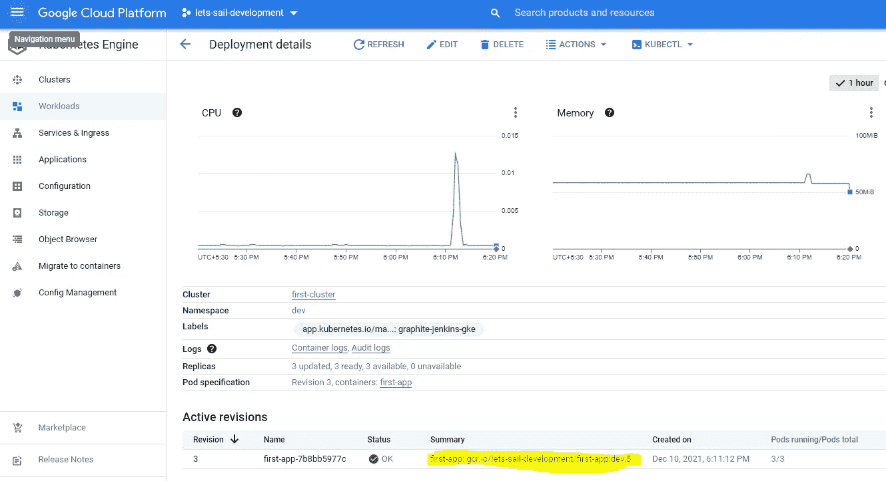

**Uat 管道**

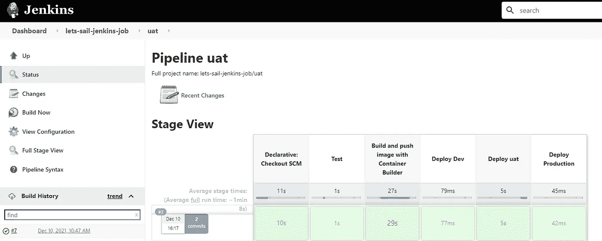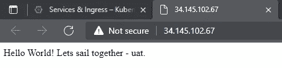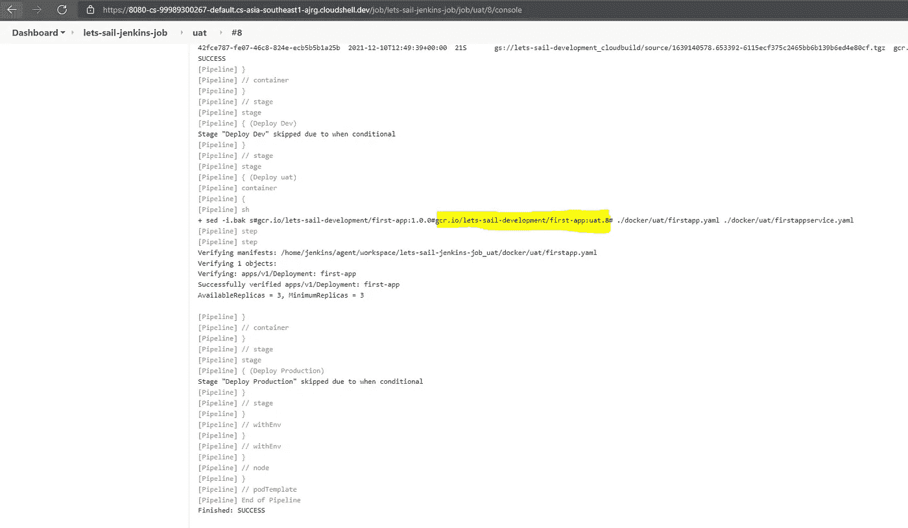

**生产管道**

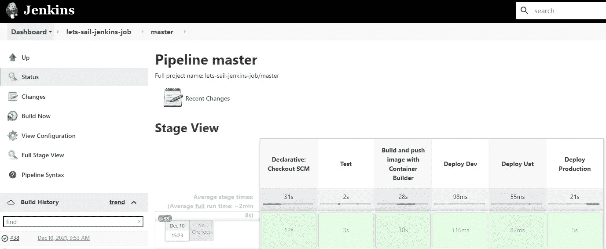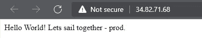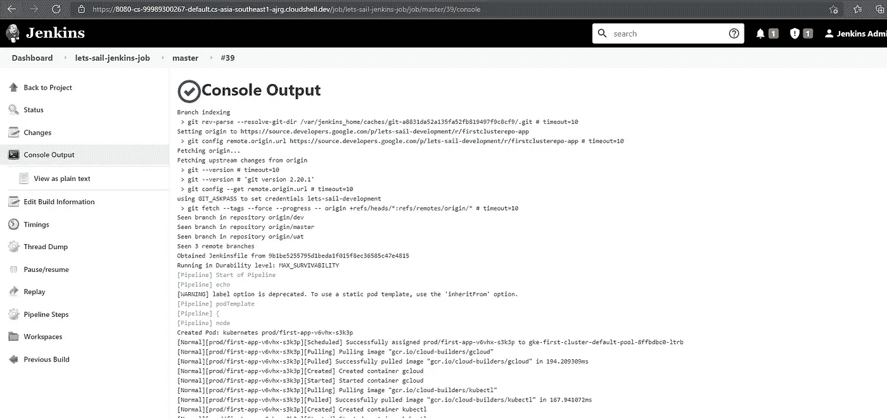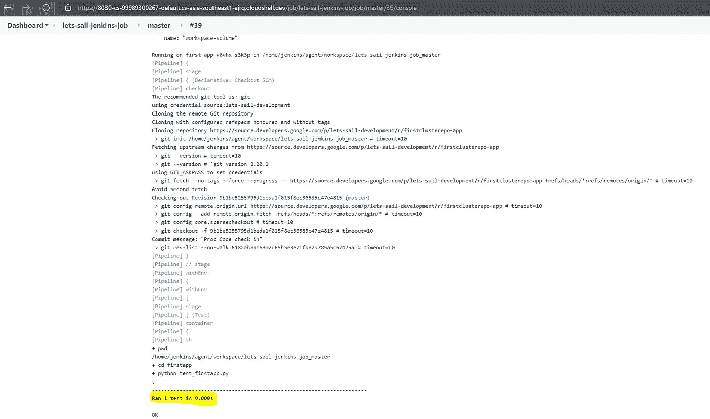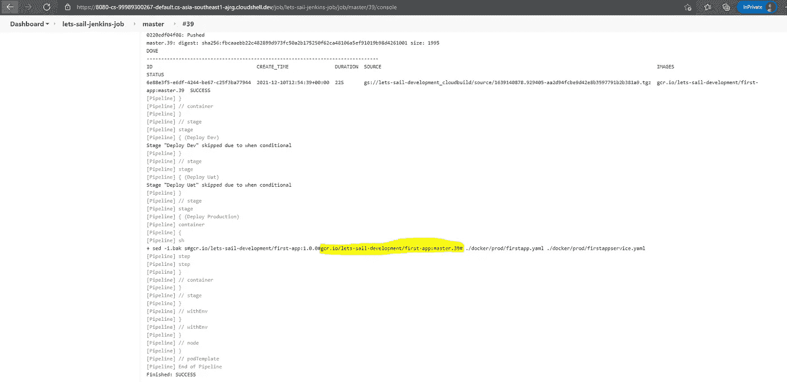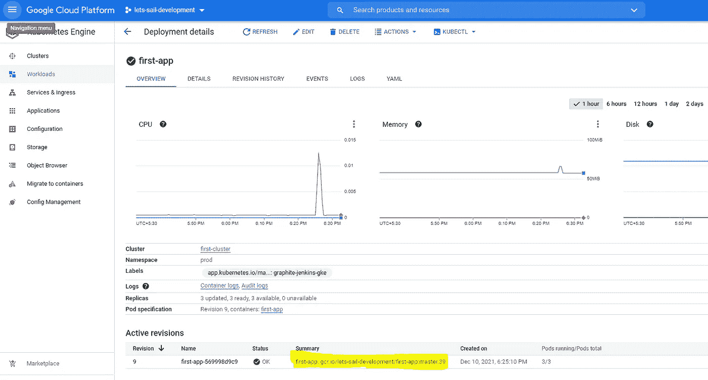

7.**监控您的应用:**设置云监控仪表板，以监控 pods 状态和其他指标

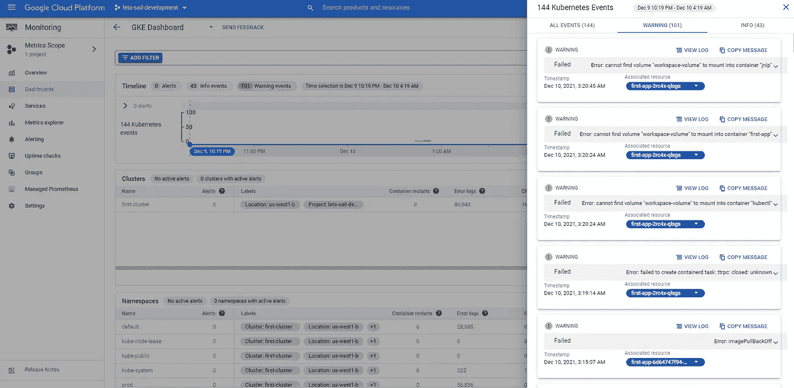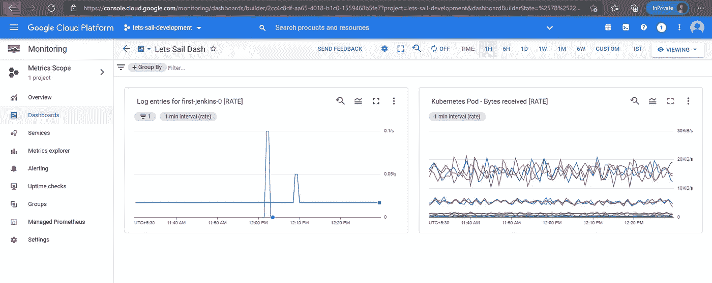

添加:

Kubens 过去常常在名称空间之间切换

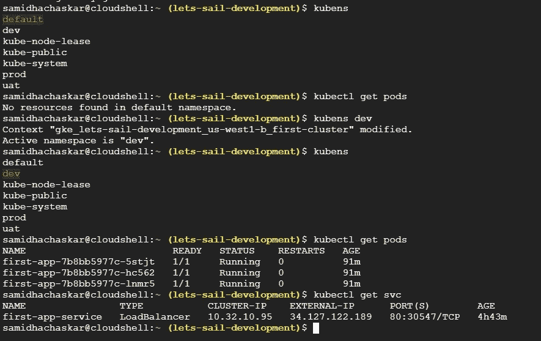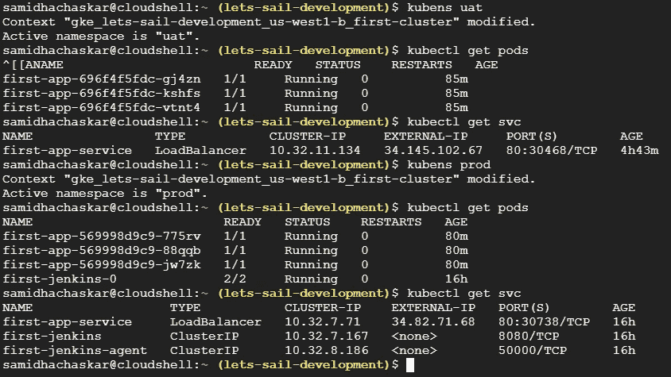

Kubectx 曾经在集群之间切换

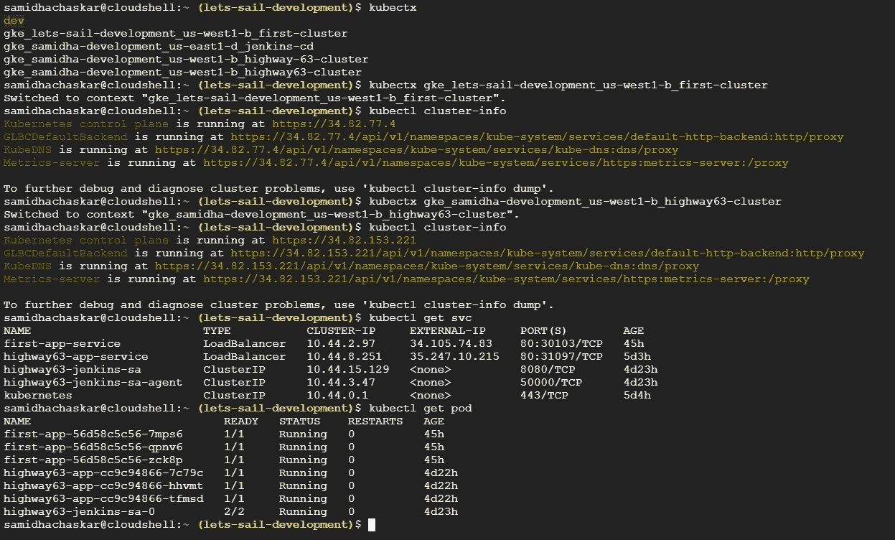