# GCP 认证——让我们一起航行。首个端到端项目—詹金斯和 GKE 的 CI/CD—第一部分

> 原文：<https://medium.com/javarevisited/gcp-certification-lets-sail-together-9f08c0344f18?source=collection_archive---------1----------------------->

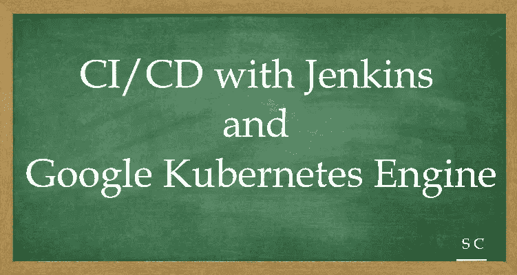

大家好，

经过 2 个月的努力学习 GCP，这里是我第一次尝试创建一个端到端的项目与 CI/CD 管道使用以下产品:-

1.  [云壳](https://cloud.google.com/shell/docs)
2.  [谷歌 Kubernetes 引擎(GKE)](https://cloud.google.com/kubernetes-engine/docs)
3.  [云源库](https://cloud.google.com/source-repositories/docs)
4.  [云构建](https://cloud.google.com/build/docs)
5.  [集装箱登记处](https://cloud.google.com/container-registry/docs)
6.  [计算引擎](https://cloud.google.com/compute/docs)
7.  [云负载均衡](https://cloud.google.com/load-balancing/docs)
8.  [身份和访问管理(IAM)](https://cloud.google.com/iam/docs)
9.  [云存储](https://cloud.google.com/storage/docs)
10.  [云日志](https://cloud.google.com/logging/docs)
11.  [云监测](https://cloud.google.com/monitoring/docs)
12.  [烧瓶](https://flask.palletsprojects.com/en/2.0.x/)
13.  [Python](https://www.python.org/)
14.  [可回答的](https://www.ansible.com/)
15.  [地形](https://www.terraform.io/)
16.  [码头工人](https://www.docker.com/)
17.  [詹金斯](https://www.jenkins.io/)
18.  kubectx——在集群之间切换的工具
19.  kubens——在 Kubernetes 名称空间之间切换的工具
20.  [实例组](https://cloud.google.com/compute/docs/instance-groups#managed_instance_groups)
21.  [实例模板](https://cloud.google.com/compute/docs/instance-templates/)

**关键参考文献**

1.  [谷歌 OAuth 凭证](https://plugins.jenkins.io/google-oauth-plugin/)
2.  [创建和管理服务账户密钥](https://cloud.google.com/iam/docs/creating-managing-service-account-keys#iam-service-account-keys-create-gcloud)
3.  K8s — [部署](https://kubernetes.io/docs/concepts/workloads/controllers/deployment/) / [服务](https://kubernetes.io/docs/concepts/services-networking/service/) / [入口](https://kubernetes.io/docs/concepts/services-networking/ingress/) / [机密](https://kubernetes.io/docs/concepts/configuration/secret/)
4.  [名称空间](https://kubernetes.io/docs/concepts/overview/working-with-objects/namespaces/)
5.  [用名称空间共享一个集群](https://kubernetes.io/docs/tasks/administer-cluster/namespaces/)
6.  [使用 RBAC 授权](https://kubernetes.io/docs/reference/access-authn-authz/rbac/)
7.  [詹金斯插件](https://plugins.jenkins.io/kubernetes/)
8.  [詹金斯的管道代码](https://www.jenkins.io/solutions/pipeline/)
9.  [使用 Jenkinsfile](https://www.jenkins.io/doc/book/pipeline/jenkinsfile/)

# 目标:-

在 kubernetes 引擎上部署简单的 hello world python 应用程序。使用负载平衡器公开应用程序，然后使用 jenkins 实施 CI/CD。

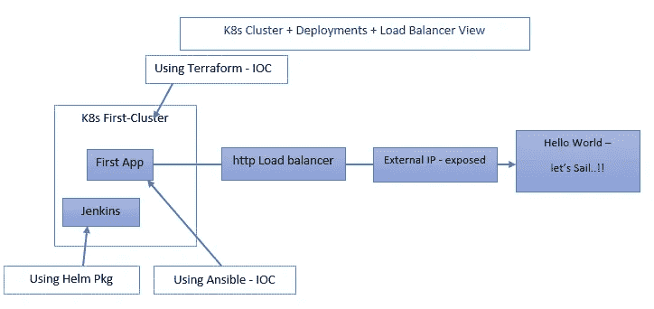

**高级执行步骤:-**

1.  **版本控制:**创建并克隆源代码库，推送应用代码
2.  **应用开发:**使用 flask 构建简单的 python hello world 应用
3.  **构建应用**:使用 Docker 构建应用映像，并将其推送到容器注册表中
4.  **基础架构设置:**设置 GKE 集群，在同一个集群中的 3 个不同环境(开发、Uat 和生产)中启用自动扩展
5.  **部署:**在 GKE 部署应用程序，并通过负载均衡器公开服务。
6.  **CI/CD :** 通过 Jenkins 使自动化
7.  **监控您的应用:**设置云监控仪表板，以监控 pods 状态和其他指标

让我们启航吧……!！！

**准备工作** :-执行以下基本设置命令

```
gcloud auth list
gcloud config list project
gcloud config set project lets-sail-development#Enable required API'sgcloud services enable container.googleapis.com cloudbuild.googleapis.com sourcerepo.googleapis.com containeranalysis.googleapis.com#Let's set the zone upfront
gcloud config set compute/zone us-west1-b 
```

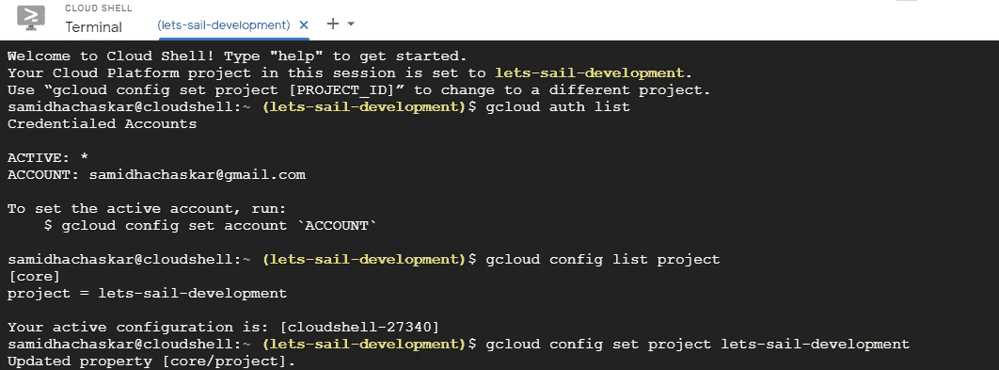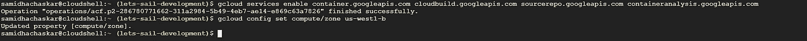

现在让我们设置回购，以便我们开始签入代码。

1.  **版本控制:**创建并克隆源代码库，推送应用代码

```
gcloud source repos create firstclusterepo-appfirst google source repository:- [https://source.cloud.google.com/lets-sail-development/firstclusterepo-app](https://source.developers.google.com/p/lets-sail-development/r/firstclusterepo-app)mkdir lets-sail
cd lets-sailgcloud initgcloud source repos clone firstclusterepo-app --project=lets-sail-development
cd firstclusterepo-app
git status
```

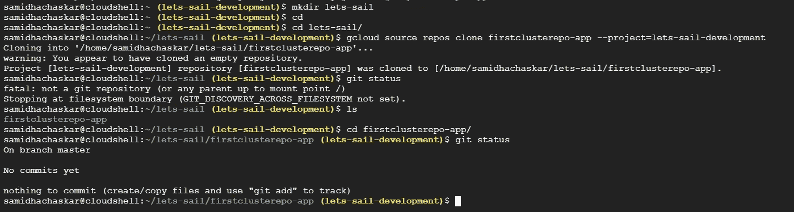

要查看您的代码报告，请转到导航菜单>源代码库

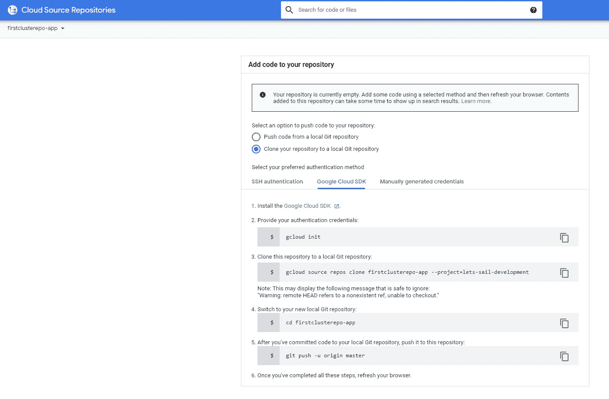

2.**应用开发:**使用 flask 构建简单的 Hello World python 应用

应用程序 python 文件

```
cd ~/lets-sail/firstclusterepo-app
mkdir firstapp
cd firstapp**nano firstapp.py**from flask import Flask
app = Flask('first-app')
[@app](http://twitter.com/app).route('/')
def hello():
  return "Hello World! Lets sail together - prod.\n"
if __name__ == '__main__':
  app.run(host = '0.0.0.0', port = 8080)
```

应用程序 python 测试文件

```
**nano test_firstapp.py**import unittest
from firstapp import hello
class TestFirstApp(unittest.TestCase):
    def test_hello(self):
        self.assertEqual(hello(), "Hello World! Lets sail together - prod.\n")
if __name__ == '__main__':
  unittest.main()
```

应用程序 docker 文件

```
**nano Dockerfile**FROM python:3.7-slim
RUN pip install flask
WORKDIR /app
COPY firstapp.py /app/firstapp.py
ENTRYPOINT ["python"]
CMD ["/app/firstapp.py"]
```

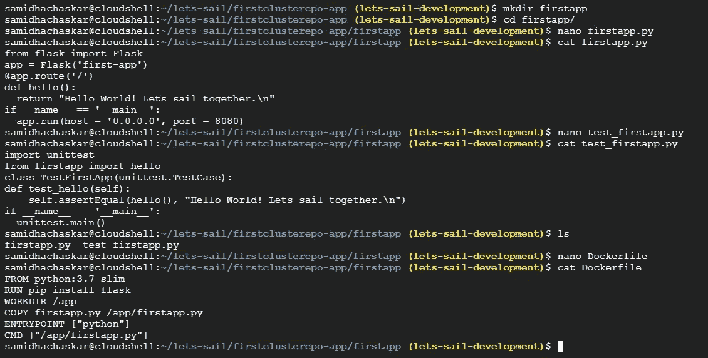

让我们提交 Terraform 配置文件和 firstapp 代码

```
cd ~/lets-sail/firstclusterepo-app/firstappgit status
git add .#You can use your own email id and user id
git config --global user.email "[student-01-c6fca7d7079c@qwiklabs.net](mailto:student-01-c6fca7d7079c@qwiklabs.net)"
git config --global user.name "[student-01-c6fca7d7079c](mailto:student-01-c6fca7d7079c@qwiklabs.net)"
git commit -m "Firstapp code"
git push
```

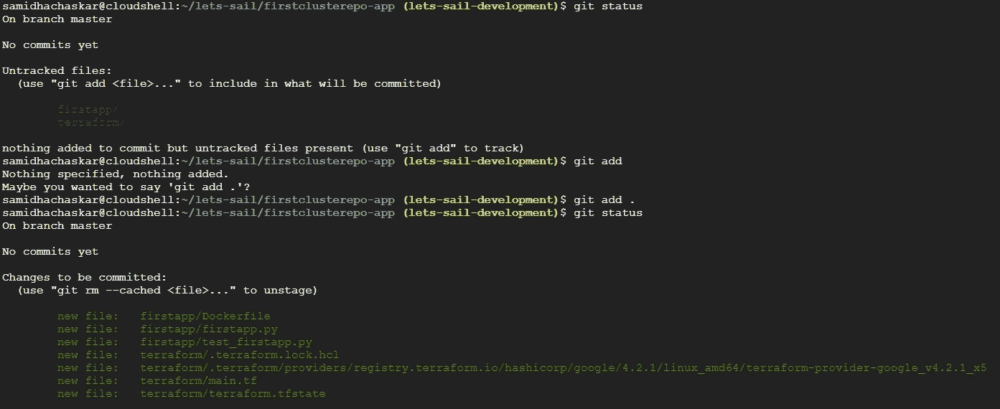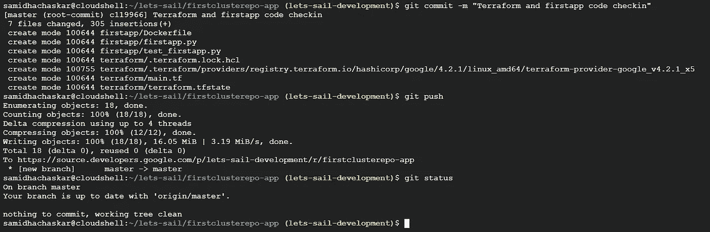

3.**构建应用**:使用云构建器构建 docker 映像。将图像推送到容器注册表

```
cd ~/lets-sail/firstclusterepo-app/firstappgcloud builds submit --tag="gcr.io/lets-sail-development/first-app:1.0.0" .**Image** : gcr.io/lets-sail-development/first-app:1.0.0
```

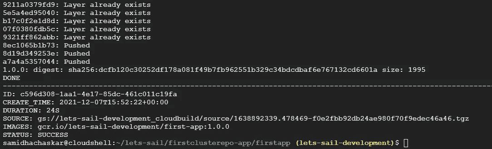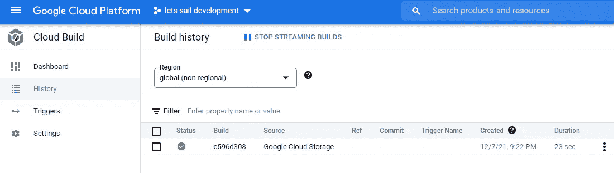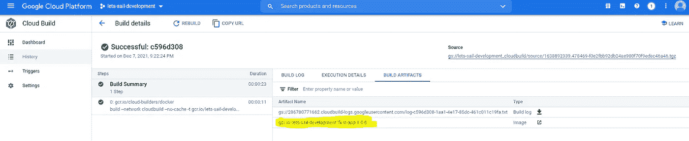

4.**基础架构设置:**在同一个集群中的 3 个不同环境(开发、Uat 和生产)中设置启用了自动扩展的 GKE 集群

让我们使用 Terraform 设置基本集群

```
cd ~/lets-sail/firstclusterepo-app/
mkdir terraform
cd terraform**nano main.tf**resource "google_container_cluster" "first-cluster" {
  name               = "first-cluster"
  location           = "us-west1-b"
  initial_node_count = 3
}output "cluster_name" {
  value = google_container_cluster.first-cluster.name
}
output "cluster_location" {
  value = google_container_cluster.first-cluster.location
}
```

让我们应用地形文件

```
terraform init
terraform validate
terraform apply
```

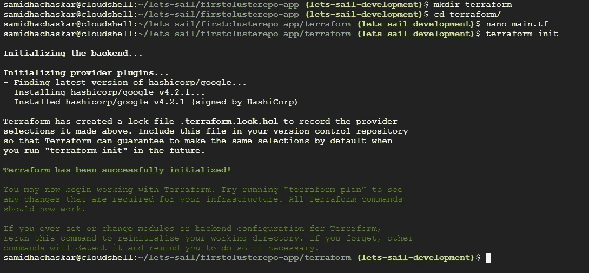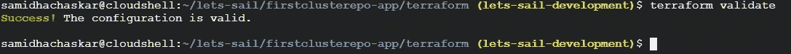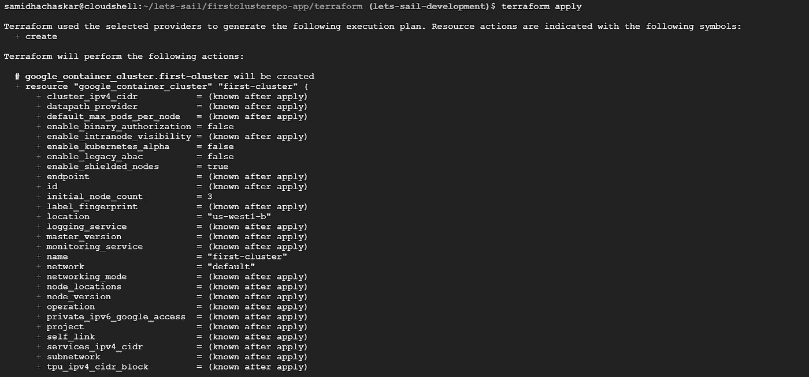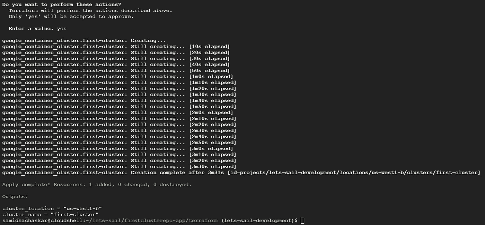

另一个高级选项是使用 cli 创建启用了自动扩展+自动节点配置功能的群集

```
gcloud container clusters create first-cluster --num-nodes=2 --enable-vertical-pod-autoscaling --release-channel=rapid  --cluster-version=1.21.5-gke.1302 --enable-autoscaling --min-nodes 1 --max-nodes 5 --enable-autoprovisioning --min-cpu 1 --min-memory 2 --max-cpu 45 --max-memory 160 --zone us-west1-b --machine-type n1-standard-2 --scopes  "[https://www.googleapis.com/auth/source.read_write,cloud-platform](https://www.googleapis.com/auth/source.read_write,cloud-platform)"
```

让我们提交地形文件

```
cd ~/lets-sail/firstclusterepo-app/terraformgit status
git commit -a -m "Terraform config "
git push
```

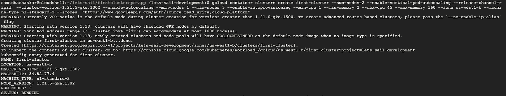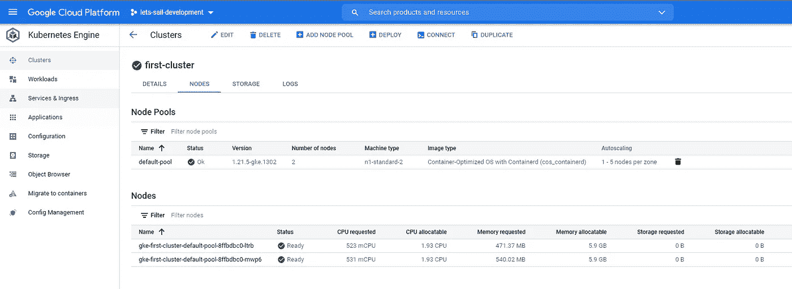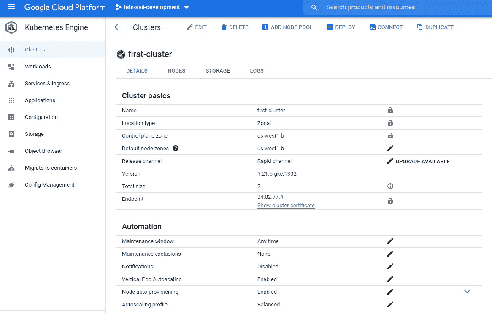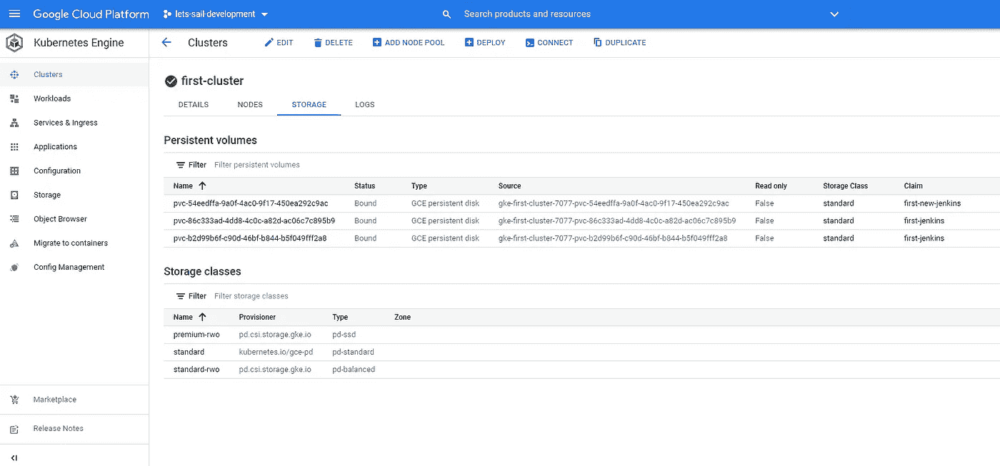

5.**部署:**在 GKE 部署应用程序，并通过负载均衡器公开应用程序服务。

应用程序部署 yaml

```
cd ~/lets-sail/firstclusterepo-app
mkdir docker
cd docker
mkdir prod
cd prod**nano firstapp.yaml**apiVersion: apps/v1
kind: Deployment
metadata:
  name: first-app
  namespace: prod
spec:
  replicas: 3
  selector:
    matchLabels:
      run: first-app
  template:
    metadata:
      labels:
        run: first-app
    spec:
      containers:
      - name: first-app
        image: gcr.io/lets-sail-development/first-app:1.0.0
        ports:
            - name: http
              containerPort: 80
```

应用服务 yaml

```
**nano firstappservice.yaml**apiVersion: v1
kind: Service
metadata:
  name: "first-app-service"
  namespace: prod
spec:
  selector:
    run: "first-app"
  ports:
    - protocol: "TCP"
      port: 80
      targetPort: 8080
  type: LoadBalancer
```


要与集群交互，请获取凭据

```
gcloud container clusters get-credentials first-cluster
```

为每个环境创建不同的名称空间

产品环境

```
cd ~/lets-sail/firstclusterepo-app/docker/prod
kubectl create ns prod
kubectl apply -f firstapp.yaml
```

使用服务 yaml 公开

```
kubectl apply -f firstappservice.yaml
```

另一个选项—如果需要，通过 cli 公开

```
kubectl expose deployment first-app --name first-app-service --namespace=prod --type LoadBalancer --port 80 --target-port 8080
```

开发环境

```
cd ~/lets-sail/firstclusterepo-app
git checkout dev
git push --set-upstream origin devmkdir docker
cd docker
mkdir dev
cd devkubectl create ns dev#Create same yaml files as prod, except for one attribute update namespace: dev
nano firstapp.yaml 
nano firstappservice.yamlkubectl apply -f firstapp.yaml
kubectl apply -f firstappservice.yaml
```

UAT 环境

```
cd ~/lets-sail/firstclusterepo-app
git checkout uat
git push --set-upstream origin uatmkdir docker
cd docker
mkdir uat
cd uatkubectl create ns uat#Create same yaml files as prod, except for one attribute update namespace: uat
nano firstapp.yaml 
nano firstappservice.yamlkubectl apply -f firstapp.yaml
kubectl apply -f firstappservice.yaml
```

回购的结构应该是这样的

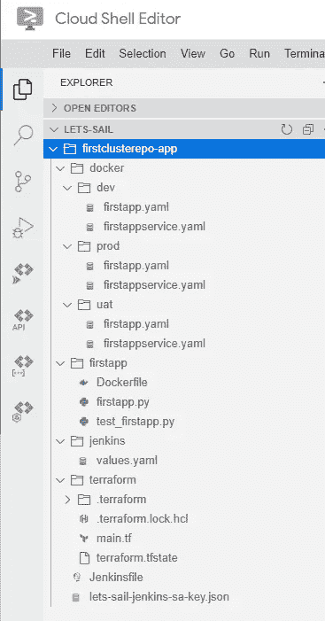

主分支

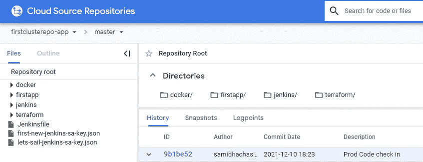

发展处


Uat 部门

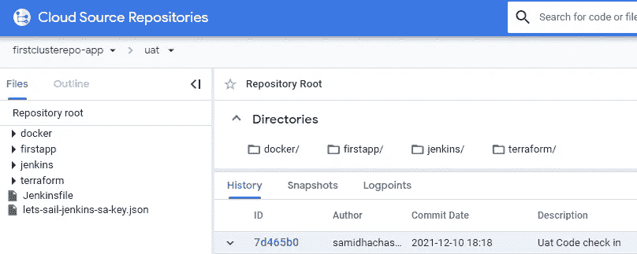

在集群上部署所有 3 个 env

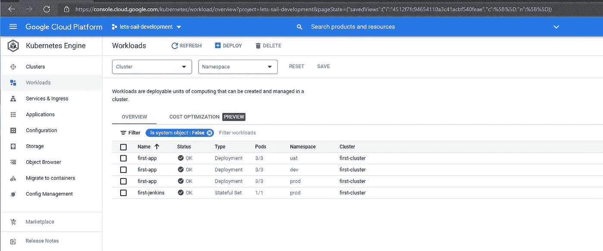

所有 3 个 env 在集群上公开的服务

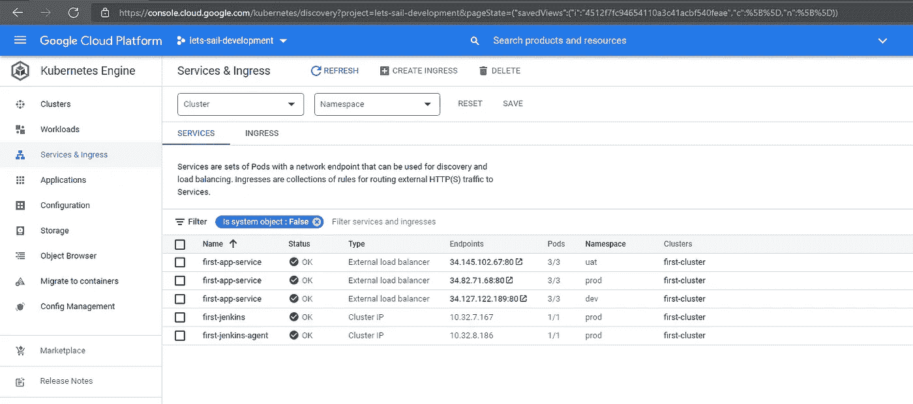

开发中—可通过外部 IP 上的负载平衡器成功访问应用

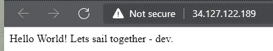

在 Uat 中—可通过外部 IP 上的负载平衡器成功访问应用

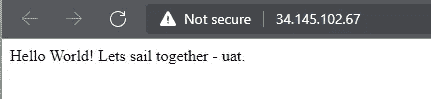

在生产中—可通过外部 IP 上的负载平衡器成功访问应用程序

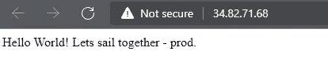

附加信息:

外部 IP 可以在 VPC 部分看到

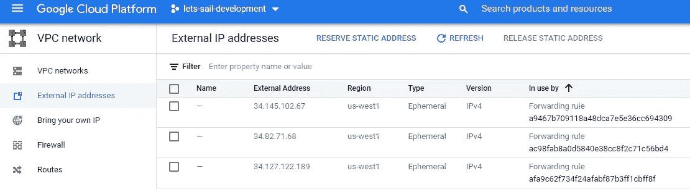

创建了其他防火墙规则

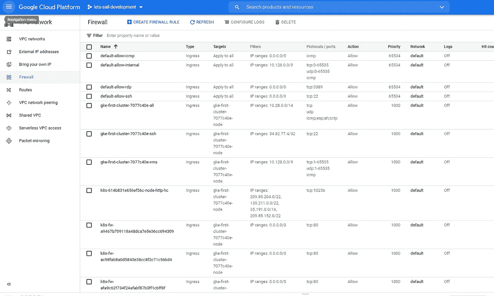

2 台计算虚拟机创建为第一个群集节点


实例模板已创建

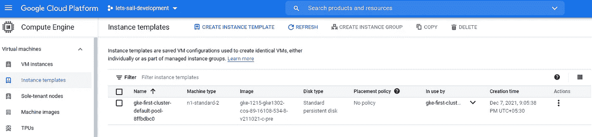

实例组已创建

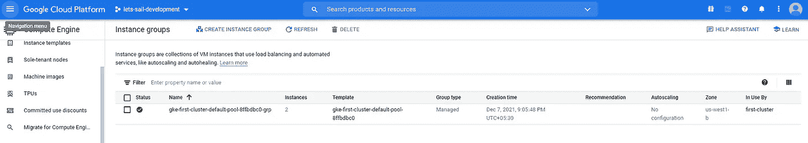

K8s 健康检查服务

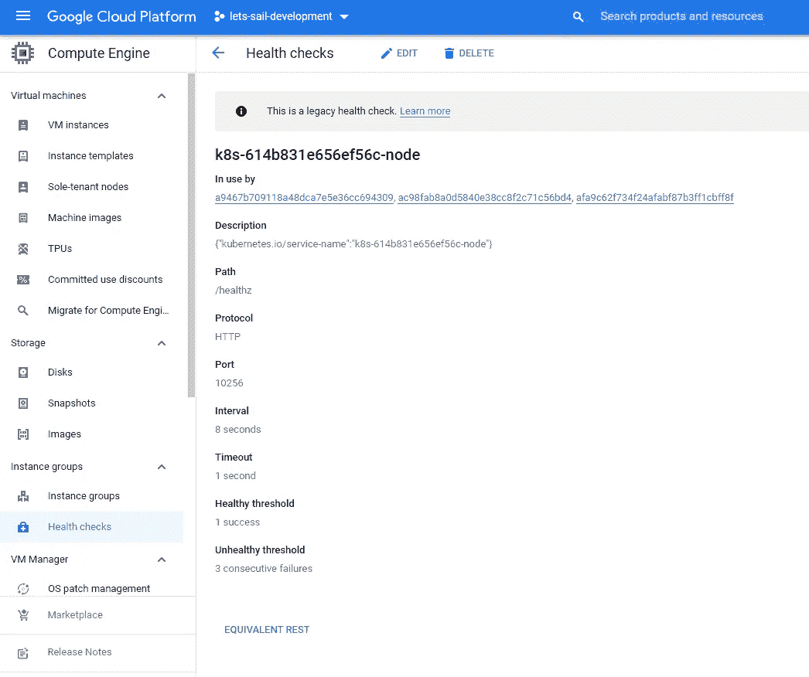

3 个负载平衡器，分别用于生产、开发和 Uat


用于应用构建的云存储


提供 docker 映像详细信息的云构建

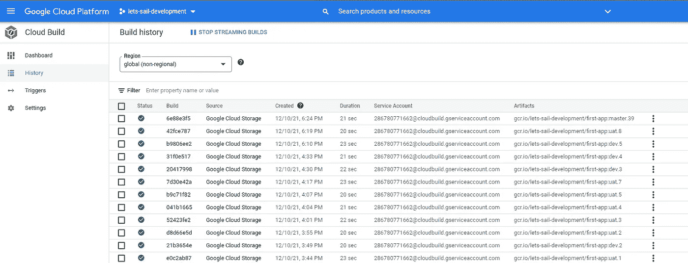

保存 docker 图像的容器注册表

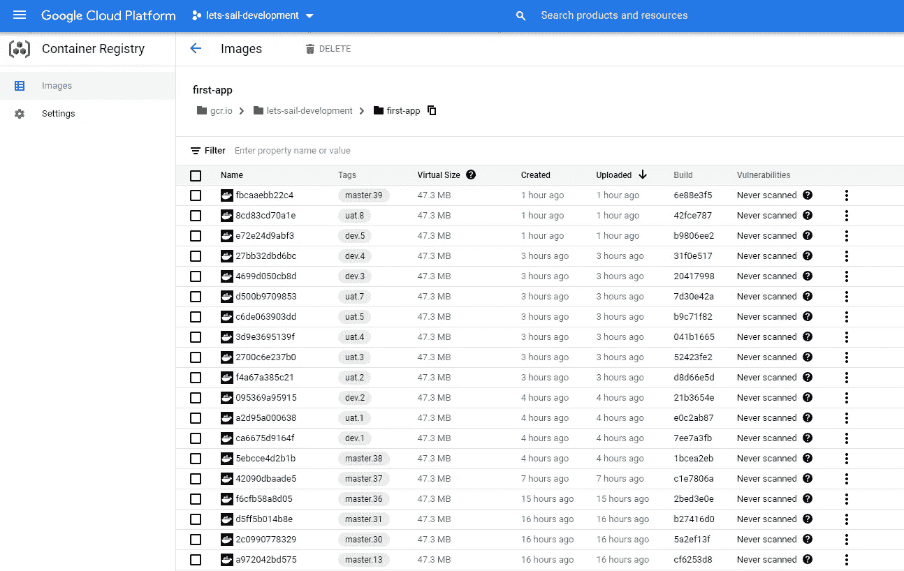

[未完待续第二部分](https://medium.com/p/714e45efb798/edit?source=your_stories_page----------------------------------------) ……..！！