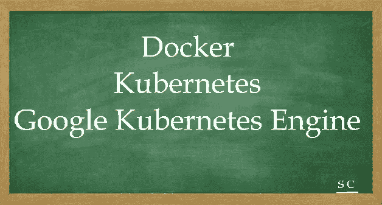

# GCP 认证——让我们一起航行。关于 Docker，Kubernetes 和谷歌 Kubernetes 引擎

> 原文：<https://medium.com/javarevisited/gcp-certification-lets-sail-together-about-docker-kubernetes-and-google-kubernetes-engine-281748cbca74?source=collection_archive---------4----------------------->

# **首次介绍 Docker**

Docker 是一个开发、发布和运行应用程序的开放平台。使用 Docker，您可以将您的应用程序与您的基础架构分开，并将您的基础架构视为托管应用程序。Docker 容器可以直接在 Kubernetes 中使用，这使得它们可以轻松地在 Kubernetes 引擎中运行。

接触 Docker 的最佳实验室之一—*[***Docker 简介***](https://www.cloudskillsboost.google/focuses/1029?catalog_rank=%7B%22rank%22%3A4%2C%22num_filters%22%3A0%2C%22has_search%22%3Atrue%7D&parent=catalog&search_id=14554189>) ***(详细步骤参见下文)****

# *第二个关于 Kubernetes*

*Kubernetes 是一个开源项目，可以在许多不同的环境下运行，从笔记本电脑到高可用性多节点集群；从公共云到内部部署；从虚拟机到裸机。*

*接触 Kubernetes 的最佳实验室之一—[***Kubernetes 简介***](https://www.cloudskillsboost.google/focuses/564?catalog_rank=%7B%22rank%22%3A8%2C%22num_filters%22%3A0%2C%22has_search%22%3Atrue%7D&parent=catalog&search_id=14554189) ***(详细步骤参见下文)****

*我推荐观看以下两段由 Anshul Tiwari 制作的精彩视频:*

1.  *Kubernetes 速成班:不到 15 分钟*
2.  *[让我们了解容器|创建 docker 容器的 5 个简单步骤](https://youtu.be/d9fQ4hGz6-4)*

# *最后关于谷歌 Kubernetes 引擎*

*Google Kubernetes Engine (GKE)为使用 Google 基础设施部署、管理和扩展您的容器化应用程序提供了一个托管环境。*

*Google Kubernetes 引擎(GKE)集群由 Kubernetes 开源集群管理系统提供支持。*

*Kubernetes 提供了与容器集群交互的机制。*

*接触 GKE 最好的实验室之一— [Kubernetes 引擎:Qwik Start](https://www.cloudskillsboost.google/focuses/878?parent=catalog) ***(详细步骤参考下文)****

*我推荐看下面 GK 的 3 个精彩视频的播放列表:[谷歌 Kubernetes 引擎— YouTube](https://www.youtube.com/playlist?list=PLBRBRV08tHh21k417YR04lZQdlTiqiaOJ)*

*[***Docker***](https://www.cloudskillsboost.google/focuses/1029?catalog_rank=%7B%22rank%22%3A4%2C%22num_filters%22%3A0%2C%22has_search%22%3Atrue%7D&parent=catalog&search_id=14554189>)***实验室步骤:-****

*在本实验中，您将学习:-
根据 Docker Hub 的公开图像运行容器。
构建您自己的容器映像，并将其推送到 Google 容器注册表。
·学会了调试正在运行的容器的方法。
基于从 Google 容器注册表中提取的图像运行容器。*

*第一步:运行 hello World 容器
第二步:hello world 映像在 VM 上不存在，因此它从[Docker Hub](https://hub.docker.com/)——一个公共存储库
中提取映像第三步:当您运行 Hello World 容器时，它不会给出“无法在本地找到映像——从库/hello-world 中提取”的消息，因为它已经存在。
第四步:新建 node.js app : my-app(包括 Docker 文件和一个 app js 文件)
第五步:构建 Docker 镜像并运行 my-app v1 容器
第六步:用-d 标志在后台运行 my-app v1 容器的另一种方式
第七步:用不同的消息构建 node.js : my-app 的版本 2。然后为 my-app v2
构建 docker 映像第 8 步: *Add on info :* 使用 docker logs -f 调试容器日志<容器 id >
第 9 步: *Add on info :* 在运行的容器内部启动一个交互式 Bash 会话。您可以使用 docker exec 来完成此操作—docker exec-it[container _ id]bash
步骤 10 : *Add on info :* 使用 Docker inspect:Docker inspect[container _ id]
检查 Docker 中容器的元数据步骤 11 : *Add on info :* 检查返回的 JSON use — format 中的特定字段。例如:
docker inspect—format = ' { { range . network settings . networks } } {。IP address } } { { end } } '[container _ id]
步骤 12:现在是从虚拟机迁移到云的时候了，将图像发布到 Google 容器注册表，格式为:*

*[主机名]/[项目 id]/[图像]:[标签]。*

*对于 google cloud registry :-
【主机名】= gcr.io
【项目 ID】=您的项目 ID
【图片】=您的图片名称
【标签】=您选择的任何字符串标签。如果未指定，则默认为“最新”。*

*步骤 13:删除所有容器并清除 VM 上的现有映像，这样您就只有一个容器从云映像运行。
步骤 14:从云中提取图像并运行打印“Hello Cloud”的容器*

*[***Kubernetes***](https://www.cloudskillsboost.google/focuses/564?catalog_rank=%7B%22rank%22%3A8%2C%22num_filters%22%3A0%2C%22has_search%22%3Atrue%7D&parent=catalog&search_id=14554189)***实验室步骤*** :*

*在本实验中，您将学习:-
如何构建、运行和调试 Docker 容器。
如何从 Docker Hub 和 Google Container 注册表中提取 Docker 图片。
如何将 Docker 图片推送到 Google 容器注册表。*

*第一步:新建 server.js app : my-node(包含服务器 js 文件)
第二步:使用云壳内置的 Web 预览功能访问你的 app。
第三步:为 my-node v1 构建 Docker 映像并运行 my-node v1 容器
第四步:在端口 8080 上访问 my-node app，然后停止容器
第五步:现在是从 VM 迁移到 cloud 的时候了，将映像发布到 Google 容器注册表，格式为:
[hostname]/[project-id]/[Image]:[tag]。
对于 google cloud registry :-
【主机名】= gcr.io
【项目 ID】=您的项目 ID
【图片】=您的图片名称
【标签】=您选择的任何字符串标签。如果未指定，则默认为“最新”。
验证您可以通过导航菜单>容器注册表下的云控制台查看图像。
步骤 6:通过 Kubernetes 引擎从 Google 控制台使用标准 N1 机器和 2 个节点创建。
第 7 步:通过 Kubernetes 引擎>工作负载
部署容器映像第 8 步:通过端口 8080 上的外部 IP 通过负载平衡器公开部署—这也可以从 google cloud 控制台完成
第 9 步:现在您应该能够通过将浏览器指向以下地址来访问服务:http:// <EXTERNAL _ IP>:8080—“Hello World”应该是屏幕上的消息
步骤 10:在热模式下纵向扩展服务—无需停止或重新部署您的工作负载，只需纵向扩展即可这是 Kubernetes 提供的强大功能之一。 通过部署和机架计数验证纵向扩展的节点。
第 9 步:对您的服务进行升级——这是允许在热模式下进行部署更新而不影响用户的另一个功能。
这可以通过编辑现有 hello-node 部署来更改容器的图像标签来完成
步骤 10:您现在应该能够通过将浏览器指向以下地址来访问服务:http://<EXTERNAL _ IP>:8080—“Hello Kubernetes World”应该是屏幕上的消息*

*[*K****ubernetes 引擎 Qwik 启动***](https://www.cloudskillsboost.google/focuses/878?parent=catalog) ***实验室步骤*** :*

*在本实验中，您将学习:-*

*如何创建 Google Kubernetes 集群
获取访问 Google Kubernetes 集群的凭证
如何将应用程序部署到 Google Kubernetes 集群
删除 Google Kubernetes 集群*

*步骤 1:为实验室设置默认区域(这很重要)
如果您设置了默认区域，它可能会在每个区域中创建 3 个节点。例如，如果一个区域以 3 个区域为中心，它将创建 3 * 3–9 个节点。
这可能会阻止你的帐户，因为它不需要在一个地区的不同区域创建节点。
第二步:创建一个 GKE 集群:一个集群由至少一个集群主机和多个称为节点的工作机组成。
节点是计算引擎虚拟机(VM)实例，运行使它们成为集群的一部分所必需的 Kubernetes 进程。
步骤 3:创建集群后，您需要认证凭证来与之交互。
gcloud 容器集群 get-credentials mycluster
步骤 4:从 hello-app 容器映像创建一个新的部署 hello-server。这是将作为容器部署到 K8s 集群上的 docker 映像。
第 5 步:最后是负载平衡概念，通过服务向外界公开 hello 应用程序。*

*好样的…..让我们一起航行吧。*