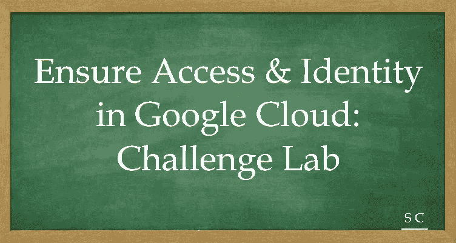

# GCP 认证——让我们一起航行。确保 Google Cloud 中的访问和身份:挑战实验室

> 原文：<https://medium.com/javarevisited/gcp-certification-lets-sail-together-ensure-access-identity-in-google-cloud-challenge-lab-786eab033c7f?source=collection_archive---------3----------------------->

[](https://javarevisited.blogspot.com/2019/07/top-5-google-cloud-platform-gcp-courses-certifications-online.html)

# 让我们去确保谷歌云的访问和身份:挑战实验室

根据在此任务中完成的差异实验，在此挑战实验中，您应该

1.  创建自定义安全角色
2.  创建服务帐户
3.  根据所需的最低权限将 IAM 安全角色绑定到服务帐户
4.  在现有的自定义子网中创建私有 Kubernetes 集群
5.  最后，将应用程序部署到私有的 Kubernetes 集群。

让我们开始行动吧。

**确保在 cli 命令中替换 5 个以下变量**

1.  项目标识:qwiklabs-gcp-02-de90f326eb51
2.  自定义安全角色:orca_storage_manager_855
3.  服务帐户:orca-private-cluster-662-sa
4.  集群名称:orca-cluster-985
5.  orca-jump 主机 IP : 192.168.10.2

**让我们从基本步骤开始**
gcloud 授权列表
gcloud 配置列表项目
gcloud 配置集计算/区域 us-east1-b

**请注意:-**
1。您可以提前获取虚拟机 IP，因为已经使用以下命令创建了跳转主机虚拟机实例:—

```
gcloud compute instances describe orca-jumphost --format='get(networkInterfaces[0].networkIP)'
```

2.您可以提前从 VPC“orca-build-VPC”和子网“orca-build-subnet”获得区域详细信息，以便您可以在同一区域创建 Kubernetes 集群。

**让我们深潜进去————**

**步骤 1:创建自定义安全角色**

选项 1:使用标志

```
gcloud iam roles create orca_storage_manager_855 --project $DEVSHELL_PROJECT_ID --title "orca_storage_manager_855" --description "Custom role description." --permissions storage.buckets.get,storage.objects.get,storage.objects.list,storage.objects.update,storage.objects.create --stage ALPHA
```

方案二:使用 Yaml
nano custom-role-definition . Yaml
title:" orca _ storage _ manager _ 855
描述:" Permissions "
stage:" ALPHA "
included Permissions:
—storage . buckets . get
—storage . objects . get
—storage . objects . list
—storage . objects . update
—storage . objects . create

```
gcloud iam roles create orca_storage_manager_855 --project $DEVSHELL_PROJECT_ID --file custom-role-definition.yaml
```

**第二步:创建服务帐户**

```
gcloud iam service-accounts create orca-private-cluster-662-sa --display-name "orca-private-cluster-662-sa"
```

**步骤 3:将 IAM 安全角色绑定到服务帐户。**
角色/monitoring.viewer
角色/monitoring.metricWriter
角色/logging.logWriter

```
gcloud projects add-iam-policy-binding $DEVSHELL_PROJECT_ID --member serviceAccount:[orca-private-cluster-662-sa@qwiklabs-gcp-02-de90f326eb51.iam.gserviceaccount.com](mailto:orca-private-cluster-662-sa@qwiklabs-gcp-02-de90f326eb51.iam.gserviceaccount.com) --role roles/monitoring.viewergcloud projects add-iam-policy-binding $DEVSHELL_PROJECT_ID --member serviceAccount:[orca-private-cluster-662-sa@qwiklabs-gcp-02-de90f326eb51.iam.gserviceaccount.com](mailto:orca-private-cluster-662-sa@qwiklabs-gcp-02-de90f326eb51.iam.gserviceaccount.com) --role roles/monitoring.metricWritergcloud projects add-iam-policy-binding $DEVSHELL_PROJECT_ID --member serviceAccount:[orca-private-cluster-662-sa@qwiklabs-gcp-02-de90f326eb51.iam.gserviceaccount.com](mailto:orca-private-cluster-662-sa@qwiklabs-gcp-02-de90f326eb51.iam.gserviceaccount.com) --role roles/logging.logWritergcloud projects add-iam-policy-binding $DEVSHELL_PROJECT_ID --member serviceAccount:[orca-private-cluster-662-sa@qwiklabs-gcp-02-de90f326eb51.iam.gserviceaccount.com](mailto:orca-private-cluster-662-sa@qwiklabs-gcp-02-de90f326eb51.iam.gserviceaccount.com) --role projects/qwiklabs-gcp-02-de90f326eb51/roles/orca_storage_manager_855
```

**步骤 4:在自定义子网中创建私有 Kubernetes 引擎集群**

```
gcloud beta container clusters create orca-cluster-985 --master-ipv4-cidr=10.142.0.0/28 --network=orca-build-vpc --subnetwork orca-build-subnet --enable-master-authorized-networks --master-authorized-networks 192.168.10.2/32 --enable-ip-alias --enable-private-nodes --enable-private-endpoint --[service-account=orca-private-cluster-662-sa@qwiklabs-gcp-02-de90f326eb51.iam.gserviceaccount.com](mailto:service-account=orca-private-cluster-662-sa@qwiklabs-gcp-02-de90f326eb51.iam.gserviceaccount.com) --zone us-east1-b
```

**步骤 5:将应用部署到私有的 Kubernetes 引擎集群**

```
gcloud compute ssh orca-jumphost --zone us-east1-bgcloud container clusters get-credentials orca-cluster-985 --internal-ip --zone us-east1-b --project qwiklabs-gcp-02-de90f326eb51kubectl create deployment hello-server --image=gcr.io/google-samples/hello-app:1.0
```

好样的…..让我们一起航行吧。