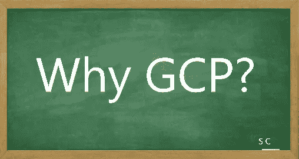

# GCP 认证——让我们一起航行。第一个问题:为什么是 GCP？

> 原文：<https://medium.com/javarevisited/gcp-certification-lets-sail-together-first-question-why-gcp-2bf286b7da72?source=collection_archive---------2----------------------->

朋友们好——这是我的第一篇博客。

我希望踏上获取 **GCP 建筑师解决方案知识**并证明自己的旅程。在这次旅程中，我希望分享我的经验，并与云有志者共同成长。

简而言之，我会试着回答我想到的第一个问题，对其他打算获得认证的人也是如此。

我该去考哪个认证——**AWS/AZURE/GCP**？

如果我们参考 2021 年 7 月 27 日发布的 Gartner 报告“云基础架构和平台服务魔力象限”，ID G00736363。AWS 领先，Azure 和 GCP 紧随其后。

但我去 GCP 只是因为两个原因

1.MLOps 是我的下一个目标，我已经开始浏览谷歌为 ML 提供的 Vertex AI 产品。GCP 有很好的 ML/AI 产品。

2.甚至参加了谷歌提供的几个车库系列，在那里我对 GCP 产品和 GCP 控制台有了一些基本的了解。

最后但同样重要的是，我的导师云倡导者之一——[AWS Vs Azure Vs GCP——选择哪种云可以获得更好的职业生涯和薪酬](https://www.youtube.com/watch?v=UJ6-k19gMbk)？视频让我的决定变得简单而具体:我对 GK 感激不尽。

当我决定申请 GCP 认证时，下一个问题是如何申请？

对于任何认证，你都需要一个定义学习范围的指南。

从以下参考资料开始

关于 https://cloud.google.com/certification/cloud-architect GCP 认证—

考试指南—[https://cloud . Google . com/certification/guides/professional-cloud-architect](https://cloud.google.com/certification/guides/professional-cloud-architect)

学习路径—[https://cloud . Google . com/training/cloud-infra structure # cloud-architect-learning-path](https://cloud.google.com/training/cloud-infrastructure#cloud-architect-learning-path)

一旦你回顾了范围，下一个问题就是我应该去哪个在线学习平台？我推荐 GK 的这个视频:[如何选择合适的云培训平台](https://www.youtube.com/watch?v=9-ykVNTn7ys)。

其中大多数是自定进度的学习课程，有些是由培训师指导的。

正如 GK 所说，这取决于什么样的过程最适合你。我更喜欢结构化的学习方式，通过实际操作让学习变得更令人兴奋。

因此，我先参考考试指南列出我的主题，然后探索不同的途径，通过云 SME 从 YouTube 视频中收集知识。

谷歌技能提升实验室和各自的挑战实验室是我准备的关键方面之一。周末浏览理论，理解概念。工作日在实验室练习。这是你有效管理当前工作量的一种方式，也是你在工作日挤出几个小时进行学习或动手实验的一种方式。

一旦涵盖了 75%的范围，我计划通过练习集测试我对各个主题的知识，然后重复相同的过程。

当我继续写博客的时候，我会继续发布 youtubers 上的云 SME 的参考资料…！！请全程关注并鼓掌，谢谢。

一些列出的可供参考的在线平台-

<https://acloudguru.com/>  <https://www.pluralsight.com/>  <https://intellipaat.com/>  <https://cloudacademy.com/>  <https://www.edureka.co/>  <https://www.coursera.org/in>  

[在线课程——根据您的时间表学习任何内容| Udemy](https://www.udemy.com/)