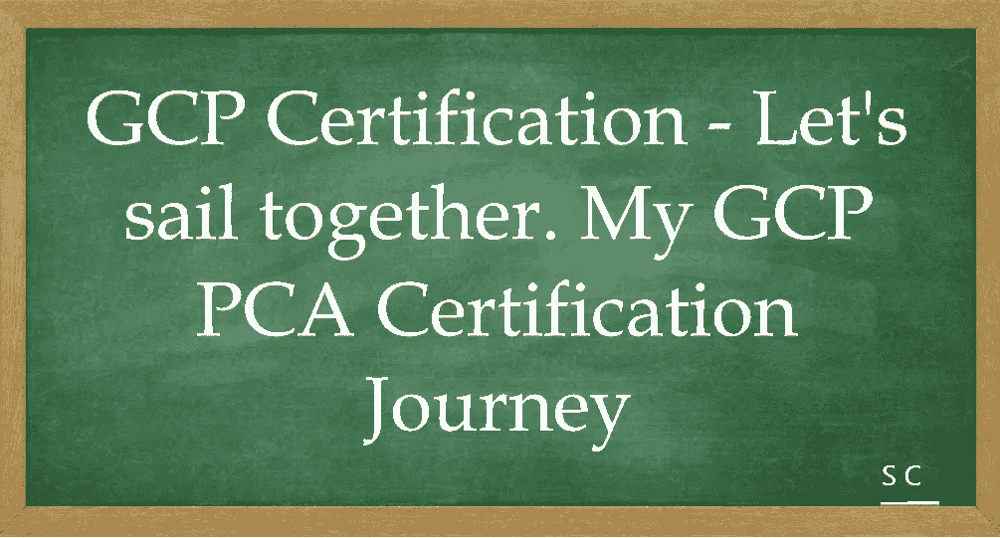
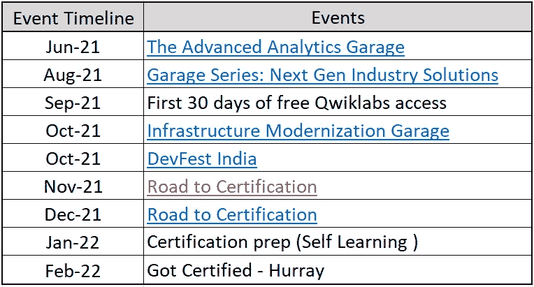

# GCP 认证——让我们一起航行。我的谷歌云专业架构师认证之旅

> 原文：<https://medium.com/javarevisited/gcp-certification-lets-sail-together-mygoogle-cloud-professional-architect-certification-journey-698f34ad1066?source=collection_archive---------4----------------------->

大家好，

我的 GCP 之旅总结:-

1.  第一次触发:2021 年 6 月— [高级分析车库](https://inthecloud.withgoogle.com/advanced-analytics-garage-series-21/register.html)
2.  第二次触发:2021 年 8 月— [车库系列:下一代行业解决方案](https://inthecloud.withgoogle.com/industry-solutions-21/register.html)
3.  鼓励:2021 年 9 月——前 30 天免费访问 Qwiklabs，继续我的谷歌云学习。
4.  **大促** —谷歌首次升值:2021 年 10 月— [基础设施现代化车库](https://inthecloud.withgoogle.com/infrastructure-modernization-garage-21/register.html)
5.  **第二次大提升** —云竞赛获胜者:2021 年 10 月— [印度发展节](https://devfestindia.com/)
6.  2021 年 11 月至 2022 年 1 月中旬:[认证之路](https://events.withgoogle.com/road-to-certification-india/) +自我学习:一种祝福，也正是我所需要的——**6 周** **指导课程**，专为那些想要准备谷歌云认证的人设计
7.  2022 年 1 月中旬至 2022 年 2 月:认证准备

# 2 月 14 日情人节——我参加了考试，并在 2022 年 2 月 18 日得到了谷歌的确认。

来自我的 LinkedIn 帖子的推荐，包括我旅程中推荐的资源的详细信息:-

[https://www . LinkedIn . com/embed/feed/update/urn:李:share:6901608905437519872](https://www.linkedin.com/embed/feed/update/urn:li:share:6901608905437519872)

最近我和大家分享了一些快乐时刻的例子——这里还有一个……!！

在此分享我在云之旅中实现第一个目标的喜悦——我正式**[**Google Cloud 认证——专业云架构师**](/javarevisited/10-best-free-google-cloud-professional-architect-certification-courses-practice-tests-943e75f03929) **”。****

**5 个月前，我开始了一段旅程，从多个来源自学，然后整理我自己的结构化计划，以获得信心，这一旅程获得了回报。我坚信自学是获取知识的最佳途径。**

**在尝试之前，Whizlabs 和 [QwikSkills](https://www.linkedin.com/company/qwikskills/) 模拟测试有助于了解考试题型。 [Qwiklabs](https://www.linkedin.com/company/qwiklabs-inc-/) 体验动手实验室**

**非常感谢云中小企业和我的导师们在 YouTube 上创造了精彩的内容
[Sathish VJ](https://www.linkedin.com/in/ACoAAADeNrkBglNv4_5KVzoGjhEjoOhe_Pc1qqA)——[https://lnkd.in/dTHiNhB3](https://lnkd.in/dTHiNhB3)
[Krishna Chaitanya Gadhiraju(GK)](https://www.linkedin.com/in/ACoAABTMVVUB31bxTGNOcBv-dDFr1xtEkAdQrzo) —[https://lnkd.in/dVPXihXG](https://lnkd.in/dVPXihXG)
[安舒尔·蒂瓦里](https://www.linkedin.com/in/ACoAAAZlahgBCG4ntcHmoT_gNMYikBwwyGVTeSk)—[https://lnkd.in/d-vSExsF](https://lnkd.in/d-vSExsF)
马赫什·库马尔 RP—[https://lnkd.in/dcqpku46](https://lnkd.in/dcqpku46)
[普里扬卡·韦尔加迪亚](https://www.linkedin.com/in/ACoAAAMrpUUBlNSpQaMIiGE1voPDZFsXlvYXEK0)—[https://lnkd.in/dsP_9E8w](https://lnkd.in/dsP_9E8w)
[阿米特·威廉姆斯](https://www.linkedin.com/in/ACoAAAcdZkkBgF_fEIz_7jEfrBFF8HUeDku2jGY) —谷歌云专业云架构师备考表——[https://lnkd.in/gUqiYgQs](https://lnkd.in/gUqiYgQs)** 

**最后但同样重要的是，特别感谢——通往认证计划社区之路——主持人:[https://lnkd.in/dKpNqDGn](https://lnkd.in/dKpNqDGn)
尤其是——[阿伦·泰贾·戈达瓦蒂](https://www.linkedin.com/in/ACoAABw9axoBtSuUwKa08KONkKfpHdsZDCCtRvQ)，[安特里克什·古普塔](https://www.linkedin.com/in/ACoAACS2JSYBd4pvOYaBkYgGJq5d1VDH5F53OjA)，[尼拉夫·科塔里](https://www.linkedin.com/in/ACoAAASZaYQBg2tG_zmSrK-9uD07yUnzFNpdoog) [高拉夫·赫特尔帕](https://www.linkedin.com/in/ACoAAABPmfIBXiW0_opD0RlpbrXbXICvOVVy0Ok) &团队令人惊叹的会议，持续的指导&支持。**

**非常感谢@谷歌—车库系列—[https://lnkd.in/dTnH-nyr](https://lnkd.in/dTnH-nyr)([瑞安·科斯特洛](https://www.linkedin.com/in/ACoAAAK_gm0BLGcG3UutzQ_2ryRXWNbMuxOq_RY)、[杰拉尔德·考恩](https://www.linkedin.com/in/ACoAAAZRneABWiqzwLlKtnMoZn--2sEYesACJK0)、[纳雷什·r·贾索塔尼](https://www.linkedin.com/in/ACoAAB-4JygBoeLwOK9iucXz6JQJTwgfjwGRVlk)、[萨加尔·凯瓦拉马尼](https://www.linkedin.com/in/ACoAAANKfWcBBrevN9-DE7WjGFpJMAjBgoDq8s0)、[里奇·德肯](https://www.linkedin.com/in/ACoAAAQT8IQBk5igUWLfxWOgoIqwORCfjMrrj-E))唤醒了人们对谷歌云平台的好奇。**

**“印度 2021 发展节”谷歌开发者小组和所有演讲者通过一些有用的会议来激发对 GCP 的兴趣。**

**如果你想获得 [GCP 的 PCA 认证](https://javarevisited.blogspot.com/2020/07/top-5-courses-to-become-google-cloud-professional-architect.html)来跟随我在[https://lnkd.in/d-cRVVGA](https://lnkd.in/d-cRVVGA)的故事。**

**不用说——没有家人的支持，我们将一事无成，主要是我的妻子萨米达·查斯卡，她是我的支柱。当我疲惫和情绪低落的时候，她总是在那里给我打气。**

**下一个目标是 terraformassociate…让我们一起航行…！！**

**如果您有任何疑问，请随时联系我。**