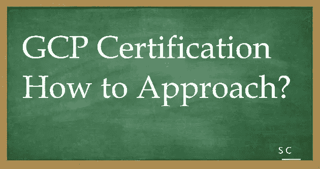

# GCP 认证——让我们一起航行。第二个问题:如何接近？

> 原文：<https://medium.com/javarevisited/gcp-certification-lets-sail-together-second-question-how-to-approach-a249dc4ccbba?source=collection_archive---------5----------------------->

当我决定去 GCP 认证，下一个问题是如何接近…..！！

对于任何认证，你都需要一个定义学习范围的指南。

从以下参考资料开始

关于 https://cloud.google.com/certification/cloud-architect GCP 认证—

考试指南—[https://cloud . Google . com/certification/guides/professional-cloud-architect](https://cloud.google.com/certification/guides/professional-cloud-architect)

学习路径—[https://cloud . Google . com/training/cloud-infra structure # cloud-architect-learning-path](https://cloud.google.com/training/cloud-infrastructure#cloud-architect-learning-path)

一旦你回顾了范围，下一个问题就是我应该去哪个在线学习平台？我推荐 GK 的这个视频:[如何选择合适的云培训平台](https://www.youtube.com/watch?v=9-ykVNTn7ys)。

其中大多数是自定进度的学习课程，有些是由培训师指导的。

正如 GK 所说，这取决于什么样的过程最适合你。我更喜欢结构化的学习方式，通过实际操作让学习变得更令人兴奋。

因此，我先参考考试指南列出我的主题，然后探索不同的途径，通过云 SME 从 YouTube 视频中收集知识。

谷歌技能提升实验室和各自的挑战实验室是我准备的关键方面之一。周末浏览理论，理解概念。工作日在实验室练习。这是你有效管理当前工作量的一种方式，也是你在工作日挤出几个小时进行学习或动手实验的一种方式。

一旦涵盖了 75%的范围，我计划通过练习集测试我对各个主题的知识，然后重复相同的过程。

当我继续写博客的时候，我会继续发布 youtubers 上的云 SME 的参考资料…！！请全程关注并鼓掌，谢谢。

一些列出的可供参考的在线平台-

 [## 主页

### GCP Azure、AWS 云认证和培训课程的领导者。亲身体验。业务和个人计划…

acloudguru.com](https://acloudguru.com/)  [## Pluralsight -无限在线开发人员、IT 和网络安全培训

### 在 Pluralsight，我们每天都亲眼目睹技术如何将不可能变为可能。这就是为什么复视一号…

www.pluralsight.com](https://www.pluralsight.com/)  [## 在线专业培训课程和认证- Intellipaat

### Intellipaat 提供由行业专家撰写的专业认证在线培训课程。学习高…

intellipaat.com](https://intellipaat.com/)  [## 推动数字化转型的云培训-云学院

### Connie Marthinsen 是 SAS 的首席学习和发展专家，“作为云学院的管理员…

cloudacademy.com](https://cloudacademy.com/)  [## 讲师指导的在线培训，24X7 全天候终身支持| Edureka

### 浏览所有课程探索我们广泛的课程 Sr. Scrum Master 我很高兴为 Edureka 写推荐书…

www.edureka.co](https://www.edureka.co/)  [## Coursera |顶级教育工作者的在线课程和证书。免费加入

### 在线学习，从 ISB 大学、密西根大学、史丹福大学等顶尖大学和领先公司获得有价值的证书…

www.coursera.org](https://www.coursera.org/in) 

[在线课程——根据您的时间表学习任何内容| Udemy](https://www.udemy.com/)