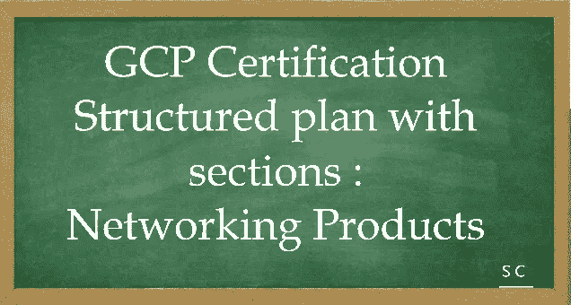

# GCP 认证-让我们一起航行。分部分的结构化计划:网络产品。

> 原文：<https://medium.com/javarevisited/gcp-certification-lets-sail-together-structured-plan-with-sections-networking-products-fe103b44af68?source=collection_archive---------4----------------------->



大家好，

[1 分钟了解谷歌云认证|谷歌云博客](https://cloud.google.com/blog/topics/developers-practitioners/get-know-google-cloud-certifications-1-minute)

在这里，我向您展示了一份结构化的计划，其中包含一些章节，供打算获得解决方案架构师认证的云爱好者参考。

**了解基本知识:**

1.  云计算简介
2.  不同云平台的概述([AWS](/javarevisited/5-best-aws-courses-for-beginners-and-experienced-developers-to-learn-in-2021-563212409fbd)/[Azure](/javarevisited/5-best-azure-fundamentals-courses-to-pass-az-900-certification-exam-in-2020-9e602aea035d)/[GCP](/javarevisited/5-best-courses-to-learn-google-cloud-platform-gcp-in-2021-169093a3771a))—很好的对比[将 AWS 和 Azure 服务与谷歌云](https://cloud.google.com/free/docs/aws-azure-gcp-service-comparison)进行对比
3.  谷歌云平台及其可用产品概述

**感受谷歌云产品:** [*产品说明书*](https://raw.githubusercontent.com/gregsramblings/google-cloud-4-words/master/DarkPoster-lowres.png)

1.  [网络产品](https://cloud.google.com/products/networking)
2.  [计算产品](https://cloud.google.com/products/compute)
3.  [存储产品](https://cloud.google.com/products/storage)
4.  [集装箱](https://cloud.google.com/products/#section-6)
5.  [开发者工具](https://cloud.google.com/products/tools)
6.  [安全和身份产品](https://cloud.google.com/products/security-and-identity)

…..更多，但这应该有助于您开始并在您的旅程中不断增加。

在动手之前，先熟悉

1.  [谷歌云控制台](https://cloud.google.com/cloud-console)
2.  [Google Cloud shell](https://cloud.google.com/shell) — [命令行](https://cloud.google.com/sdk/gcloud)工具是创建和管理 Google Cloud 资源的主要 CLI 工具
3.  [谷歌云存储](https://cloud.google.com/storage)——[gsutil 访问它](https://cloud.google.com/storage/docs/gsutil)
4.  [bq 命令行工具](https://cloud.google.com/bigquery/docs/bq-command-line-tool) —基于 Python 的 BigQuery 命令行工具。
5.  [地区和区域](https://cloud.google.com/compute/docs/regions-zones)和[全球位置](https://cloud.google.com/about/locations)

*———**联网开始**————*

深潜的时间到了

**虚拟网络**——特别是如果你没有网络背景，那就花点时间消化这些概念。夯实你的基础非常重要。

GCP 的混合连接产品是云 VPN、云互联和对等。

[云 VPN](https://cloud.google.com/network-connectivity/docs/vpn) —通过 IPsec VPN 隧道将您的内部网络安全地连接到您的 GCP VPC 网络。在两个网络之间传输的流量由一个 VPN 网关加密，然后由另一个 VPN 网关解密。这保护了您在公共互联网上传输的数据，这也是云 VPN 适用于低流量数据连接的原因。

您的内部 VPN 网关的云 VPN 最大传输单元(MTU)不能大于 1460 字节。这是因为数据包的加密和封装。

云路由器可以使用边界网关协议(BGP)管理云 VPN 隧道的路由。这种路由方法允许在不改变隧道配置的情况下更新和交换路由。

为了自动传播网络配置更改，VPN 隧道使用云路由器在 VPC 和本地 VPN 网关(必须支持 BGP)之间建立 BGP 会话。然后在网络之间无缝地通告新的子网。这意味着新子网中的实例可以立即开始发送和接收流量。

除了经典 VPN，Google Cloud 还提供了第二种云 VPN 网关，HA VPN。

**HA VPN** 是一款高可用性云 VPN 解决方案，可让您在单个区域内通过 IPsec VPN 连接将内部网络安全地连接到虚拟专用云(VPC)网络。HA VPN 提供 99.99%服务可用性的 SLA。

*———**联网**继续— — — — *

1.  [云互联](https://cloud.google.com/network-connectivity/docs/interconnect)

a.专用互连—在您的内部网络和 Google 网络之间提供直接的物理连接。
b .合作伙伴互连—通过受支持的服务提供商在您的内部和 VPC 网络之间提供连接。

其他连接类型:

1.  [直接对等概述](https://cloud.google.com/network-connectivity/docs/direct-peering)
2.  [运营商对等概述](https://cloud.google.com/network-connectivity/docs/carrier-peering)
3.  [CDN 互联概述](https://cloud.google.com/network-connectivity/docs/cdn-interconnect)

*———**联网**继续— — — — — *

[服务的私人访问选项](https://cloud.google.com/vpc/docs/private-access-options)

1.  [私有服务连接](https://cloud.google.com/vpc/docs/private-service-connect) —使用 VPC 网络中的端点连接到 Google APIs 和服务。Google 云和内部资源不需要外部 IP 地址。
2.  [私有 Google 访问](https://cloud.google.com/vpc/docs/private-google-access) —使用此选项连接到 Google APIs 和服务，无需为您的 Google 云资源提供外部 IP 地址。
3.  [本地主机的私有 Google 访问](https://cloud.google.com/vpc/docs/private-google-access-hybrid) —使用此选项通过 VPC 网络连接到 Google APIs 和服务*。这种方法不要求您的本地主机拥有外部 IP 地址。*
4.  [私人服务访问](https://cloud.google.com/vpc/docs/private-services-access) —使用此选项连接到特定的 Google 和第三方服务，无需为您的 Google 云和 Google 或第三方资源分配外部 IP 地址。
5.  [无服务器 VPC 访问](https://cloud.google.com/vpc/docs/serverless-vpc-access) —使用此选项从谷歌云上的无服务器环境(云运行，具有标准 env 和云功能的应用工程师)使用内部 IP 地址直接连接到 VPC 网络中的资源。

*———**联网**继续— — — — *

[云负载均衡概述](https://cloud.google.com/load-balancing/docs/load-balancing-overview) —另一个重要而棘手的话题。

云负载平衡是一种完全分布式、软件定义的托管服务。

**内部**负载均衡器使用 **Andromeda** ，这是 GCP 的软件定义的网络虚拟化堆栈，**网络**负载均衡器使用 **Maglev** ，这是一个大型的分布式软件系统。

1.  [内部 HTTP(S)负载平衡概述](https://cloud.google.com/load-balancing/docs/l7-internal)
2.  [外部 TCP/UDP 网络负载平衡概述](https://cloud.google.com/load-balancing/docs/network)
3.  [内部 TCP/UDP 负载平衡概述](https://cloud.google.com/load-balancing/docs/internal)
4.  [SSL 代理负载平衡概述](https://cloud.google.com/load-balancing/docs/ssl)
5.  [TCP 代理负载平衡概述](https://cloud.google.com/load-balancing/docs/tcp)

以下是获取负载平衡知识的最佳培训课程之一-

[利用 pluralsight.com GCP 上的负载平衡选项](https://www.pluralsight.com/courses/google-cloud-platform-leveraging-load-balancing-options)

[网络端点组](https://cloud.google.com/load-balancing/docs/negs) — (NEG)是指定一组后端端点或服务的配置对象。

有四种类型的否定:

1.  带状的
2.  互联网
3.  无服务器
4.  混合连接

*———**联网**继续— — — — *

[云 CDN](https://cloud.google.com/cdn) —使用谷歌的全球边缘网络来提供更贴近用户的内容，从而加速您的网站和应用。

云 CDN 与[外部 HTTP(S)负载平衡](https://cloud.google.com/load-balancing/docs/https)协同工作，向您的用户交付内容。外部 HTTP(S)负载平衡器提供接收请求的前端 IP 地址和端口，以及响应请求的后端。

云 CDN 内容可以来自各种类型的后端:

*   [实例组](https://cloud.google.com/compute/docs/instance-groups)
*   [区域网络端点组](https://cloud.google.com/load-balancing/docs/negs/zonal-neg-concepts)
*   [无服务器 NEGs](https://cloud.google.com/load-balancing/docs/negs/serverless-neg-concepts) :一个或多个 [App 引擎](https://cloud.google.com/appengine/docs)、[云运行](https://cloud.google.com/run/docs)或[云功能](https://cloud.google.com/functions/docs)服务
*   [用于外部后端的互联网 NEGs](https://cloud.google.com/load-balancing/docs/negs/internet-neg-concepts)
*   [云存储中的存储桶](https://cloud.google.com/storage/docs)

[云盔甲](https://cloud.google.com/armor) —帮助您保护您的 Google 云部署免受多种类型的威胁，包括分布式拒绝服务(DDoS)攻击和跨站点脚本(XSS)和 SQL 注入(SQLi)等应用程序攻击。

[云 NAT](https://cloud.google.com/nat/docs/overview) —允许某些没有外部 IP 地址的资源创建到互联网的出站连接。

ref—[Google Cloud NAT 如何工作？](https://www.youtube.com/watch?v=K6hgdXNvanQ)和 [NAT 解释—网络地址转换](https://www.youtube.com/watch?v=FTUV0t6JaDA)

云 NAT 为以下资源提供传出连接:

*   没有外部 IP 地址的计算引擎虚拟机(VM)实例
*   私有 Google Kubernetes 引擎(GKE)集群
*   云运行实例通过[无服务器 VPC 访问](https://cloud.google.com/vpc/docs/configure-serverless-vpc-access)
*   云功能实例通过[无服务器 VPC 访问](https://cloud.google.com/vpc/docs/configure-serverless-vpc-access)
*   App Engine 标准环境实例通过[无服务器 VPC 访问](https://cloud.google.com/vpc/docs/configure-serverless-vpc-access)

*———**联网**继续— — — — *

[VPC 概述](https://cloud.google.com/vpc/docs/overview)

1.  [共享 VPC 概述](https://cloud.google.com/vpc/docs/shared-vpc) —共享 VPC 允许一个[组织](https://cloud.google.com/resource-manager/docs/cloud-platform-resource-hierarchy)将多个项目的资源连接到一个公共的[虚拟专用云(VPC)网络](https://cloud.google.com/vpc/docs/vpc)，以便他们可以使用该网络的内部 IP 安全高效地相互通信。
2.  [VPC 网络对等概述](https://cloud.google.com/vpc/docs/vpc-peering) — VPC 网络对等使您能够连接 VPC 网络，以便不同 VPC 网络中的工作负载可以进行内部通信。流量停留在谷歌的网络内，不穿越公共互联网。

*———**联网**继续— — — — *

[网络服务等级](https://cloud.google.com/network-tiers/docs) — [网络服务等级概述](https://cloud.google.com/network-tiers/docs/overview)

**Premium Tier** 通过使用谷歌的低延迟、高度可靠的全球网络，将流量从外部系统传送到谷歌云资源。该网络由遍布全球的超过 [100 个接入点(pop)](http://peering.google.com/)组成。该网络的设计允许在传输流量的同时承受多种故障和中断。

**标准层**通过在互联网上路由流量，将流量从外部系统传送到谷歌云资源。它利用了谷歌网络的双重冗余，但仅限于谷歌数据中心连接对等 PoP 的地方。离开谷歌网络的数据包是通过公共互联网传送的，并受到中间传输提供商和互联网服务提供商的信任。标准层提供的网络质量和可靠性可与其他云提供商相媲美。

*———**联网**End————*

参考消息— [谷歌云平台服务水平协议](https://cloud.google.com/terms/sla/)

好样的…..让我们一起航行吧。

*————**问题**———*

为了让它更令人兴奋，我会在这里列出一些问题，鼓励你在评论区回答:-

**回答:**将在我的下一个故事《计算产品的结构化计划》中分享

```
Q1\. Your organization has a 3-tier web application deployed in the same Google Cloud Virtual Private Cloud (VPC). Each tier (web, API, and database) scales independently of the others. Network traffic should flow through the web to the API tier, and then on to the database tier. Traffic should not flow between the web and the database tier. How should you configure the network with minimal steps?A. Add each tier to a different subnetwork.
B. Set up software-based firewalls on individual VMs.
C. Add tags to each tier and set up routes to allow the desired traffic flow.
D. Add tags to each tier and set up firewall rules to allow the desired traffic flow.Q2\. What are the three types of networks offered in Google Cloud?A. IPv4 unicast network, IPv4 multicast network, IPv6 network
B. Default network, auto network, and custom network.
C. Gigabit network, 10 gigabit network, and 100 gigabit network
D. Zonal, regional, and globalQ3\. When you connect two VPC networks using Google Cloud VPN, at least one of the networks needs to be a(n) _____ network.A.Minimum
B.Custom
C.Auto
BaseQ4\. Which of the following statements about expanding a CIDR block subnet in Google Cloud Platform is false?A.You cannot shrink the primary IP range of a subnet.
B.By setting the mask prefix length to a larger number, you make more addresses available on the subnet itself.
C.If you need to expand the range of an automatically created subnet within an auto mode network, the broadest subnet mask or prefix that you can use is /16.
D.You cannot undo the expansion of the primary IP range of a subnet.Q5\. Your organization's development team has requested access to Bigtable and BigQuery for a project hosted in Google Cloud VM instances. These services do not require the VMs to have external IP addresses and they will not need one.As the VPC network admin, what would be the best solution for configuring private API access for the services?A.Enable Private Google Access for subnet containing the Cloud VMs.
B.Enable Serverless VPC Access for the subnet containing the Cloud VMs.
C.Enable Private Services Access for subnet containing the Cloud VMs.
D.Enable the API for the desired services in the Cloud VM, and ensure that each user has access to enable the API. Then create an API key.
```

*————**问题结束**———*