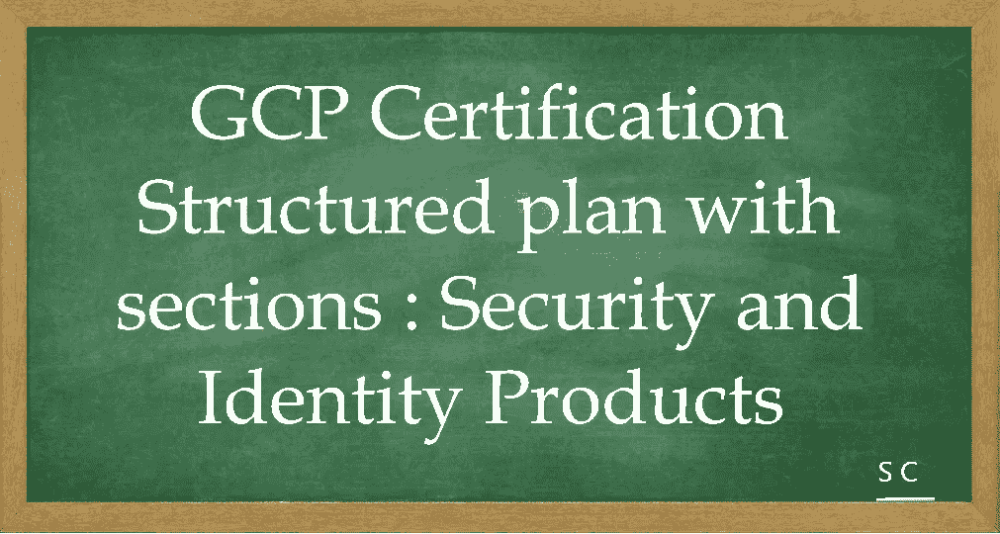

# GCP 认证-让我们一起航行。安全和身份产品。

> 原文：<https://medium.com/javarevisited/gcp-certification-lets-sail-together-structured-plan-with-sections-security-and-identity-products-984fae35efb9?source=collection_archive---------1----------------------->

[](https://medium.com/javarevisited/top-10-cloud-certification-to-aim-in-2022-aws-azure-and-google-cloud-platform-bd054fff0538)

大家好，

[1 分钟了解谷歌云认证|谷歌云博客](https://cloud.google.com/blog/topics/developers-practitioners/get-know-google-cloud-certifications-1-minute)

在此，我向您展示一份包含多个部分的结构化计划，作为计划获得解决方案架构师认证的云有志者的参考。

**了解基本知识:**

1.  [云计算简介](https://javarevisited.blogspot.com/2019/07/top-5-online-courses-to-learn-cloud-computing-aws.html)
2.  不同云平台的概述([AWS](/javarevisited/5-best-aws-courses-for-beginners-and-experienced-developers-to-learn-in-2021-563212409fbd)/[Azure](/javarevisited/5-best-azure-fundamentals-courses-to-pass-az-900-certification-exam-in-2020-9e602aea035d)/[GCP](/javarevisited/5-best-courses-to-learn-google-cloud-platform-gcp-in-2021-169093a3771a))—一个很好的对比[将 AWS 和 Azure 服务与谷歌云进行对比](https://cloud.google.com/free/docs/aws-azure-gcp-service-comparison)
3.  谷歌云平台及其可用产品概述

**感受谷歌云产品:** [*产品说明书*](https://raw.githubusercontent.com/gregsramblings/google-cloud-4-words/master/DarkPoster-lowres.png)

1.  [网络产品](https://cloud.google.com/products/networking)
2.  [计算产品](https://cloud.google.com/products/compute)
3.  [数据库产品](https://cloud.google.com/products/databases)
4.  [存储产品](https://cloud.google.com/products/storage)
5.  [集装箱](https://cloud.google.com/products/#section-6)
6.  [开发者工具](https://cloud.google.com/products/tools)
7.  [安全和身份产品](https://cloud.google.com/products/security-and-identity)

…..更多，但这应该有助于您开始并在您的旅程中不断增加。

在动手之前，先熟悉

1.  [谷歌云控制台](https://cloud.google.com/cloud-console)
2.  [Google Cloud shell](https://cloud.google.com/shell) — [命令行](https://cloud.google.com/sdk/gcloud)工具是创建和管理 Google Cloud 资源的主要 CLI 工具
3.  [谷歌云存储](https://cloud.google.com/storage) — [gsutil 访问它](https://cloud.google.com/storage/docs/gsutil)
4.  [bq 命令行工具](https://cloud.google.com/bigquery/docs/bq-command-line-tool) —基于 Python 的 BigQuery 命令行工具。
5.  [地区和区域](https://cloud.google.com/compute/docs/regions-zones)和[全球位置](https://cloud.google.com/about/locations)

*————**安全和身份**开始— — — — *

防火墙规则—

[谷歌云平台中的 VPC 防火墙规则——YouTube](https://www.youtube.com/watch?v=8pqwoZflqPo)很好的参考

对象—组织、文件夹、项目、资源、角色和成员。

策略是附加到资源的访问语句的集合。

每个策略包含一组角色和角色成员，资源从其父策略继承。请这样想:资源策略是父策略和资源的联合，限制较少的父策略将总是覆盖限制较多的资源策略。

*————**安全和身份**继续— — — — *

[组织资源](https://cloud.google.com/resource-manager/docs/cloud-platform-resource-hierarchy#organizations) —适用于 Google Workspace 和 Cloud Identity 客户:

*   **Google Workspace:** 报名 [Google Workspace](https://support.google.com/a/answer/53926) 。
*   **云身份:**报名[云身份](https://cloud.google.com/identity/docs/setup)。

**云身份超级管理员**和 **Google 云组织管理员**是设置过程中的关键角色，负责组织资源的生命周期控制。

**云身份超级管理员**的职责是:

1.  将组织管理员角色分配给一些用户。
2.  作为恢复问题的联系人。
3.  控制工作区或云身份帐户和组织资源的生命周期。

**组织管理员角色**的职责是:

1.  定义 IAM 策略。
2.  确定资源层次结构。
3.  通过 IAM 角色委派网络、计费和资源层级等关键组件的职责。

文件夹提供了额外的分组机制和项目之间的隔离边界。文件夹可用于建立公司内不同法人主体、部门和团队的模型。

*————**安全与身份**继续— — — — *

资源经理角色

**组织**

1.  管理员:对所有资源的完全控制
2.  查看者:查看对所有资源的访问权限

**文件夹**

1.  管理员:对文件夹的完全控制
2.  创建者:浏览层次结构并创建文件夹
3.  查看器:查看资源下的文件夹和项目

**项目**

1.  创建者:创建新项目(自动所有者)并将新项目迁移到组织中
2.  删除者:删除项目

**角色类型:-**

1.  原始角色(所有者、编辑者和查看者)—粗粒度

**所有者**拥有完全的管理权限。这包括添加和删除成员以及删除项目的能力。

**编辑**角色拥有修改和删除权限。这允许开发人员部署应用程序并修改或配置其资源。

**查看者**角色具有只读权限。

**计费管理员**角色管理计费，添加或删除管理员，无权更改项目中的资源。

1.  预定义的角色—精细划分
2.  自定义角色

*————**安全和身份**继续— — — — *

**成员**，它们定义了“谁可以在哪个资源上做什么”的“谁”部分

有五种不同类型的成员:

Google Accounts——代表开发人员、管理员或任何其他与 Google Cloud 交互的人。任何与谷歌账户相关的电子邮件地址都可以是一个身份，包括 gmail.com 或其他域名。

服务帐户—是属于您的应用程序而不是单个最终用户的帐户。当您运行托管在 Google Cloud 上的代码时，您需要指定运行代码的帐户。

Google Groups —是 Google 帐户和服务帐户的命名集合。每个群组都有一个与该群组相关联的唯一电子邮件地址。Google groups 是一种将访问策略应用于一组用户的便捷方式。您可以一次授予和更改整个组的访问控制，而不是一次授予或更改单个用户或服务帐户的访问控制。

云身份域—允许您使用 Google 管理控制台管理用户和组，但您无需支付或接收 Workspace 的协作产品，如 Gmail、Docs、Drive 和 Calendar。Cloud Identity 有免费版和高级版。高级版增加了移动设备管理功能。

工作空间域—代表您的组织的互联网域名，例如 example.com，当您将用户添加到您的工作空间域时，会为该虚拟组中的用户创建一个新的 Google 帐户，例如 username@example.com。

*————**安全和身份**继续— — — — *

服务帐户的类型

1.  用户创建或自定义
2.  内置的
3.  Google APIs 服务帐户。

[身份感知代理](https://cloud.google.com/iap) —允许您为 HTTPS 访问的应用程序建立中央授权层，因此您可以使用应用程序级访问控制模型，而不是依赖网络级防火墙。

当您通过 Cloud IAP 授予用户对应用程序或资源的访问权限时，他们会受到正在使用的产品所实施的细粒度访问控制，而不需要 VPN。当用户试图访问受云 IAP 保护的资源时，云 IAP 执行身份验证和授权检查。

[屏蔽虚拟机](https://cloud.google.com/shielded-vm)

[云密钥管理](https://cloud.google.com/security-key-management)

[云端数据防丢失](https://cloud.google.com/dlp)

[身份和访问管理](https://cloud.google.com/iam)

*————**安全和身份**继续— — — — *

*   [身份感知代理](https://cloud.google.com/iap)
*   [屏蔽的虚拟机](https://cloud.google.com/shielded-vm)
*   [云密钥管理](https://cloud.google.com/security-key-management)
*   [云数据丢失预防](https://cloud.google.com/dlp)
*   [身份和访问管理](https://cloud.google.com/iam)

1.  原始角色(所有者、编辑者和查看者)—粗粒度
2.  预定义的角色—精细划分
3.  自定义角色

*————**安全和身份**继续— — — *

[云 KMS](https://cloud.google.com/kms/docs/how-tos)

1.  [云 HSM](https://cloud.google.com/kms/docs/hsm)
2.  [云外部密钥管理器](https://cloud.google.com/kms/docs/ekm)

[云存储上的数据加密选项](https://cloud.google.com/storage/docs/encryption)

1.  谷歌管理的加密密钥:在数据写入磁盘之前，云存储总是在服务器端加密你的数据，不收取额外费用。
2.  服务器端加密:在云存储接收到您的数据之后，但在数据写入磁盘并存储之前发生的加密。

a.[客户管理的加密密钥](https://cloud.google.com/storage/docs/encryption/customer-managed-keys) —您可以通过[云密钥管理服务](https://cloud.google.com/security-key-management)创建和管理您的加密密钥。客户管理的加密密钥可以作为软件密钥存储在 [HSM 集群](https://cloud.google.com/kms/docs/hsm)或[外部](https://cloud.google.com/kms/docs/ekm)中。

b.[客户提供的加密密钥](https://cloud.google.com/storage/docs/encryption/customer-supplied-keys) —您可以创建和管理自己的加密密钥。这些密钥充当标准云存储加密之上的附加加密层。

客户提供的加密密钥(CSEK)只有在[谷歌云存储](https://cloud.google.com/storage)和[谷歌计算引擎](https://cloud.google.com/compute)中才有。

3.[客户端加密密钥](https://cloud.google.com/storage/docs/encryption/client-side-keys) —数据发送到云存储之前进行的加密。此类数据到达云存储时已经加密，但还要经过服务器端加密。

*————**安全和身份**继续— — — — *

[VPC 服务控制](https://cloud.google.com/vpc-service-controls/docs/overview) —提高您降低云存储和 BigQuery 等谷歌云服务数据泄露风险的能力。您可以使用 VPC 服务控件来创建外围环境，以保护您明确指定的服务的资源和数据。

VPC 服务控制允许您定义安全策略，防止在可信边界之外访问 Google 管理的服务，阻止来自不可信位置的数据访问，并降低数据泄露风险。您可以将 VPC 服务控件用于以下用例:

*   [将谷歌云资源和 VPC 网络](https://cloud.google.com/vpc-service-controls/docs/overview#isolate)隔离到服务范围内
*   [将周界扩展到内部网络](https://cloud.google.com/vpc-service-controls/docs/overview#hybrid_access)到授权的 VPN 或云互联
*   [控制从互联网访问谷歌云资源](https://cloud.google.com/vpc-service-controls/docs/overview#internet)
*   [通过使用入口和出口规则保护跨边界和组织的数据交换](https://cloud.google.com/vpc-service-controls/docs/secure-data-exchange)
*   [通过使用入口规则，基于客户端属性允许对资源的上下文感知访问](https://cloud.google.com/vpc-service-controls/docs/context-aware-access)

安全控制-

1.  VPC 服务控制—数据渗透/按信任级别隔离资源
2.  Cloud Armour —缓解 DDos 攻击并提供 WAF (web 应用防火墙)
3.  威胁检测—根据日志和报告向安全指挥中心强制攻击
4.  DLP —用于检测和识别任何敏感信息，如抄送号码或任何 PII 数据

*————**安全和身份**结束— — — — *

参考消息— [谷歌云平台服务水平协议](https://cloud.google.com/terms/sla/)

好样的…..让我们一起航行吧。

*——————**问题** — — — — —

为了让它更令人兴奋，我会在这里列出一些问题，鼓励你在评论区回答:-

**回答:**查看评论

```
Q1\. our company is planning to store pictures in Cloud Storage buckets. Your manager has asked you to use a key that is created and managed on-premises in the encryption process of the objects.What type of key service would you use?a.Use Cloud KMS default encryption
b.Use HashiCorp Vault
c.Use KMS customer-managed encryption keys
d.Use Cloud Storage customer-supplied encryption keysQ2\. In Google Cloud Platform, the _____ role provides the same permissions as the Logs Viewer role, but it applies only to the _Required and _Default buckets.a.Logs Writer
b.Project Viewer
c.Project Owner
d.Project EditorQ3\. You are working on a project with two compliance requirements. The first requirement states that your developers should be able to see the Google Cloud Platform billing charges for only their own projects and read-only access to their project as default. The second requirement states that your finance team members can set budgets and view the current charges for all projects in the organization. The finance team should not be able to view the project contents. 
You want to set permissions. What should you do?a. Add the finance team to the Viewer role for the Project. Add the developers to the Security Reviewer role for each of the billing accounts.
b. Add the finance team members to the default IAM Owner role. Add the developers to a custom role that allows them to see their own spend only.
c. Add the finance team members to the Billing Administrator role for each of the billing accounts that they need to manage. Add the developers to the Viewer role for the Project.
d. Add the developers and finance managers to the Viewer role for the Project.Q4\. Which of these is not a principle you should apply when setting roles and permissions?a. Whenever possible, assign roles to groups instead of individuals.
b. Grant users the appropriate permissions to follow the principle of least privilege
c. Whenever possible, assign primitive roles rather than predefined roles.
d. Audit all policy changes by checking the Cloud Audit Logs.Q5\. One of your clients is storing highly sensitive data on Google Cloud Storage, they strictly adhere to their compliance, hence they do not want their keys to be stored in a cloud, please suggest to them the right choice of encryption.a.Google recommends the usage of cloud KMS for storing CMEK
b. Give your Cloud Storage service account access to an encryption key, that service account encrypts
c. All objects on Google Storage are encrypted by default hence additional encryption isn’t required
d. You provide a raw CSEK as part of an API call
```

*————**问题结束**———*