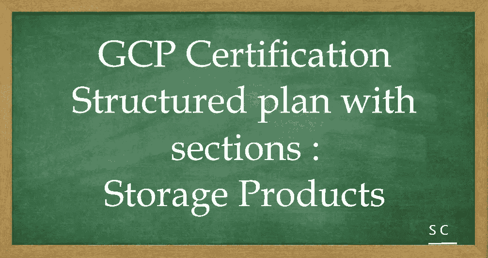

# GCP 认证-让我们一起航行。包含部分的结构化计划:从存储产品开始。

> 原文：<https://medium.com/javarevisited/gcp-certification-lets-sail-together-structured-plan-with-sections-staring-with-storage-products-a251119b373d?source=collection_archive---------2----------------------->

[](https://medium.com/javarevisited/10-best-google-cloud-certifications-to-aim-1ade11d9f01b)

大家好，

[1 分钟了解谷歌云认证|谷歌云博客](https://cloud.google.com/blog/topics/developers-practitioners/get-know-google-cloud-certifications-1-minute)

在此，我向您展示一份包含多个部分的结构化计划，作为计划参加[解决方案架构师认证](/javarevisited/10-best-free-google-cloud-professional-architect-certification-courses-practice-tests-943e75f03929)的云爱好者的参考。

**了解基本知识:**

1.  [云计算简介](https://javarevisited.blogspot.com/2019/07/top-5-online-courses-to-learn-cloud-computing-aws.html)
2.  不同云平台的概述([AWS](/javarevisited/5-best-aws-courses-for-beginners-and-experienced-developers-to-learn-in-2021-563212409fbd)/[Azure](/javarevisited/5-best-azure-fundamentals-courses-to-pass-az-900-certification-exam-in-2020-9e602aea035d)/[GCP](/javarevisited/5-best-courses-to-learn-google-cloud-platform-gcp-in-2021-169093a3771a))—一个很好的比较[将 AWS 和 Azure 服务与谷歌云进行比较](https://cloud.google.com/free/docs/aws-azure-gcp-service-comparison)
3.  [谷歌云平台](/javarevisited/7-free-courses-to-learn-google-cloud-platform-for-beginners-cbb260fbd8e4)及其可用产品概述

**感受谷歌云产品:** [*产品说明书*](https://raw.githubusercontent.com/gregsramblings/google-cloud-4-words/master/DarkPoster-lowres.png)

1.  [网络产品](https://cloud.google.com/products/networking)
2.  [计算产品](https://cloud.google.com/products/compute)
3.  [数据库产品](https://cloud.google.com/products/databases)
4.  [存储产品](https://cloud.google.com/products/storage)
5.  [容器](https://cloud.google.com/products/#section-6)
6.  [开发者工具](https://cloud.google.com/products/tools)
7.  [安全和身份产品](https://cloud.google.com/products/security-and-identity)

…..更多，但这应该有助于您开始并在您的旅程中不断增加。

在动手之前，先熟悉

1.  [谷歌云控制台](https://cloud.google.com/cloud-console)
2.  [Google Cloud shell](https://cloud.google.com/shell) — [命令行](https://cloud.google.com/sdk/gcloud)工具是创建和管理 Google Cloud 资源的主要 CLI 工具
3.  [谷歌云存储](https://cloud.google.com/storage)——[gsutil 访问它](https://cloud.google.com/storage/docs/gsutil)
4.  [bq 命令行工具](https://cloud.google.com/bigquery/docs/bq-command-line-tool) —基于 Python 的 BigQuery 命令行工具。
5.  [地区和区域](https://cloud.google.com/compute/docs/regions-zones)和[全球位置](https://cloud.google.com/about/locations)

*————**存储**启动— — — — *

[GCP 草图注:存储选项](https://thecloudgirl.dev/StorageOptions.html)

1.  对象:[云存储](https://cloud.google.com/storage)
2.  块:[持久磁盘](https://cloud.google.com/persistent-disk)和[本地 SSD](https://cloud.google.com/local-ssd) -短暂(与 CE 和 GKE 完全集成)

[GCP 关于 PD 的素描笔记](https://thecloudgirl.dev/PD.html)

1.  存档:[云存储](https://cloud.google.com/storage)
2.  文件:[文件存储](https://cloud.google.com/filestore)(网络附加存储—共享文件系统)

*—————**存储**继续— — — *

[**云存储**](https://cloud.google.com/storage/docs/introduction)

[GCP 关于云存储的草图笔记](https://thecloudgirl.dev/CloudStorage.html)

更多关于[持久磁盘](https://cloud.google.com/compute/docs/disks#pdspecs)

磁盘类型—配置永久磁盘时，可以选择以下磁盘类型之一。

*   **标准持久性磁盘** ( `pd-standard`)由[标准硬盘驱动器(HDD)](https://en.wikipedia.org/wiki/Hard_disk_drive) 支持。
*   **平衡持久磁盘** ( `pd-balanced`)由[固态硬盘(SSD)](https://en.wikipedia.org/wiki/Solid-state_drive) 支持。它们是 SSD 持久磁盘的替代品，可以平衡性能和成本。
*   **SSD 持久磁盘** ( `pd-ssd`)由[固态硬盘(SSD)](https://en.wikipedia.org/wiki/Solid-state_drive) 支持。
*   **极速持久磁盘** ( `pd-extreme`)由[固态硬盘](https://en.wikipedia.org/wiki/Solid-state_drive)支持。凭借在随机访问工作负载和批量吞吐量方面始终如一的高性能，extreme persistent 磁盘专为高端数据库工作负载而设计。与其他磁盘类型不同，您可以调配所需的 IOPS。更多信息，请参见 [Extreme persistent disks](https://cloud.google.com/compute/docs/disks/extreme-persistent-disk) 。

*—————**存储**继续— — — — *

[**数据传输服务**](https://cloud.google.com/storage-transfer/docs/overview)

*   [传输设备](https://cloud.google.com/transfer-appliance/docs/4.0/overview) —用于移动(从数百 TB 到 1 Pb)离线数据、大型数据集或来自带宽有限的源的数据

[传输装置离线模式](https://cloud.google.com/transfer-appliance/docs/4.0/procedure-guide#prepare-for-appliance) —离线模式允许您将数据复制到装置。当设备已满时，请将设备退回给我们。如果您选择离线模式，则在收到设备后，您将无法切换模式。

[传输设备在线模式](https://cloud.google.com/transfer-appliance/docs/hybrid-appliance/procedure-guide) —在线模式支持将复制到设备的数据流式传输到您的云存储桶。如果选择在线模式，一旦拥有设备，就可以在离线和在线模式之间切换。

*   [BigQuery 数据传输服务](https://cloud.google.com/bigquery/transfer)将数据从 SaaS 应用程序转移到 BigQuery。它在预定的、可管理的基础上自动将数据移动到 [BigQuery](https://cloud.google.com/bigquery/docs/introduction) 中。
*   [本地数据转移服务](https://cloud.google.com/storage-transfer/docs/on-prem-overview)将数据从本地机器转移到云存储，尤其是大型数据集。
*   使用 [gsutil rsync](https://cloud.google.com/storage/docs/gsutil/commands/rsync) 在云存储和其他云存储提供商之间，或者在云存储和您的内部数据之间传输数据

*—————**存储**继续— — — — *

**转移场景**

1.  从其他云存储提供商传输—使用存储传输服务。
2.  从内部传输小于 1 TB 的数据—使用 gsutil。
3.  从另一个云存储区域传输少于 1 TB 的数据—使用 gsutil。
4.  从内部传输超过 1 TB 的数据—使用内部数据传输服务。
5.  从另一个云存储区域传输超过 1 TB 的数据(T21)—使用存储传输服务。

*————**储存**结束— — — — *

参考消息— [谷歌云平台服务水平协议](https://cloud.google.com/terms/sla/)

好样的…..让我们一起航行吧。

*——————**问题**—————*

为了让它更令人兴奋，我会在这里列出一些问题，鼓励你在评论区回答:-

**回答:**查看评论

```
Q1\. Your developers are working on a set of VM’s frequently throughout the day. To save costs, you terminate the VM when it is not in use. However, you need to preserve the contents of the disk when the VM is terminated so users can resume where they left off when a new one is created. What is the most cost-effective way to do it? (Choose two)a. Back up the disk contents to Cloud Storage before deleting the instance.
b. Use the –no-auto-delete flag while creating the VM or disable auto-delete behaviour for the boot disk.
c. Boot disk cannot be preserved. You need to attach an additional disk to VM and use that disk.
d. When not in use, only stop the instance instead of deleting it.Q2\. You work for one of the biggest digital media companies called QSMedia in the USA. The company management has decided to move 90 TB of backups and archival data to Google Cloud from their on-premises servers. They are looking for long term cost-effective archival storage for disaster recovery in Google Cloud. The network bandwidth of the company is around 10Gbps. And the company is looking to transfer the data in a week. Please select the right solution to transfer the data to GCS.a. Transfer data using Storage Transfer Service and use the Archive storage class for the bucket.
b. Use the Transfer Appliance and Coldline storage class for the bucket.
c. Use gsutil CLI tool to transfer the data and Nearline storage class for the bucket.
d. Use Transfer Appliance to transfer the data and Nearline storage class for the bucket.Q3\. Over time, you’ve created 5 snapshots of a single instance. To save space, you delete snapshots number 3 and 4\. What has happened to the 5th snapshot?a. The data from snapshot 4 necessary for continuance was transferred to snapshot 5, however snapshot 3's contents were transferred to snapshot 2
b. All later snapshots, including 5, are automatically deleted as well
c. It is no longer usable and cannot restore data
d. The data from both snapshots 3 and 4 necessaries for continuance are transferred to snapshot 5.Q4\. You work for a company called QSLabs, every day the scientists at work would record videos of the experiments they conduct and upload them to Google Cloud Storage through gsutil. The size of each video is around 3GB, uploads to Google Cloud Storage are taking forever. What would be the best way to upload the files to Google Cloud?a. Use Cloud Storage Transfer Appliance
b. Use Cloud Storage Transfer Service
c. Use: gsutil -m cp video-experiment-1.mp4 gs://my-bucket
d. Use: gsutil -o GSUtil:parallel_composite_upload_threshold=150M cp video-experiment-1.mp4 gs://your-bucket (where video-experiment-1.mp4 is the file name)Q5\. A production database virtual machine on Google Compute Engine has an ext4-formatted persistent disk for data files. The database is about to run out of storage space.
How can you remediate the problem with the least amount of downtime?a. In the Cloud Platform Console, increase the size of the persistent disk and use the resize2fs command in Linux.
b. Shut down the virtual machine, use the Cloud Platform Console to increase the persistent disk size, then restart the virtual machine
c. In the Cloud Platform Console, increase the size of the persistent disk and verify the new space is ready to use with the fdisk command in Linux
d. In the Cloud Platform Console, create a new persistent disk attached to the virtual machine, format and mount it, and configure the database service to move the files to the new disk
e. In the Cloud Platform Console, create a snapshot of the persistent disk restore the snapshot to a new larger disk, unmount the old disk, mount the new disk and restart the database service
```

*————**问题结束**————*