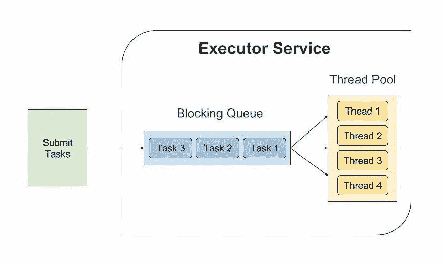

# GCP-如何通过发布/订阅和 Spring Boot 实现高性能同步拉取

> 原文：<https://medium.com/javarevisited/gcp-how-to-achieve-high-performance-synchronous-pull-with-pub-sub-and-spring-boot-12cb220c4d65?source=collection_archive---------0----------------------->

GCP 发布插曲

# 介绍

谷歌云平台( [GCP](/javarevisited/5-best-courses-to-learn-google-cloud-platform-gcp-in-2021-169093a3771a) )提供了一套云计算服务，运行在谷歌内部用于终端用户产品的相同基础设施上。

为了增强事件驱动系统和流分析的消息传递和接收能力， [GCP](https://javarevisited.blogspot.com/2019/07/top-5-google-cloud-platform-gcp-courses-certifications-online.html#axzz6iNNhKZui) 提供了发布/订阅服务。它提供了可扩展的、有序的消息传递，具有拉和推模式、自动扩展和自动供应，以及许多其他很酷的功能。欲了解更多信息，请访问[文档](https://cloud.google.com/pubsub)。

对于订阅发布/订阅主题，google cloud 提供了两种订阅模式。首先是[流拉](https://cloud.google.com/pubsub/docs/pull#streamingpull)，如果您需要高吞吐量/速度，并且没有太多的处理接收到的消息，这是非常好的。

然后是[同步拉取](https://cloud.google.com/pubsub/docs/pull#synchronous_pull)，这比“流拉取”慢得多，但如果您有一些处理逻辑，需要对消息数量进行限制，准确地说，每个拉取请求有 1000 条消息，这就更好、更合适了。在本文中，我将介绍一种方法，使这个选项*非常快*，同时仍然享受它带来的好处。

# 用例

我在爱马仕的团队主要与信息和经纪人打交道，我们总是把他们从 A 地转移到 B 地，或者从任何地方转移到任何地方。不久前，我接了一个任务，我们需要在消息所在的发布/订阅中的主题之间建立一个连接，并将它们移动到我们的 ActiveMQ 代理。

这项任务最重要的验收标准是速度要快，不低于每小时 1000 万条消息。

这意味着发布/订阅中的消息只有在成功提交给我们的 ActiveMQ 代理时才能被确认。所以我必须从 Pub/Sub 中提取消息，将它们发送给代理，成功提交这个事务，然后确认消息。

# 设计

所以我前面提到过，同步 Pub/Sub 的每个 Pull 请求不能检索 1000 条以上的消息。因此，它会很慢，不会满足我的标准。幸运的是，这些文件提到了以下几点:

> 请注意，要实现同步拉的低消息传递延迟，有许多同时未完成的拉请求是很重要的。随着主题吞吐量的增加，需要更多的拉请求。

这里的关键词是同步 PRs。因此，我决定设计这个任务，并利用 [ThreadPoolExecutor](https://docs.oracle.com/javase/7/docs/api/java/util/concurrent/ThreadPoolExecutor.html) 来拥有我想要的尽可能多的并发 PRs。

线程池执行器图

线程池执行器允许您定义一个线程池。这些线程坐在那里等待工作(任务)，然后您开始向池提交任务。然后这个[池](https://javarevisited.blogspot.sg/2013/07/how-to-create-thread-pools-in-java-executors-framework-example-tutorial.html#ixzz5EAhFySdA)中的一个自由线程将从池中弹出一个任务并开始处理它。这个设置最酷的一点是，所有这些都已经为您配置好了，您只需要两行代码来设置这样的需求，请看这个例子。

# 履行

有了 executor 服务，我将订阅代码放在一个**任务**中，这个任务只是一个实现那个 [Runnable](https://www.java67.com/2016/01/7-differences-between-extends-thread-vs-implements-Runnable-java.html) 接口的类。差不多就是这样。

它只是创建一个订阅者，并开始从 Pub/Sub 获取，完成后关闭订阅者。关闭步骤对于确保没有泄漏非常重要。

要从 Pub/Sub 中提取，您需要类似以下的内容:

这是为了将订阅逻辑设计到任务中，其中每个任务都是一个到发布/订阅的 PR。剩下的只是开始把这些任务提交给线程池执行器，开始拉。

我的设置达到了每小时 3000 万条消息，这真的很酷。

# 多线程的注意事项

了解您的系统的限制以利用这样的设置是很重要的。因此，一个 CPU 内核一次大约可以运行一个线程(如果没有激活超线程),因此，如果您有一个 pod(您最终将在其中部署您的应用),它在一个内核上运行，而您配置了一个有 10 个线程的线程池，这将是一种资源浪费，基本上没有任何意义。

同样重要的是要知道，更多的线程并不一定意味着更快的速度，大多数时候瓶颈在其他地方。例如，在我们的例子中，一个人可能发现性能有点慢，他/她想要优化它。因此，他将尝试同时执行 20 个任务(20 个线程)，这意味着大约 20K 条消息将同时发送到 ActiveMQ 代理。

虽然这可以在发布/订阅端工作，但对于 ActiveMQ 来说，处理这样的负载可能是个问题。在这种情况下，优化测量应用在了错误的部分。一本关于这类主题的好书以及更多的书将会成为 Java 性能的权威指南。

<https://javarevisited.blogspot.com/2018/07/top-5-java-performance-tuning-books-for.html>  

***随意分享你对文章和内容的想法，如果觉得有趣或者有用，就鼓掌分享。***