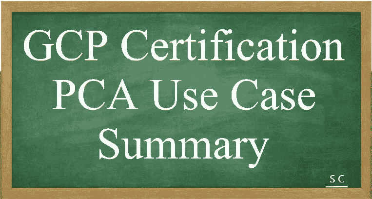
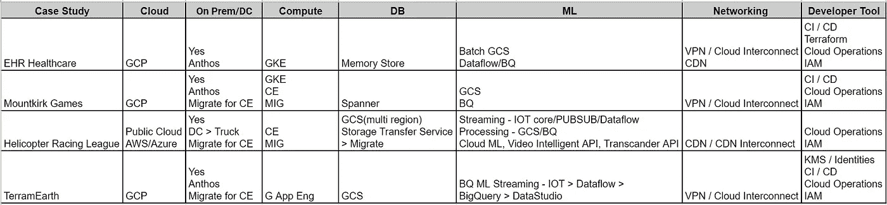

# 所有人的 GCP PCA 使用案例摘要

> 原文：<https://medium.com/javarevisited/gcp-pca-use-case-summary-for-all-91f32f3b3d32?source=collection_archive---------2----------------------->

大家好，

以下是 GCP PCA 使用案例的摘要

我们都知道理解用例在考试中准确回答问题是多么重要。这一观点在我考试前非常有用。

希望你能参考这篇文章，它也会对你有用。

参考 GCP 用例:-[https://cloud . Google . com/certification/guides/professional-cloud-architect](https://cloud.google.com/certification/guides/professional-cloud-architect)

更多的参考资料—

1.  EHR 医疗保健

【techgeeknext.com 最新 EHR 医疗保健案例研究(2022)——谷歌云架构师| TechGeekNxt>>

[通过 GCP 建筑师考试——2021 年 5 月 1 日开始的 EHR 医疗保健新用例，包含完整分析](https://youtu.be/tSTDaMV8ZFc)

2.Mountkirk 小游戏

[最新 Mountkirk 游戏案例研究(2022) —谷歌云架构师| TechGeekNxt>>(techgeeknext.com)](https://www.techgeeknext.com/google-cloud-architect/mountkirk-games-case-study)

[通过 GCP 建筑师考试——mount Kirk Games——从 2021 年 5 月 1 日更新的使用案例，包含完整分析](https://youtu.be/1w1olPjlPZY)

3.直升机竞赛联盟

[最新直升机竞赛联盟案例研究(2022) —谷歌云架构师| TechGeekNxt>>(techgeeknext.com)](https://www.techgeeknext.com/google-cloud-architect/helicopter-racing-league-case-study)

[通过 GCP 建筑师考试——直升机竞赛联盟——2021 年 5 月 1 日起的新用例，包含完整分析](https://youtu.be/659bnT9A2X8)

4.特拉米尔思

[最新 TerramEarth 案例研究——谷歌云架构师(2022)| TechGeekNxt>>(techgeeknext.com)](https://www.techgeeknext.com/google-cloud-architect/terramearth-case-study)

[通过 GCP 建筑师考试——terra mearth——从 2021 年 5 月 1 日起更新的用例，包含完整分析](https://youtu.be/0G8hx9HUnbk)

如果您有任何疑问，请随时联系我。