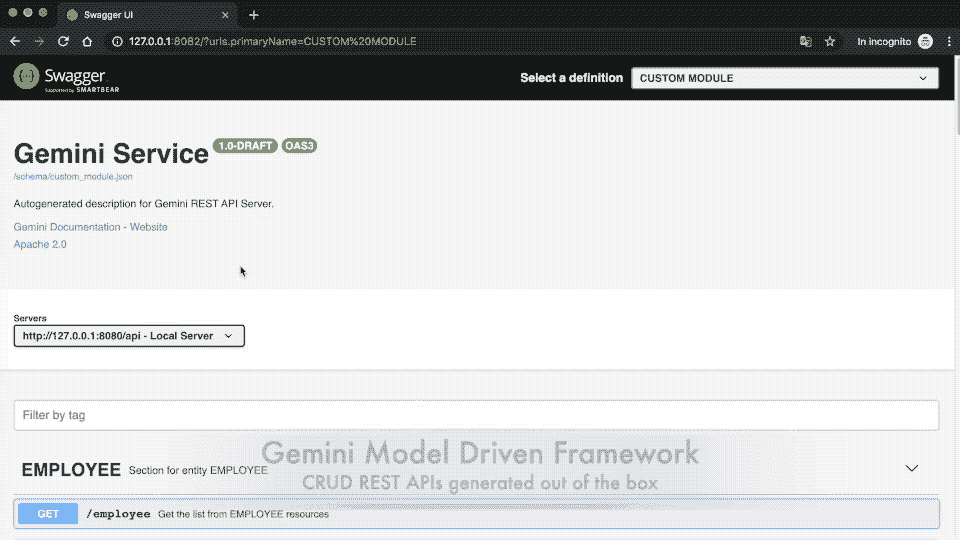
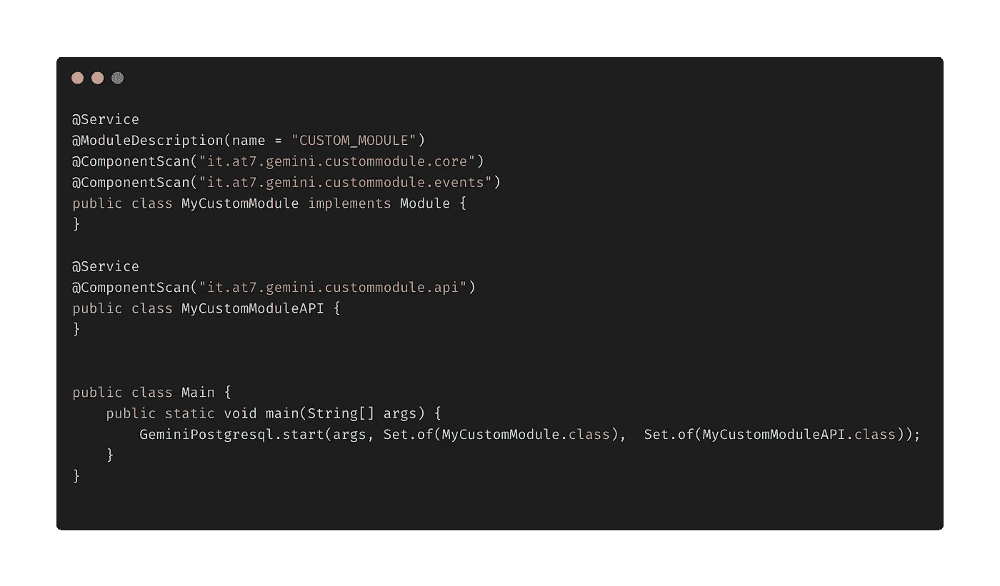
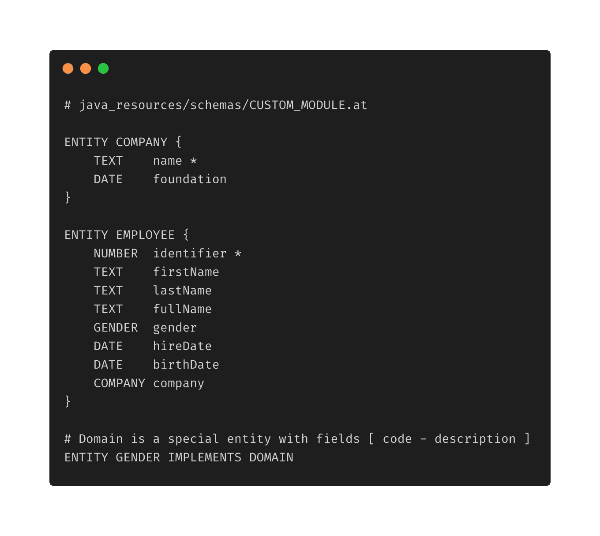
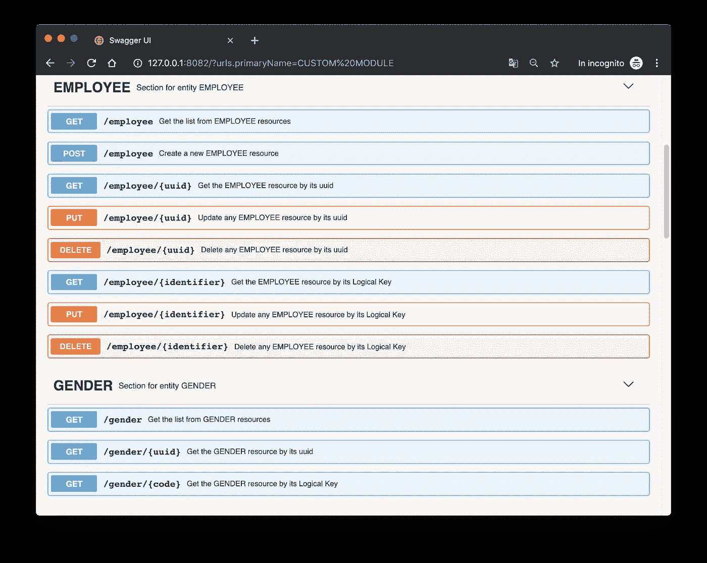
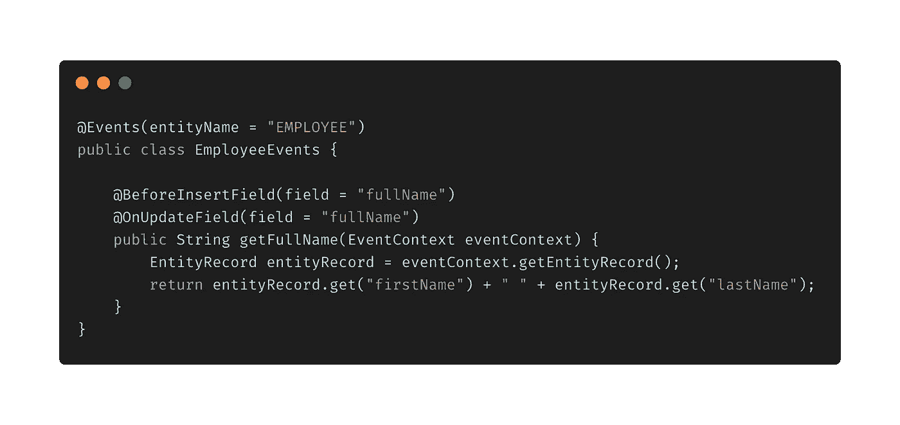
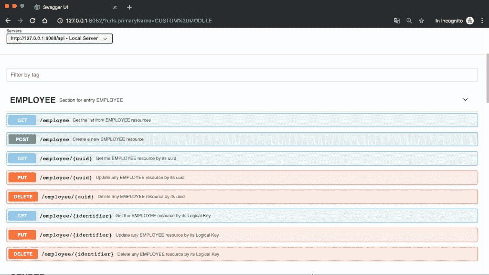

# Gemini Starter:几分钟内完成模型驱动的 REST APIs

> 原文：<https://medium.com/javarevisited/gemini-starter-model-driven-rest-apis-in-minutes-9576a4988ff?source=collection_archive---------1----------------------->

如何使用 Gemini 框架(一个 Spring/Java 平台)从数据模型开始设置 CRUD REST APIs，而无需生成代码

> **Gemini** 是一个**模型驱动的** **REST** **框架**来自动生成 CRUD APIs。你可以在这里看一下官方知识库[。](https://github.com/gemini-projects/gemini)

我们将定义实体和代码来获得以下 CRUD APIs。

本文解释了**Gemini Starter repository**中包含的内容，以及如何开始一个完整的 Gemini 项目。

 [## Gemini-项目/Gemini-psql-入门

### 这个库可以作为一个梯度依赖模块从 Gemini 开始使用。Gemini 是一个模型驱动的 REST 框架…

github.com](https://github.com/gemini-projects/gemini-psql-starter) 

# 1.Gemini 定制模块

Gemini 由一系列模块(核心、认证、图形用户界面等)组成..).当您开始一个项目时，您还可以提供您的自定义模块，它是您的实体、代码和 API 的容器。

前面的代码显示了如何从一个 **Gemini 模块**开始。Gemini 有两个 [Spring 上下文](https://javarevisited.blogspot.com/2019/02/difference-between-contextconfiguration-and-springapplicationConfiguration-annotations-in-spring-boot-testing.html):加载实体和处理核心特性的根和启动 Web 应用程序的 api 上下文。因此，我们使用 **MyCustomModule** 来扫描核心组件和事件，而 **MyCustomModuleAPI** 用于扫描 API 模块(如果您想要注册完全自定义的 Spring web/rest 端点，这可能很有用)。但是通常你不需要他们从双子座基本 [REST 特性](https://javarevisited.blogspot.com/2016/05/what-are-idempotent-and-safe-methods-of-HTTP-and-REST.html#axzz5j9AEsxuT)开始。

重要的是核心 bean 必须覆盖**模块** Gemini 接口。

# 2.Gemini DSL 和实体

由于自定义模块的名称是 CUSTOM_MODULE，我们可以将模式定义放在资源文件***schemas/CUSTOM _ MODULE . at***中

在存储库中，我们有:

注意，雇员有两个实体引用:公司和性别。

**性别**是实现一个域的特殊实体(一个 Gemini 内置接口，提供两个字段:**代码**和**描述**)。

# 3.不可变实体

不可变实体是不可修改的实体，因此不允许添加记录( [POST](https://javarevisited.blogspot.com/2016/10/difference-between-put-and-post-in-restful-web-service.html) )或修改已有记录( [PUT](https://www.java67.com/2016/09/when-to-use-put-or-post-in-restful-web-services.html) )。但是双子座怎么初始化它们呢？这很简单，只需将模块记录初始化文件**内的所有记录*记录/CUSTOM _ module . ATR***

在前面的文件中，我们已经定义了:

*   **性别**实体的域值
*   我们把性别设为不可变，指定这是一个**封闭域**。

> 注意:在 Gemini 中，每个实体都有大量的元数据和它自己相关联。所有这些元都存储在称为实体的实体中。是的，您可以使用实体端点使用 Swagger 查询所有元数据。

所以在 Gemini 完成启动后，你已经用文件中初始化的值填充了性别。

如果你看一下性别 API，你会发现你不能[发布/上传/删除](https://javarevisited.blogspot.com/2016/04/what-is-purpose-of-http-request-types-in-RESTful-web-service.html)。它是一个**封闭的不可变域**。只要拿到性别记录。

# 4.使用 Gemini 事件的计算字段

CRUD APIs 很有用，但有时您希望添加一些逻辑或自定义行为，如验证或计算字段或记录，它们会自动创建其他记录作为依赖项。

例如，让使 ***全名*** 成为由 ***名字*** 和 ***姓氏*** 串联而成的计算字段。我们正在处理 **EMPLOYEE** 实体，我们在第一次插入(创建)记录之前以及每次记录更改(更新)之前注册事件。

很简单。您只需要 Gemini 注释和提取全名的函数的组合。

正如你所看到的，如果我们**发布**一个**新实体**全名会被自动计算。

# 最后

在本文中，我将向您展示如何轻松地从双子座开始。但是将会开发出很多改进，所以我建议关注我和主存储库关于每个版本的更新。

学习 Java 的其他**有用资源**你可能喜欢的
[2019 年 Java 程序员应该学习的 10 件事](https://javarevisited.blogspot.com/2017/12/10-things-java-programmers-should-learn.html#axzz5atl0BngO)
[从零开始学习 Java 的 10 门免费课程](http://www.java67.com/2018/08/top-10-free-java-courses-for-beginners-experienced-developers.html)
[深入学习 Java 的 10 本书](https://medium.freecodecamp.org/must-read-books-to-learn-java-programming-327a3768ea2f)
[10 个工具每个 Java 开发者都应该知道的](http://www.java67.com/2018/04/10-tools-java-developers-should-learn.html)
[学习 Java 编程语言的 10 个理由](http://javarevisited.blogspot.sg/2013/04/10-reasons-to-learn-java-programming.html)
[2019 年 Java 和 Web 开发者应该学习的 10 个框架【t 成为 2019 年更优秀的 Java 开发者](http://javarevisited.blogspot.sg/2018/01/10-frameworks-java-and-web-developers-should-learn.html)
[2019 年要学习的 5 大 Java 框架](http://javarevisited.blogspot.sg/2018/04/top-5-java-frameworks-to-learn-in-2018_27.html)
[每个 Java 开发者都应该知道的 10 个测试库](https://javarevisited.blogspot.sg/2018/01/10-unit-testing-and-integration-tools-for-java-programmers.html)

 [## 我最喜欢的深入学习 Java 的免费课程

### 我的免费课程列表深入学习 Java 从核心 Java 到多线程到 JDBC 到合集，什么都有…

medium.com](/javarevisited/10-free-courses-to-learn-java-in-2019-22d1f33a3915)