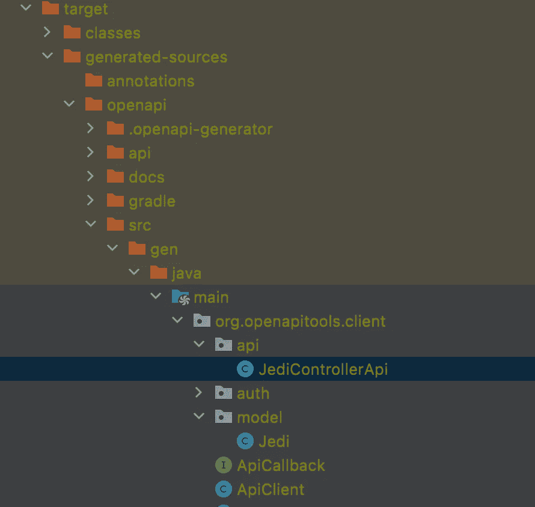

# 用 OpenApi codegen 生成 API 客户端

> 原文：<https://medium.com/javarevisited/generate-api-client-with-openapi-codegen-763e3f2f8703?source=collection_archive---------0----------------------->

## 在银河系中追踪绝地


许多 API 都是使用 [Swagger](https://swagger.io/) 编写的，这对我们开发人员来说是一件好事，有助于理解它们如何工作以及如何调用它们。
在这篇文章中，我将尽力帮助你使用这些文档来生成一个调用这些 API 的客户端。

# 你需要什么

为了遵循本教程，您将需要一个 [REST API](/javarevisited/top-5-books-and-courses-to-learn-restful-web-services-in-java-using-spring-mvc-and-spring-boot-79ec4b351d12?source=---------17------------------) ，因此您可以:

*   按照那些[教程来构建你的 API](/javarevisited/building-a-simple-rest-api-with-springboot-3f2e4b123ebb) ，[一个来文档化它](/javarevisited/documenting-your-api-with-swagger-c27a94104135)，然后[迁移到 openApi](/javarevisited/migration-from-swagger-2-to-openapi-3-391f3e97da73)
*   用 openApi 2 准备好另一个 API 文档

# 步骤 1:导入 api json 文档

本教程最简单的部分是导入您希望第一个调用的 api 的 json 文档，并将其放在 ressource 文件夹中。
在我的例子中，我将使用我的克隆 API，我已经创建了一个 jedi API，所以为了让我的克隆取回 Jedi，我将导入 Jedi 文档文件，然后生成它的客户端


# 步骤 2:更新 pom.xml

为了生成客户端，我们将使用 [openApi codegen maven 插件](https://github.com/OpenAPITools/openapi-generator)。

为此，我们需要更新 pom.xml 的构建部分并添加插件。

让我们看看这里有什么:

*   目标 generate 告诉我们，客户端将在我们构建的… generate 阶段生成，或者可以使用 maven 命令 *mvn generate 生成。*

该配置将包含一些用于定制生成的客户端的选项，如:

*   inputSpec 告诉插件在哪里可以找到导入的文件
*   案例的 generatorName
*   sourceFolder 将是我的客户端将在我的 ressource 文件夹中生成的位置

您可以添加更多选项，我建议您阅读项目的 [README.md](https://github.com/OpenAPITools/openapi-generator/blob/master/modules/openapi-generator-maven-plugin/README.md) 以更好地了解可能的选项，并选择适合您情况的选项。

# 步骤 3:启动构建

现在我们已经实现了插件用法，让我们转到*全新安装*我们的项目。如果一切顺利，你的目标文件夹中应该有这样的内容:



如您所见，在 pluggin 配置中描述的路径上，我有我的控制器 jediControllerApi，它使用 ApiClient 调用 jedi API 和我的文档中描述的模型 Jedi。

有了它，我可以在我的项目中直接使用这个对象，而不必创建自己的对象，然后进行一些映射。

# 步骤 4:浏览生成的文件

如果您已经仔细阅读了步骤 1，在我的文档文件中，服务器 url 是我使用端口 8082 的本地主机，所以在我的 ApiClient 中我也有一个字段(basepath)包含这个值

```
private String basePath = “http://localhost:8082";
```

默认情况下，生成的客户端将使用 Okhttp 进行 api 调用，因此您可能需要向 pom.xml 添加更多的依赖项，以便运行您的应用程序。

# 步骤 5:使用客户端

既然我们已经一路走过了客户端的生成，那么使用它将是最好的，你不这样认为吗？这里没什么难的，只需声明你生成的控制器并调用它来达到第二个 API

```
JediControllerApi jediControllerApi = **new** JediControllerApi();
**return** jediControllerApi.getAllJedi();
```

感谢您的阅读，和以前一样，本教程中使用的代码可以在[这个 Github 库](https://github.com/ErwanLT/HumanCloningFacilities)的分支 openApiCodeGen 中找到。