# Java 集合框架入门

> 原文：<https://medium.com/javarevisited/getting-started-with-collection-framework-part-1-f2b546adcf29?source=collection_archive---------2----------------------->

在本文中，我们将尝试从非常基础的角度来理解 Java 集合框架。这将是一系列的文章，将逐步涵盖收集的每个方面。让我们开始吧。


帕斯卡尔·布鲁克迈尔在 [Unsplash](https://unsplash.com?utm_source=medium&utm_medium=referral) 上的照片

# **对集合框架的需求💡**

让我们假设，您想要表示大量的值，那么为每个值使用单独的变量不是一个好的编程实践。因此，为了克服这个问题，我们可以采用 [**阵列**概念](https://www.java67.com/2015/07/array-concepts-interview-questions-answers-java.html)。

**数组** 数组是固定数量的同质数据元素的索引集合。数组的主要优点是，我们可以用单个变量表示多个值。从而提高代码的可读性。

**数组⚠️的限制**

1.  [数组的大小是固定的](https://www.java67.com/2014/08/what-is-array-data-structure-in-java.html)，也就是说，一旦我们创建了一个数组，就没有机会根据我们的要求来增加或减少大小。因此，要使用数组的概念，我们必须事先知道数组的大小，但这并不总是可能的。
2.  数组只能保存同类数据类型元素。

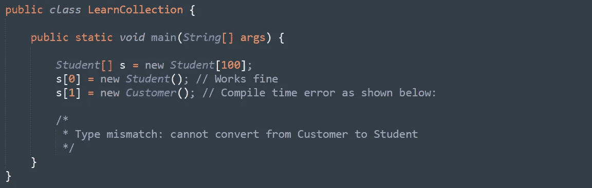

然而，我们可以通过使用**对象**类型数组来解决这个问题。

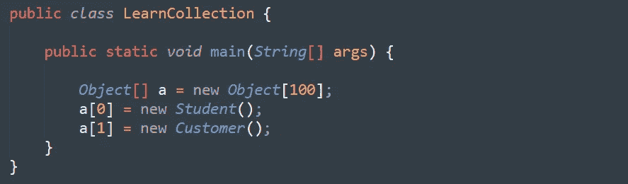

3.数组概念没有基于某些[标准数据结构](https://www.java67.com/2013/08/ata-structures-in-java-programming-array-linked-list-map-set-stack-queue.html)实现，因此没有现成的方法支持。对于每一个需求，我们必须显式地编写代码。这增加了编程的复杂性。

> 要克服以上排列问题，我们应该去寻找“**集合**的概念。💡

1.  系列本质上是可增长的，即根据我们的需求，我们可以增加/减少规模。
2.  集合可以包含同类和异类元素。
3.  每个集合类都是基于某种[标准数据结构](/javarevisited/7-best-courses-to-learn-data-structure-and-algorithms-d5379ae2588?source=---------18------------------)实现的。因此，对于每个需求，现成的方法支持都是可用的。

```
*Being a programmer, we are responsible to use those methods and we are not responsible to implement those methods.*
```

> ***阵列和集合❓*** 有什么区别

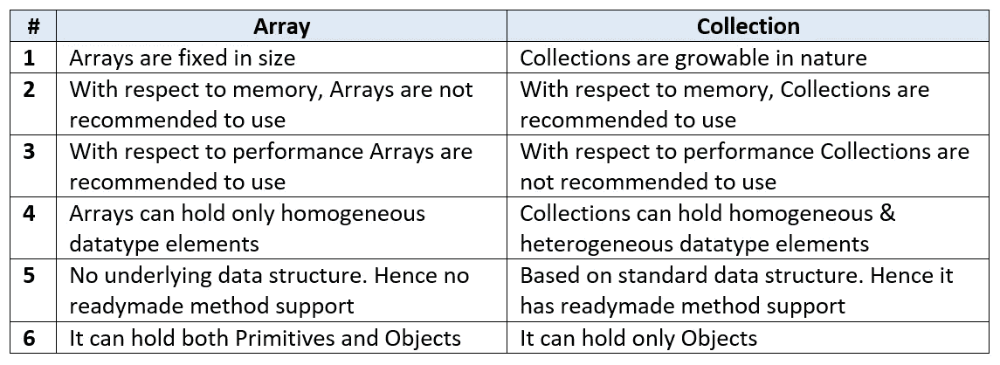

数组和集合的区别

## **收藏**

如果我们想将一组单独的对象表示为一个实体，那么我们应该选择“集合”。

## **收藏框架**

它包含几个类和接口，可用于将一组单独的对象表示为单个实体。

该集合已有其他语言版本，但名称不同。下面以 [C++](/javarevisited/top-10-courses-to-learn-c-for-beginners-best-and-free-4afc262a544e) 为例:


C++中的集合替代项

# 收集框架的 9 个关键接口

1.收藏
2。列表
3。设置
4。已排序集合
5。可导航集
6。队列
7。地图
8。分类地图
9。导航地图

> 接下来，我们将逐一讨论每个接口的用途。

## **1。** [**收藏**](/javarevisited/50-java-collections-interview-questions-for-beginners-and-experienced-programmers-4d2c224cc5ab)

*   如果我们想把一组单独的对象表示为一个单独的实体，那么我们应该选择“*集合*”。
*   集合接口定义了适用于任何集合对象的最常见的方法。
*   一般来说，集合被认为是集合框架的根接口。
*   没有直接实现集合的具体类。

> ***收藏有什么区别&收藏❓***

“**集合**”是一个接口。如果我们想将一组单独的对象表示为一个单独的实体，那么我们应该选择集合。

" **Collections** "是`java.util`包中的一个实用类，用于定义集合对象的几个实用方法(如排序、搜索等)。

## 2.目录

*   它是集合的子接口。
*   如果我们想将一组单独的对象表示为一个允许重复的实体，并且插入顺序必须保持不变，那么我们应该选择“ [*列表*](https://www.java67.com/2015/06/20-java-arraylist-interview-questions.html) ”。


列表接口的实现

`**Note:**` 在 JDK 1.2 中，Vector 和 Stack 类被重新设计实现了 List 接口。

## 3.一组

*   它是集合的子接口。
*   如果我们想将一组单独的对象表示为一个不允许重复且不要求插入顺序的实体，那么我们应该选择“ [*Set*](https://javarevisited.blogspot.com/2012/04/difference-between-list-and-set-in-java.html#axzz6hX6XfwBD) ”。

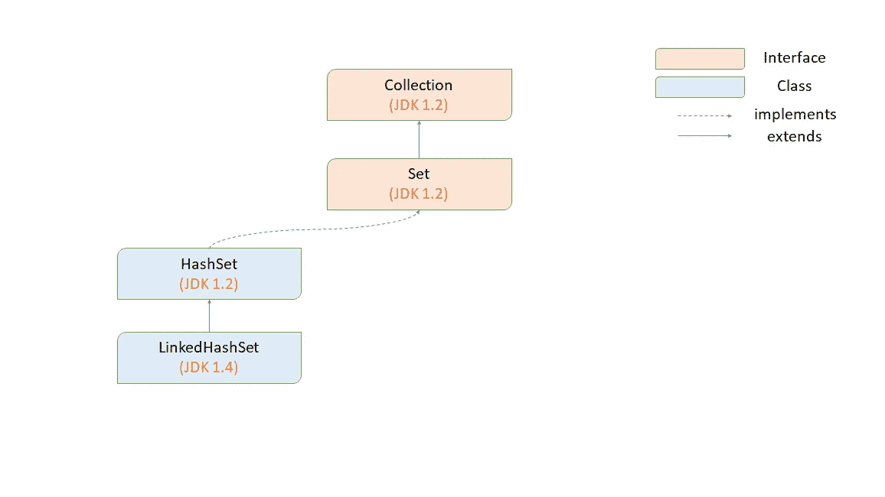

集合接口的实现

## 4.分类集合

*   它是 Set 的子接口。
*   如果我们希望将一组单独的对象表示为一个单一的实体，其中不允许重复，并且所有对象都应该按照某种排序顺序插入，那么我们应该选择 [" *SortedSet* "](https://javarevisited.blogspot.com/2012/11/difference-between-treeset-hashset-vs-linkedhashset-java.html) 。

## 5.可导航集

*   它是 SortedSet 的子接口。
*   它包含几种用于导航的方法。

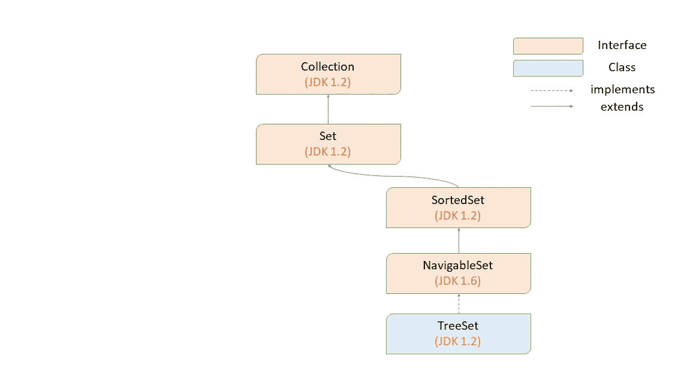

SortedSet 和 NavigableSet 接口的实现

> [***列表和集合***](https://www.java67.com/2013/01/difference-between-set-list-and-map-in-java.html)***【❓】***

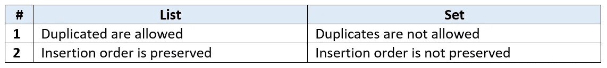

列表和集合之间的差异

## 6.长队

*   它是集合的子接口。
*   如果我们想在处理之前表示一组单独的对象，那么我们应该选择“[队列](https://javarevisited.blogspot.com/2013/10/what-is-priorityqueue-data-structure-java-example-tutorial.html)”。
*   通常队列遵循“**先进先出**”(FIFO)，但是，基于我们的需求，我们也可以实现我们自己的优先级顺序。

示例:

```
*Before sending a mail, all mail id’s we must store in some data structure. In which order we added mail id’s in same order only mail should be delivered. For this requirement “Queue” is best choice.*
```

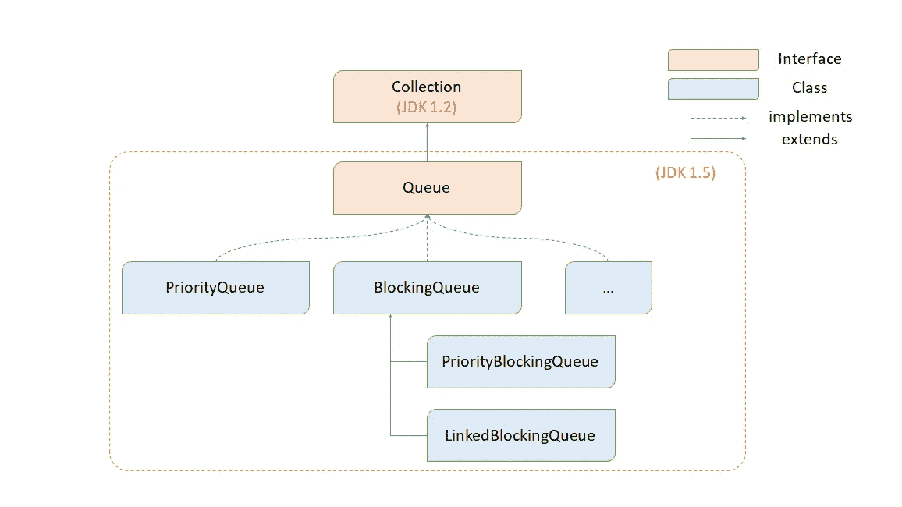

队列接口的实现

`**Note:**`

*   所有上面的接口(集合、列表、集合、排序集合、可导航集合和队列)都是为了表示一组单独的对象。
*   如果我们想用键值对来表示一组对象，那么我们应该选择“Map”。

## 7.地图

*   地图是**而不是**子界面的集合。
*   如果我们想将一组对象表示为键值对，那么我们应该选择“ [*Map*](https://www.java67.com/2017/08/top-10-java-hashmap-interview-questions.html) ”。

示例:

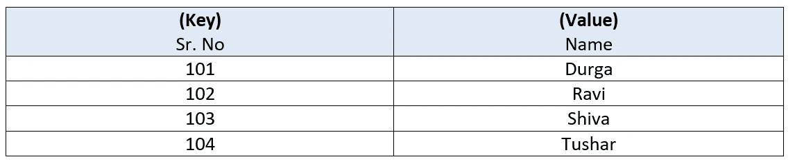

按序列号和姓名存储的学生记录

`**Note:**`

*   键和值都只是对象。
*   不允许重复键，但值可以重复。

[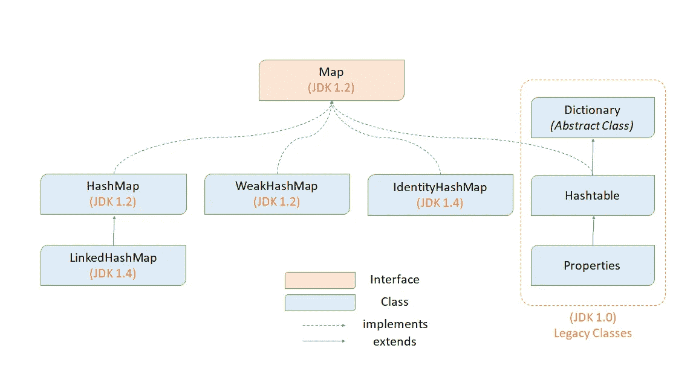](https://javarevisited.blogspot.com/2011/09/difference-hashmap-vs-hashset-java.html#axzz6hX6XfwBD)

地图接口的实现

## 8.分类地图

*   它是地图的子界面。
*   如果我们想根据键的排序顺序将一组对象表示为键-值对，那么我们应该选择“Map”。
*   在 SortedMap 中，排序应该基于键，而不是基于值。

## 9。导航地图

*   它是 SortedMap 的子接口。
*   它定义了几种用于导航的方法。

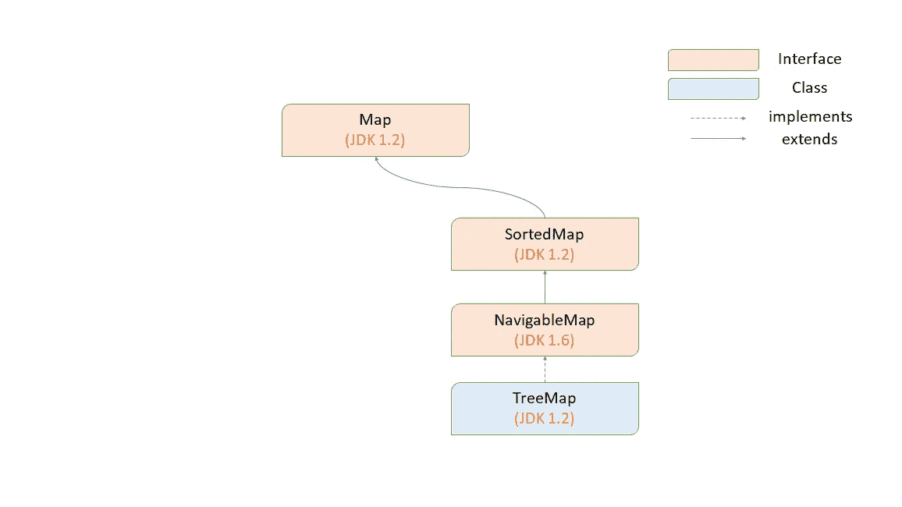

SortedMap 和 NavigableMap 接口的实现

# **完整的集合层次结构**

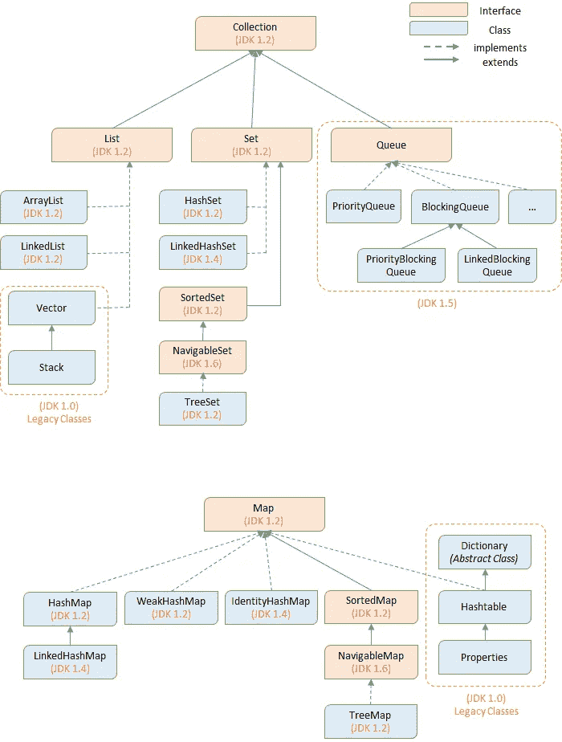

集合框架层次结构

`**Note:**` **以下是收藏框架中出现的遗留人物:** 1。
枚举(一)2。
字典(AC)3。
矢量(C)4。栈(C)
5。散列表(C)
6。属性(C)

## **与集合一起使用的可用助手接口和类:**

1.  **排序:** -可比(一)
    -比较器(一)
2.  **游标:** -枚举(I)
    -迭代器(I)
    -列表迭代器(I)
3.  **实用类:** -集合
    -数组

***在这篇文章中，我们讨论了下面几点——***

-集合框架的需求
-集合层次结构
-集合框架中的关键接口

> 第 2 部分即将推出。敬请期待！

感谢你阅读❤️