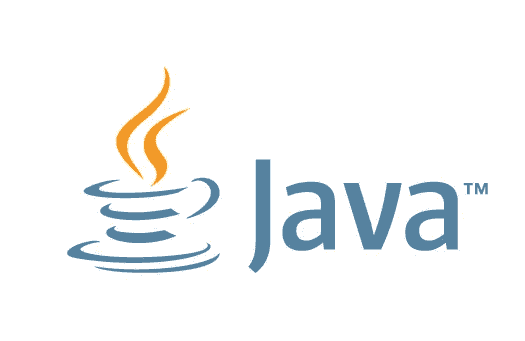
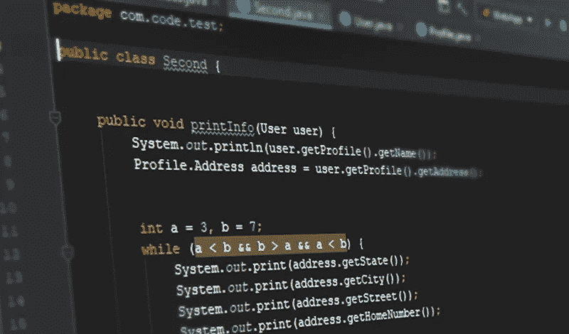
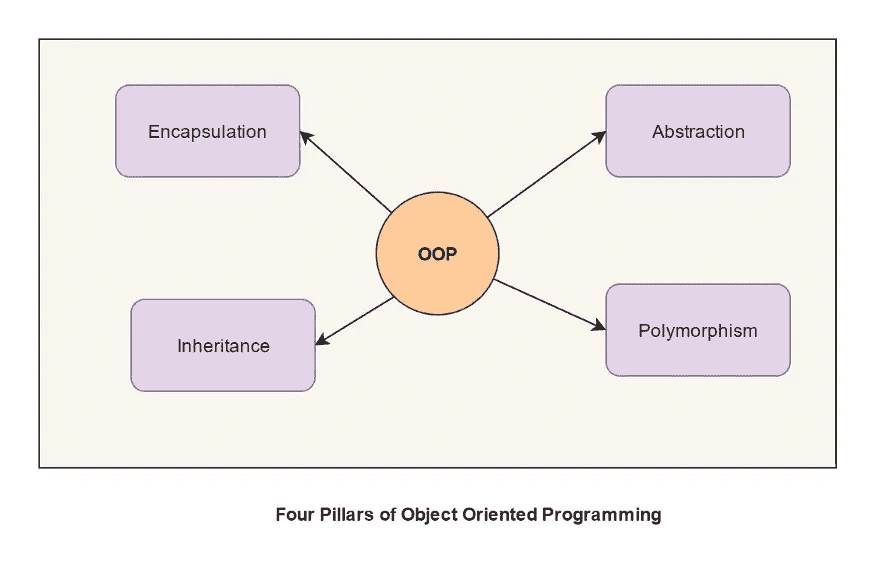

# Java 入门

> 原文：<https://medium.com/javarevisited/getting-started-with-java-93a896ddfc07?source=collection_archive---------0----------------------->



谷歌图片

# 为什么是 Java？

Java 是一种非常流行的编程语言，由詹姆斯·高斯林于 1995 年开发。尽管 Java 很古老，但它仍然是出于开发目的而需要学习的顶级语言。

Java 的主要特点是:

1.  **平台无关/可移植** : Java 是一种平台无关的语言，不像其他语言包括 [C](https://javarevisited.blogspot.com/2019/11/top-5-courses-to-learn-c-programming-in.html) 和 [C++](/javarevisited/top-10-courses-to-learn-c-for-beginners-best-and-free-4afc262a544e) 。这是因为代码被编译成独立于平台的*字节码*，而不是特定于平台的机器。
2.  **面向对象** : Java 是一种面向对象的语言，这意味着 Java 中的一切都基于*对象*和*类*。这有助于使用[面向对象方法](/javarevisited/my-favorite-courses-to-learn-object-oriented-programming-and-design-in-2019-197bab351733?source=---------103------------------)轻松解决复杂问题。
3.  **多线程**:这个特性允许开发人员构建可以同时执行任务的应用程序，从而确保应用程序平稳运行。

Java 是一种通用语言，可用于开发:

1.  [安卓应用](/javarevisited/top-5-courses-to-learn-android-for-java-programmers-667e03d995b4)
2.  桌面应用程序
3.  企业应用
4.  网络应用

有了这些特性和用途，学习 Java 是开发人员的头等大事。现在，事不宜迟，让我们深入了解如何开始。

# 第一步:熟悉语法。

学习如何用特定的编程语言编写“Hello World”类似于学习人类语言的字母表。

这就是我们用 Java 写程序的方式

```
class Tutorial{
   public static void main(String[] args){
      System.out.println("Hello World");
   }
}
```

从学习上面代码块中每个关键字的含义和重要性开始，我们为什么使用它，什么时候使用它。

下面的网站将帮助你了解进行下一步所需的基本语法和理论。我建议对条件、循环、数据类型、方法等有一个基本的了解。

<https://www.tutorialspoint.com/java/index.htm>  <https://www.w3schools.com/java/default.asp>  

# **第二步:开始编码**

[](https://medium.com/javarevisited/7-best-coding-course-to-learn-programming-with-zero-experience-in-2020-52f7d0d9cb80)

谷歌图片

只是学习关键词和理论对你帮助不大。你需要的是不断的练习。这里有各种各样的网站可以帮助你。

就个人而言，我发现 [CodeGym](https://codegym.cc/) 是[最好的开始学习如何用 Java](https://javarevisited.blogspot.com/2018/07/top-5-websites-to-learn-coding-in-java.html) 编码的网站。它从非常基础的程序开始，帮助你理解，随着你进入更高的层次，难度会增加。

一旦你基本掌握了如何用 Java 编写代码，你就可以开始在下面给出的网站上解决问题了。

1.  【https://www.hackerrank.com 
2.  [https://codingbat.com/java](https://codingbat.com/java)
3.  [https://leetcode.com](https://leetcode.com)

# 步骤 3:学习面向对象编程

如上所述，[面向对象编程](/swlh/5-free-object-oriented-programming-online-courses-for-programmers-156afd0a3a73) (OOP)是 Java 的主要特性之一。这也是大多数技术面试的主要部分。

面向对象编程帮助你根据对象和类来定义问题陈述。

OOP 有四个主要支柱

[](https://medium.com/javarevisited/7-best-online-courses-to-learn-object-oriented-design-pattern-in-java-749b6399af59)

谷歌图片

1.  [**继承**](https://javarevisited.blogspot.com/2012/10/what-is-inheritance-in-java-and-oops-programming.html) :继承是一个原则，借助于这个原则，一个类可以继承另一个类的属性和行为。继承这些属性的类称为子类。从其继承属性和特性的类被称为父类/基类。继承有助于提高代码的可重用性。
2.  [**抽象**](https://javarevisited.blogspot.com/2010/10/abstraction-in-java.html) **:** 抽象是一种帮助隐藏非必要代码，只向客户/用户显示必要代码的原则。Java 中的抽象可以使用 [*接口*和*抽象类*](http://www.java67.com/2012/09/what-is-difference-between-interface-abstract-class-java.html) 来实现
3.  [**多态**](https://www.java67.com/2012/10/difference-between-polymorphism-overloading-overriding-java.html) **:** 多态在 Java 中是指一个对象有多种形式。有两种类型的多态性，运行时/动态多态性和静态/编译时多态性。
4.  [**封装**](https://javarevisited.blogspot.com/2012/03/what-is-encapsulation-in-java-and-oops.html) **:** 封装是一种涉及隐藏数据的原理，这样就不能从类外访问数据，从而保证应用程序的安全。

下面是一些详细学习它们的好资源。

https://beginnersbook.com/2013/04/oops-concepts/

[https://www.javatpoint.com/java-oops-concepts](https://www.javatpoint.com/java-oops-concepts)

# 第四步:开始发展

到目前为止，你已经了解了大量的理论以及如何解决基本问题。为了进一步提高您对该语言的掌握，您需要开始用 Java 开发和构建项目。如上所列，有各种使用 Java 的应用程序。你可以选择任何一个开始开发。

举个例子:你可以通过安装 Android Studio 开始开发 Android 应用。添加一个好的资源让你开始。

<https://www.tutorialspoint.com/android/index.htm>  

# 第五步:读书:

这并不神秘。为了掌握任何题目，你都需要阅读大量的书籍。有很多学习 Java 的好书，无论你是初学者还是专家，这些书都会扩展你的知识。

最受欢迎的是:

1.  开始用 Java 为傻瓜编程
2.  头先 Java
3.  想想 Java

这里还有一些

</javarevisited/10-books-java-developers-should-read-in-2020-e6222f25cc72>  </javarevisited/my-favorite-books-to-learn-java-in-depth-must-read-9c4468aeec99>  

## 结论:

遵循上述步骤将帮助你达到中级水平。要掌握编程语言，需要承诺和纯粹的奉献。问题是，你愿意为此付出努力吗？